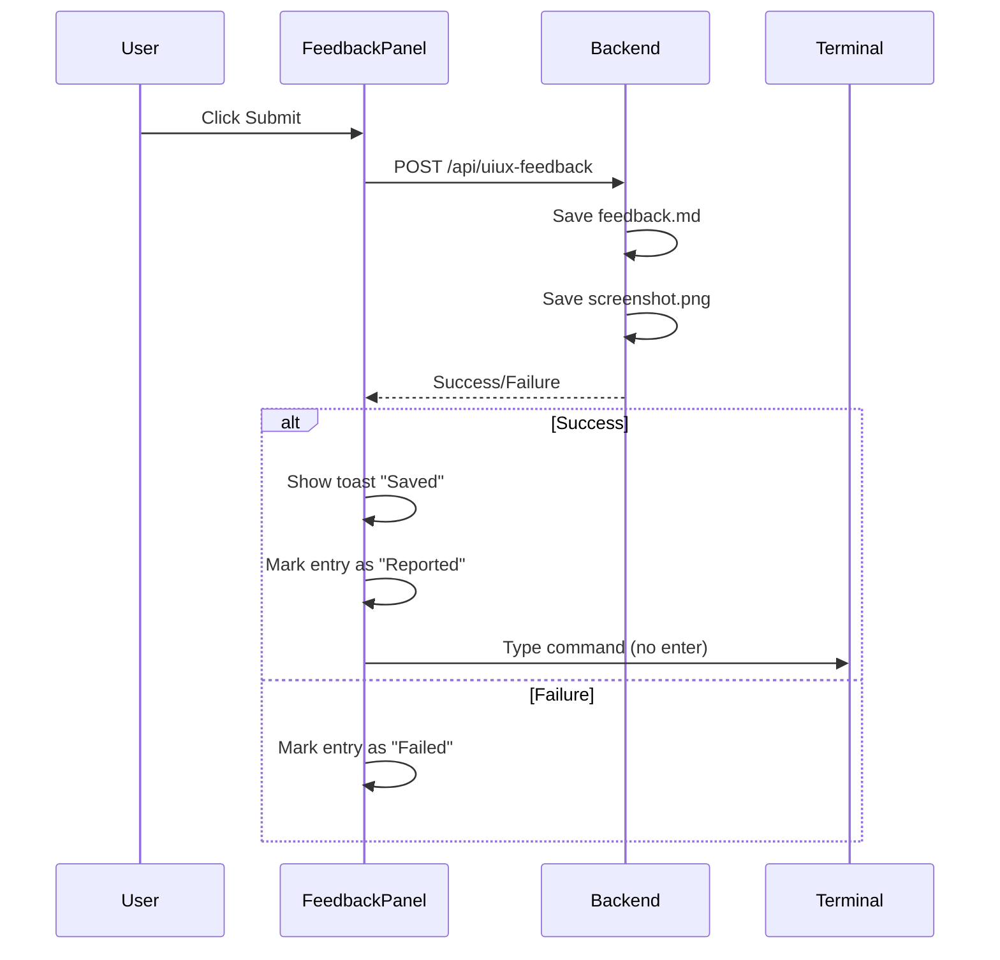
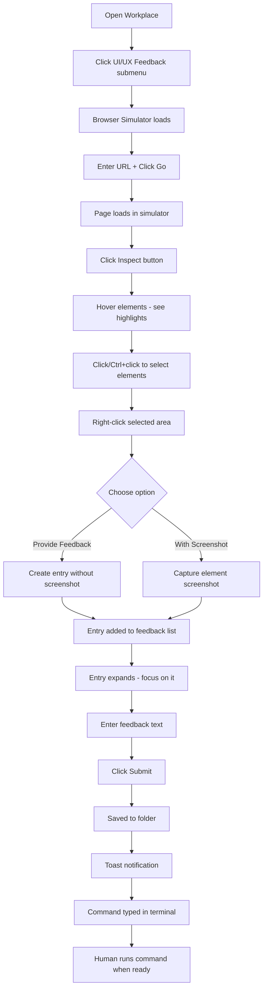

# Idea Summary: UI/UX Feedback System

> **IDEA-017** | Version: v2 | Status: Mockup Created | Date: 2026-01-28

---

## Overview

An integrated UI/UX Feedback tool within X-IPE Workplace that enables developers to browse web pages in a simulated browser environment, inspect HTML elements, and submit contextual feedback with screenshots—all without leaving the X-IPE interface.

---

## Problem Statement

Currently, providing UI/UX feedback requires:
- Switching between development environment and browser
- Taking manual screenshots
- Writing feedback in separate documents
- Losing context about which elements were being reviewed

This fragmented workflow slows down the feedback loop between design review and implementation.

---

## Proposed Solution

A dedicated **UI/UX Feedback View** accessible from the Workplace sub-menu that provides:

1. **Browser Simulator** - Full viewport browser with URL navigation
2. **Element Inspector** - Hover-to-highlight with element info display
3. **Feedback Capture** - Right-click context menu for feedback with optional screenshot
4. **Feedback Management** - Expandable list of feedback entries with submission workflow
5. **Agent Integration** - Terminal command generation for agent processing

---

## Key Features

### 1. Browser Simulator

| Attribute | Value |
|-----------|-------|
| **URL Bar** | Text input with "Go" button |
| **Viewport** | Full content area (responsive to panel size) |
| **Local Proxy** | Routes localhost URLs through X-IPE backend for full DOM access |
| **External URLs** | Loaded via iframe (with CORS limitations noted) |

**Technical Approach:**
- For `127.0.0.1` / `localhost` URLs → Use backend proxy route to bypass CORS
- For external URLs → Use sandboxed iframe with warning about inspection limitations
- For local project files → Direct file loading with full access

### 2. Element Inspector

| Attribute | Value |
|-----------|-------|
| **Activation** | Click "Inspect" toggle button |
| **Highlight** | Blue/orange border on hover |
| **Element Tag** | Small tooltip showing element type (e.g., `<button>`, `<div.card>`) |
| **Selection** | Click to select, Ctrl/Cmd+click for multi-select |

### 3. Feedback Capture (Right-Click Menu)

| Menu Option | Behavior |
|-------------|----------|
| **Provide Feedback** | Create entry with element info only |
| **Provide Feedback with Screenshot** | Create entry with element info + cropped screenshot of selected element(s) |

### 4. Feedback Entry Panel

```
┌─────────────────────────────────────────────┐
│ 📝 Feedback-20260128-140230        [Delete] │
├─────────────────────────────────────────────┤
│ URL: http://localhost:3000/dashboard        │
│ Elements: <button.submit>, <div.form-group> │
├─────────────────────────────────────────────┤
│ ┌─────────────┐                             │
│ │  Thumbnail  │  [Screenshot of elements]  │
│ └─────────────┘                             │
├─────────────────────────────────────────────┤
│ Feedback:                                   │
│ ┌─────────────────────────────────────────┐ │
│ │ Enter your feedback here...             │ │
│ └─────────────────────────────────────────┘ │
├─────────────────────────────────────────────┤
│                              [Submit]       │
└─────────────────────────────────────────────┘
```

**Entry Attributes:**
- Auto-generated name with timestamp: `Feedback-YYYYMMDD-HHMMSS`
- Delete button to remove entry
- URL and selected elements info
- Screenshot thumbnail (if captured)
- Text area for feedback description
- Submit button

### 5. Feedback Storage

**Folder Structure:**
```
x-ipe/uiux-feedback/
└── Feedback-20260128-140230/
    ├── feedback.md          # Structured feedback content
    └── page-screenshot.png  # Element screenshot (if captured)
```

**feedback.md Format:**
```markdown
# UI/UX Feedback

**ID:** Feedback-20260128-140230
**URL:** http://localhost:3000/dashboard
**Date:** 2026-01-28 14:02:30

## Selected Elements

- `<button.submit>` - Submit button in form
- `<div.form-group>` - Form container

## Feedback

{User's feedback text}

## Screenshot


```

### 6. Submission Workflow



**Terminal Command (typed but not executed):**
```
Get uiux feedback, please visit feedback folder x-ipe/uiux-feedback/Feedback-20260128-140230 to get details.
```

---

## User Flow



---

## Mockups & Prototypes

| Mockup | Type | Path | Tool Used |
|--------|------|------|-----------|
| UI/UX Feedback View | HTML | [mockups/uiux-feedback-v1.html](mockups/uiux-feedback-v1.html) | tool-frontend-design |

### Preview Instructions
- Open HTML file in browser to view interactive mockup
- Mockup shows the complete 3-column layout:
  - **Left:** Workplace sidebar with navigation
  - **Center:** Browser simulator with inspect mode active
  - **Right:** Feedback panel with expandable entries

### Mockup Highlights

1. **Browser Chrome** - Realistic browser window with URL bar and Go button
2. **Toolbar** - Refresh, Inspect toggle, Select All buttons with element count
3. **Inspect Highlight** - Blue border with element tag tooltip showing `<a.sim-btn>`
4. **Context Menu** - Right-click menu with "Provide Feedback" and "Feedback with Screenshot" options
5. **Feedback Panel** - Expandable list with active entry showing screenshot thumbnail
6. **Terminal Preview** - Shows auto-generated command at bottom of panel
7. **Toast Notification** - Success confirmation floating at bottom-right

---

## Technical Considerations

### Localhost Proxy

**Purpose:** Enable full DOM access for local development servers

**Implementation:**
- Backend route: `GET /api/proxy?url=http://localhost:3000/page`
- Fetches HTML from target URL
- Injects inspector script
- Returns modified HTML to frontend
- Only allows `127.0.0.1` and `localhost` targets (security)

### Screenshot Capture

**Method:** `html2canvas` or similar library
- Captures selected element(s) bounding box
- Converts to PNG blob
- Stores with feedback submission

### Element Selection

**Multi-select behavior:**
- First click: Select element (highlight persists)
- Ctrl/Cmd + click: Add to selection
- Click elsewhere: Clear selection
- Store array of selected element selectors

---

## Constraints & Decisions

| Decision | Choice | Rationale |
|----------|--------|-----------|
| Browser mode | Hybrid (proxy for localhost, iframe for external) | Balance between capability and simplicity |
| Screenshot scope | Selected element(s) only | Focused feedback, smaller files |
| Element selection | Multi-select with Ctrl/Cmd | Batch feedback for related elements |
| Navigation | Workplace sub-menu | Consistent with upcoming menu structure |
| Feedback list | Simple list, today only | Keep UI clean, most feedback is recent |
| Status indicator | Toast notification | Non-intrusive confirmation |
| Device support | Desktop only (v1) | Inspector requires mouse precision |
| Command execution | Human runs manually | More control over agent interaction |

---

## Out of Scope (v1)

- Responsive/mobile view simulation
- Video recording of interactions
- Collaborative feedback (multiple users)
- Feedback status tracking (open/resolved)
- Integration with issue trackers (GitHub, Jira)
- Annotation drawing tools on screenshots

---

## Success Criteria

1. User can load localhost URLs with full inspection capability
2. User can select multiple elements and capture grouped screenshot
3. Feedback is saved to structured folder format
4. Terminal command is generated for agent processing
5. Toast notification confirms successful save

---

## Next Steps

- [x] ~~Idea Mockup~~ - Created interactive HTML mockup
- [ ] **Requirement Gathering** - Break down into detailed requirements
- [ ] **Technical Design** - Design backend proxy and storage APIs

---

## References

- **Original Idea:** `x-ipe-docs/ideas/005. Feature-UIUX Feedback/new idea.md`
- **Mockup:** `x-ipe-docs/ideas/005. Feature-UIUX Feedback/mockups/uiux-feedback-v1.html`
- **Related:** Workplace sub-menu feature (pending)
