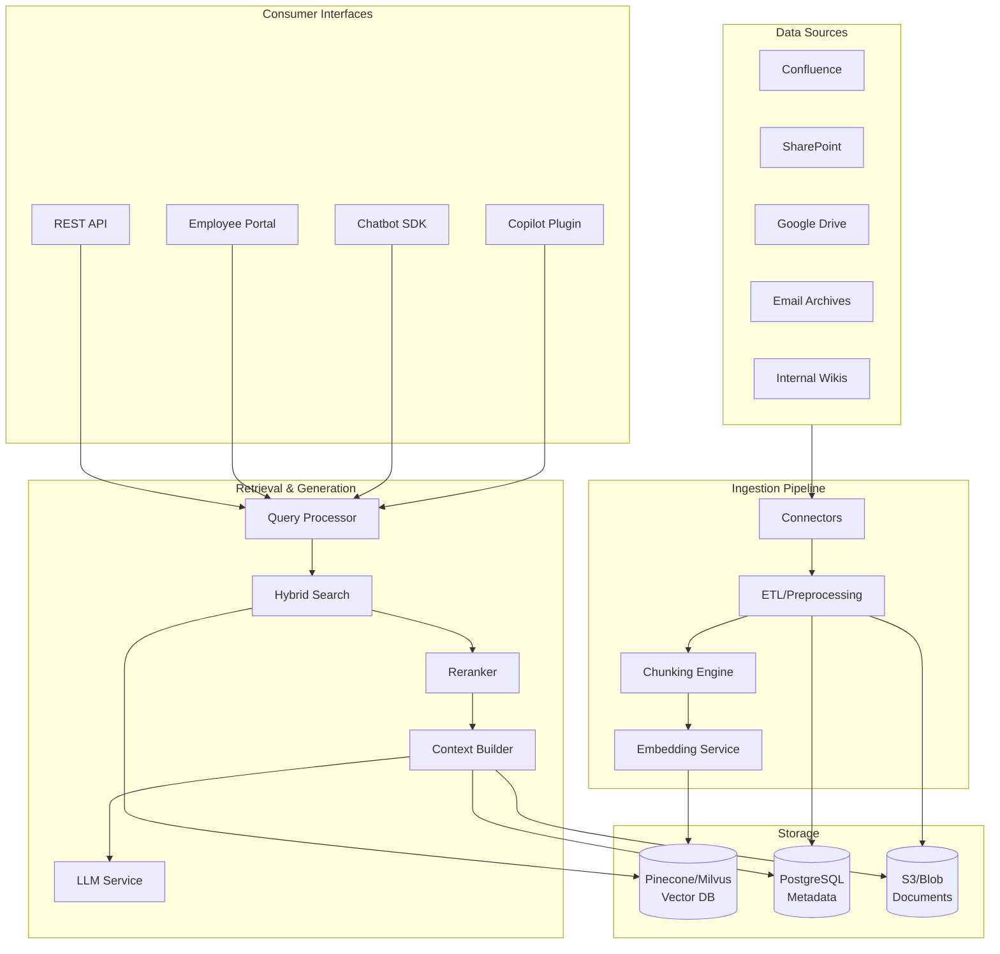

# Idea Summary

> Idea ID: IDEA-011
> Folder: Draft Idea - 01252026 133624
> Version: v1
> Created: 2026-01-25
> Status: Refined

## Overview
An AI-Integrated Enterprise Knowledge Base that serves as the unified knowledge layer for both AI agents and employees. The system consolidates fragmented knowledge tools into a single, intelligent platform powered by RAG (Retrieval-Augmented Generation) architecture.

## Problem Statement
Large enterprises face critical challenges:
- **Knowledge Fragmentation**: Multiple tools (Confluence, SharePoint, Notion, etc.) create silos
- **AI Context Gap**: AI agents lack access to real-time, accurate organizational knowledge
- **Employee Productivity Loss**: Average employee spends 20% of time searching for information
- **Knowledge Staleness**: Static repositories become outdated without continuous maintenance
- **No Single Source of Truth**: Duplication and inconsistency across systems

## Target Users
1. **AI Agents** - Internal chatbots, Copilot, automation agents, customer-facing AI
2. **Employees** (500+) - Knowledge consumers who need quick access to information
3. **Knowledge Curators** - SMEs who maintain and validate content
4. **IT/Platform Team** - System administrators and integrators

## Proposed Solution
A modern **AI Knowledge Management Platform** with three pillars:

### 1. Unified Knowledge Repository
- Centralized storage consolidating all knowledge types
- Automatic ingestion from existing tools (connectors)
- AI-powered tagging, categorization, and enrichment

### 2. RAG-Powered AI Layer
- Vector embeddings for semantic search
- Context-aware retrieval for AI agents
- Grounded generation with citations

### 3. Employee Portal (Library)
- Intuitive search and browse experience
- Personalized recommendations
- Contribution and feedback mechanisms

## Key Features

```mermaid
flowchart TD
    subgraph Ingestion["📥 Knowledge Ingestion"]
        A1[Connectors] --> A2[Preprocessing]
        A2 --> A3[Chunking & Embedding]
    end
    
    subgraph Storage["💾 Storage Layer"]
        B1[(Vector DB)]
        B2[(Document Store)]
        B3[(Knowledge Graph)]
    end
    
    subgraph Retrieval["🔍 Retrieval Layer"]
        C1[Semantic Search]
        C2[Hybrid Search]
        C3[Reranking]
    end
    
    subgraph Consumers["👥 Consumers"]
        D1[AI Agents]
        D2[Employee Portal]
        D3[External AI]
    end
    
    A3 --> B1 & B2 & B3
    B1 & B2 & B3 --> C1 & C2 & C3
    C1 & C2 & C3 --> D1 & D2 & D3
```

### Feature List

| # | Feature | Description | Priority |
|---|---------|-------------|----------|
| 1 | Multi-Source Connectors | Ingest from Confluence, SharePoint, Google Drive, Notion, email archives | P0 |
| 2 | Intelligent Chunking | Semantic document segmentation for optimal retrieval | P0 |
| 3 | Vector Embedding Pipeline | Generate and store embeddings using transformer models | P0 |
| 4 | Hybrid Search | Combine vector similarity + keyword search | P0 |
| 5 | RAG API Endpoint | REST/GraphQL API for AI agents to query knowledge | P0 |
| 6 | Employee Search Portal | Web UI with natural language search | P1 |
| 7 | Knowledge Graph | Relationship mapping for contextual navigation | P1 |
| 8 | Access Control | Row-level permissions based on user roles | P0 |
| 9 | Content Freshness | Auto-detect stale content, trigger refresh workflows | P1 |
| 10 | Usage Analytics | Track search patterns, popular content, gaps | P2 |
| 11 | Feedback Loop | Thumbs up/down on results to improve retrieval | P1 |
| 12 | AI Maintenance Agent | Auto-update, archive, and curate content | P2 |

## Success Criteria
- [ ] Reduce average time-to-answer by 50%
- [ ] Achieve 85%+ retrieval accuracy on benchmark queries
- [ ] Consolidate 3+ existing knowledge tools
- [ ] 80% employee adoption within 6 months
- [ ] AI agents use KB as primary knowledge source

## Constraints & Considerations

### Technical Constraints
- Must integrate with existing enterprise SSO/LDAP
- Data residency requirements (on-prem vs cloud)
- Latency requirements: < 2s for search results

### Business Constraints
- Migration from existing tools without data loss
- Training/change management for employees
- Compliance with data retention policies

### Security Considerations
- Sensitive data redaction before ingestion
- Audit logging for all access
- Role-based access control (RBAC)

## Brainstorming Notes

### Terminology Analysis
Modern terminology for your use case:
- **Knowledge Base** ✅ - Still widely used, understood
- **Enterprise Knowledge Platform** - More comprehensive positioning
- **AI Knowledge Hub** - Emphasizes AI integration
- **Intelligent Knowledge Management System (IKMS)** - Enterprise formal
- **Recommendation**: Use **"Enterprise Knowledge Platform"** or simply **"Knowledge Base"** as both are appropriate

### Knowledge Lifecycle (Modern AI Era)
1. **Create/Capture** → AI extracts from sources
2. **Organize/Enrich** → Auto-tagging, knowledge graphs
3. **Store/Index** → Vector DB + document store
4. **Retrieve/Deliver** → RAG-powered search
5. **Use/Collaborate** → Portals, APIs, chatbots
6. **Maintain/Improve** → Auto-archival, freshness checks
7. **Archive/Retire** → Compliance-aware lifecycle

### Key Challenges Identified
1. **Data Quality** - Garbage in, garbage out; need curation workflows
2. **Change Management** - Getting employees to adopt new system
3. **Integration Complexity** - Multiple source systems with different APIs
4. **Retrieval Accuracy** - Tuning embeddings/chunking for domain
5. **Governance** - Who owns what content, approval workflows
6. **Cost** - Vector DB compute at scale can be expensive

## Technical Architecture (Proposed)

## Implementation Roadmap

### Phase 1: Foundation (Months 1-3)
- [ ] Set up vector database infrastructure
- [ ] Build ingestion pipeline for top 2 sources
- [ ] Implement basic RAG API endpoint
- [ ] Prototype employee search UI

### Phase 2: Core Features (Months 4-6)
- [ ] Add remaining source connectors
- [ ] Implement hybrid search + reranking
- [ ] Deploy employee portal v1
- [ ] Integrate with AI agents (Copilot, chatbots)

### Phase 3: Enhancement (Months 7-9)
- [ ] Knowledge graph integration
- [ ] Content freshness automation
- [ ] Usage analytics dashboard
- [ ] Feedback loop implementation

### Phase 4: Optimization (Months 10-12)
- [ ] AI maintenance agent
- [ ] Performance tuning at scale
- [ ] Full migration from legacy tools
- [ ] Change management & training

## Source Files
- new idea.md

## Next Steps
- [ ] Proceed to Idea Mockup (employee portal wireframe)
- [ ] Proceed to Idea to Architecture (detailed system design)

## References & Applied Principles

### Applied Principles
- **RAG Architecture** - Retrieval-Augmented Generation for grounded AI responses
- **CQRS Pattern** - Separate read (retrieval) and write (ingestion) paths
- **Event-Driven Architecture** - Connectors publish changes, pipeline subscribes

### Further Reading
- [Microsoft Azure RAG Design Guide](https://learn.microsoft.com/en-us/azure/architecture/ai-ml/guide/rag/rag-solution-design-and-evaluation-guide)
- [Building Enterprise Knowledge Base with RAG](https://xenoss.io/blog/enterprise-knowledge-base-llm-rag-architecture)
- [AI Knowledge Management Best Practices](https://www.glean.com/perspectives/best-practices-for-implementing-ai-in-knowledge-management-systems)
- [Knowledge Management Lifecycle Guide](https://coworker.ai/blog/knowledge-management-lifecycle)
