# Knowledge Management Lifecycle

> Based on IDEA-011: AI-Integrated Enterprise Knowledge Base
> Created: 2026-01-25

## Lifecycle Overview (Mermaid)

```mermaid
flowchart LR
    subgraph ACQUIRE["1️⃣ ACQUIRE"]
        direction TB
        A1[📥 Connectors]
        A2[🔗 SharePoint]
        A3[📝 Confluence]
        A4[📧 Email]
    end
    
    subgraph PROCESS["2️⃣ PROCESS"]
        direction TB
        P1[⚙️ ETL Pipeline]
        P2[✂️ Chunking]
        P3[🏷️ Tagging]
        P4[🧠 Embedding]
    end
    
    subgraph STORE["3️⃣ STORE"]
        direction TB
        S1[🔢 Vector DB]
        S2[📄 Document Store]
        S3[🗃️ Metadata]
        S4[🕸️ Knowledge Graph]
    end
    
    subgraph RETRIEVE["4️⃣ RETRIEVE"]
        direction TB
        R1[🔍 Query Parser]
        R2[🎯 Vector Search]
        R3[📑 Keyword Search]
        R4[⚖️ Reranker]
    end
    
    subgraph DELIVER["5️⃣ DELIVER"]
        direction TB
        D1[🤖 RAG API]
        D2[🌐 Portal]
        D3[💬 Chatbot]
        D4[🔐 Access Control]
    end
    
    subgraph MAINTAIN["6️⃣ MAINTAIN"]
        direction TB
        M1[📊 Analytics]
        M2[👍 Feedback]
        M3[🔄 Refresh]
        M4[🗑️ Archive]
    end
    
    ACQUIRE --> PROCESS --> STORE --> RETRIEVE --> DELIVER --> MAINTAIN
    MAINTAIN -.->|Continuous Improvement| ACQUIRE
    
    style ACQUIRE fill:#10b981,stroke:#059669,color:#fff
    style PROCESS fill:#10b981,stroke:#059669,color:#fff
    style STORE fill:#10b981,stroke:#059669,color:#fff
    style RETRIEVE fill:#3b82f6,stroke:#2563eb,color:#fff
    style DELIVER fill:#3b82f6,stroke:#2563eb,color:#fff
    style MAINTAIN fill:#94a3b8,stroke:#64748b,color:#fff
```



### Legend

| Color | Meaning |
|-------|---------|
| 🟢 Green | **Phase 1 - Foundation** (Months 1-3) - Implement First |
| 🔵 Blue | **Phase 2 - Core Features** (Months 4-6) |
| ⚪ Gray | **Phase 3/4 - Enhancement** (Months 7-12) |

---

## Lifecycle Phases (Infographic)

```infographic
infographic sequence-zigzag-steps-underline-text
data
  title Knowledge Management Lifecycle
  sequences
    - label 1. ACQUIRE ⭐ Phase 1
      desc Collect knowledge from multiple sources: SharePoint, Confluence, OneDrive, Email via MS Graph API connectors
    - label 2. PROCESS ⭐ Phase 1
      desc Transform raw content: ETL pipeline, semantic chunking, metadata extraction, gte-Qwen2 embedding generation
    - label 3. STORE ⭐ Phase 1
      desc Persist in optimized stores: AnalyticDB-PG vectors, OSS documents, RDS metadata, GDB relationships
    - label 4. RETRIEVE → Phase 2
      desc Find relevant knowledge: hybrid vector + keyword search, intent classification, reranking
    - label 5. DELIVER → Phase 2
      desc Serve to consumers: RAG API endpoint, Knowledge Portal UI, Chatbot SDK, RBAC enforcement
    - label 6. MAINTAIN → Phase 3/4
      desc Keep knowledge fresh: usage analytics, feedback loop, staleness detection, AI maintenance agent
```

---

## Phase 1 Focus: Foundation Pipeline

```mermaid
flowchart TB
    subgraph Sources["Knowledge Sources"]
        SP[SharePoint]
        CF[Confluence]
    end
    
    subgraph Phase1["🟢 PHASE 1 IMPLEMENTATION"]
        direction TB
        
        subgraph Ingest["Acquire & Process"]
            CON[MS Graph Connector]
            ETL[Ingestion Pipeline]
            CHK[Chunker Service]
            EMB[gte-Qwen2 Embeddings]
        end
        
        subgraph Store["Store"]
            VDB[(AnalyticDB-PG\nVector Store)]
            OSS[(Alibaba OSS\nDocuments)]
            RDS[(RDS PostgreSQL\nMetadata)]
        end
        
        subgraph BasicRAG["Basic Retrieval & Delivery"]
            API[RAG API\nFastAPI]
            UI[Prototype UI]
        end
    end
    
    subgraph AI["AI Services"]
        QWEN[Qwen LLM]
    end
    
    Sources --> CON --> ETL --> CHK --> EMB
    EMB --> VDB
    ETL --> OSS
    ETL --> RDS
    
    VDB --> API
    OSS --> API
    RDS --> API
    QWEN --> API
    API --> UI
    
    style Phase1 fill:#ecfdf5,stroke:#10b981,stroke-width:3px
    style Ingest fill:#d1fae5,stroke:#10b981
    style Store fill:#d1fae5,stroke:#10b981
    style BasicRAG fill:#dbeafe,stroke:#3b82f6
```



---

## Why Phase 1 Focuses on ACQUIRE → PROCESS → STORE

| Reason | Explanation |
|--------|-------------|
| **Data Foundation** | You can't retrieve or deliver knowledge without first acquiring and storing it |
| **Lowest Risk** | Backend infrastructure has no user-facing dependencies |
| **Validates Architecture** | Tests Alibaba Cloud services integration before building UIs |
| **Enables Iteration** | Once data flows, we can iteratively improve retrieval quality |
| **Quick Wins** | Basic RAG API proves value to stakeholders early |

---

## Full Lifecycle Summary

| Phase | Lifecycle Stages | Timeline | Key Deliverables |
|-------|------------------|----------|------------------|
| **1 - Foundation** | Acquire, Process, Store + Basic Retrieve/Deliver | Months 1-3 | Connectors, Pipeline, Vector DB, RAG API prototype |
| **2 - Core** | Retrieve, Deliver (full) | Months 4-6 | Hybrid search, Knowledge Portal v1, refined connectors |
| **3 - Enhance** | Maintain (analytics, feedback) | Months 7-9 | Knowledge graph, freshness detection, usage analytics |
| **4 - Optimize** | Maintain (AI-driven) | Months 10-12 | AI maintenance agent, performance tuning, legacy migration |
