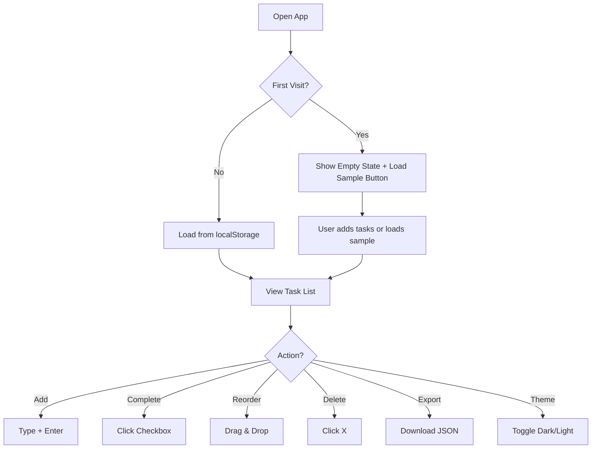
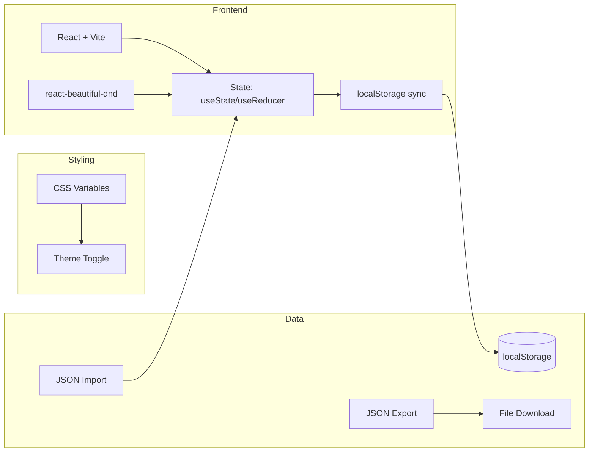

# Idea Summary

> Idea ID: IDEA-012
> Folder: Test - 01232026 225812
> Version: v2
> Created: 2026-01-23
> Status: Refined
> Previous: v1 (baseline)

## Overview

A polished, personal checklist web application optimized for **quick demo purposes**. Builds on v1 with added polish: keyboard shortcuts, drag-to-reorder, local storage with export capability, and dark mode toggle.

## Changes from v1

| Aspect | v1 | v2 |
|--------|-----|-----|
| Task Ordering | Static list | Drag-to-reorder |
| Keyboard Support | None | Shortcuts (Enter to add, Esc to cancel) |
| Theme | Light only | Light/Dark toggle |
| Data Portability | localStorage only | Export/Import JSON |
| Demo Features | Basic | Sample data loader for demos |

## Problem Statement

Need a lightweight, local-only task management tool that's polished enough for quick demos while remaining simple to implement.

## Target Users

- Personal use (single user)
- Demo/presentation scenarios
- Quick prototyping showcase

## Proposed Solution

A React web app with:
- All v1 features (CRUD, due dates, visual indicators)
- Drag-and-drop task reordering
- Keyboard shortcuts for power users
- Dark/light theme toggle
- Export/import for data portability
- "Load sample data" button for demos

## Key Features

| Feature | Description | Priority | New in v2 |
|---------|-------------|----------|-----------|
| Add Task | Create task with title + optional due date | Must Have | - |
| Task List | Display all tasks in a flat list | Must Have | - |
| Complete Task | Toggle completion (strikethrough) | Must Have | - |
| Due Date Visual | Overdue (red), due-today (yellow) | Must Have | - |
| Delete Task | Remove task from list | Must Have | - |
| Edit Task | Modify task title or due date | Should Have | - |
| **Drag Reorder** | Drag tasks to reorder | Should Have | ✅ |
| **Keyboard Shortcuts** | Enter=add, Esc=cancel, ↑↓=navigate | Should Have | ✅ |
| **Dark Mode** | Toggle light/dark theme | Nice to Have | ✅ |
| **Export/Import** | JSON file export/import | Nice to Have | ✅ |
| **Sample Data** | Load demo data with one click | Nice to Have | ✅ |
| Clear Completed | Bulk delete completed tasks | Nice to Have | - |

## User Flow

## Technical Approach

**Stack:**
- **Framework:** React 18+ with Vite
- **Drag & Drop:** react-beautiful-dnd (or @dnd-kit)
- **Styling:** CSS Variables for theming
- **Storage:** localStorage + JSON export/import
- **Build:** Vite

## Keyboard Shortcuts

| Shortcut | Action |
|----------|--------|
| `Enter` | Add new task (when input focused) |
| `Escape` | Cancel edit / clear input |
| `Ctrl+D` | Toggle dark mode |
| `Ctrl+E` | Export tasks |

## Success Criteria

- [x] All v1 criteria (add, complete, delete, due dates, persistence)
- [ ] Can drag tasks to reorder
- [ ] Keyboard shortcuts work
- [ ] Dark/light theme toggle functional
- [ ] Can export tasks to JSON file
- [ ] Can import tasks from JSON file
- [ ] "Load sample data" populates demo tasks
- [ ] App loads instantly (< 1s)

## Demo Script

For presentations:
1. Open app → Show empty state
2. Click "Load Sample Data" → Tasks appear with various states
3. Toggle dark mode → Theme switches
4. Drag a task → Reorder works
5. Add new task with Enter key → Keyboard shortcuts
6. Export → Download JSON
7. Delete all → Re-import → Data restored

## Constraints & Considerations

- **No backend** - purely client-side
- **Demo-friendly** - sample data and quick reset
- **Single device** - localStorage is browser-specific
- **Keep it simple** - features serve demo purposes

## Source Files

- new idea.md (original)
- idea-summary-v1.md (baseline)

## Next Steps

- [ ] Update mockup with v2 features (dark mode toggle, drag handles)
- [ ] Proceed to Requirement Gathering
