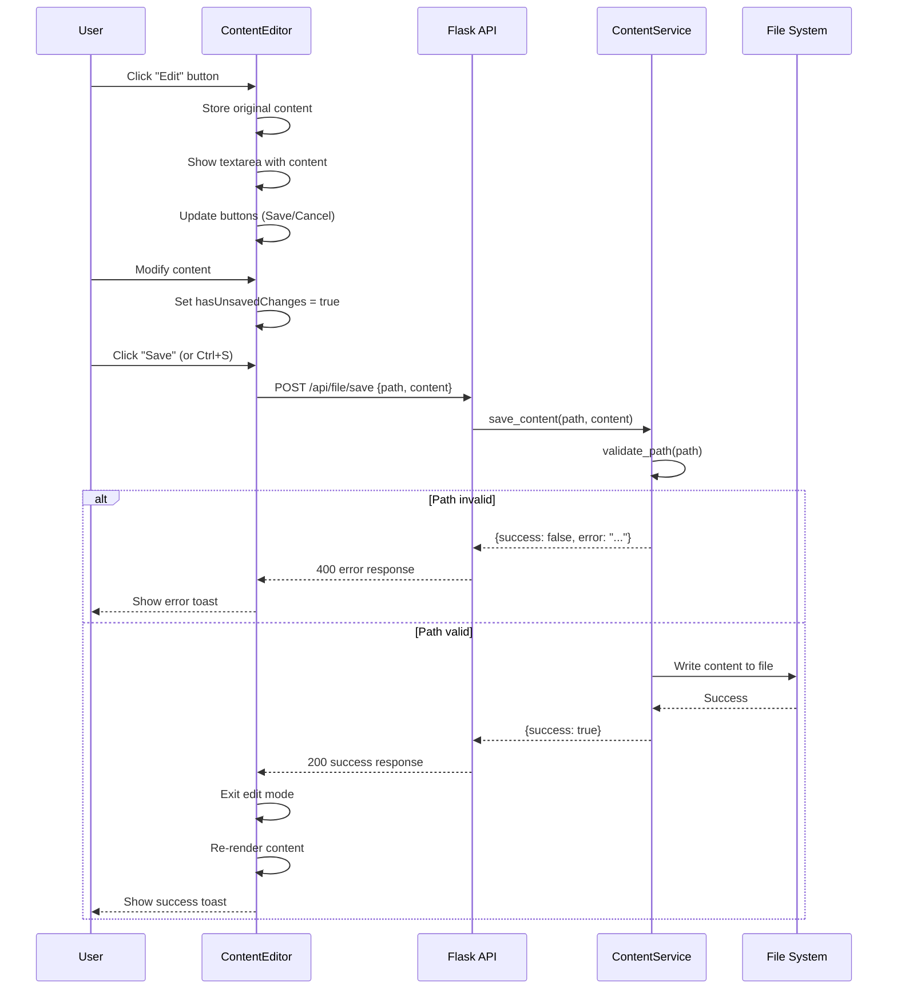
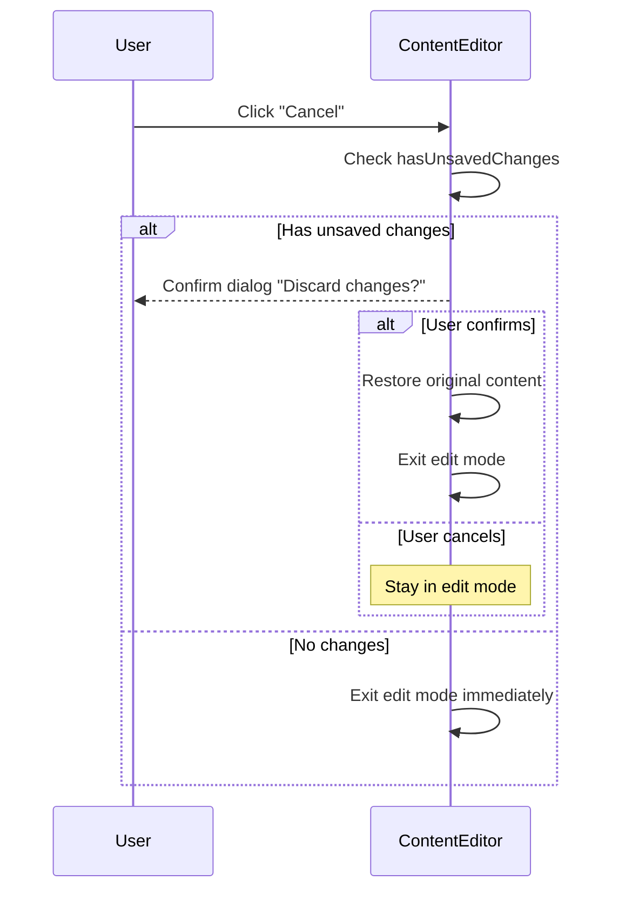

# Technical Design: Content Editor

> Feature ID: FEATURE-003 | Version: v1.0 | Last Updated: 01-20-2026

---

## Part 1: Agent-Facing Summary

> **Purpose:** Quick reference for AI agents navigating large projects.
> **📌 AI Coders:** Focus on this section for implementation context.

### Key Components to Implement

| Component | Responsibility | Scope/Impact | Tags |
|-----------|----------------|--------------|------|
| `POST /api/file/save` | Backend endpoint to save file content | API route | #api #rest #file |
| `ContentEditor` (JS) | Frontend class managing edit mode | Frontend module | #frontend #javascript #editor |
| Edit/Save/Cancel buttons | UI controls for edit operations | UI component | #frontend #ui #buttons |
| Path validation | Security check for file writes | Backend service | #security #validation |

### Scope & Boundaries

**In Scope:**
- Edit mode toggle (view ↔ edit)
- Textarea-based content editing
- `POST /api/file/save` endpoint with path validation
- Save/Cancel buttons with visual feedback
- Unsaved changes warning
- Keyboard shortcut (Ctrl/Cmd+S)

**Out of Scope:**
- Rich code editor (Monaco/CodeMirror)
- New file creation
- File deletion/rename
- Conflict detection with external changes
- Side-by-side preview

### Dependencies

| Dependency | Source | Design Link | Usage Description |
|------------|--------|-------------|-------------------|
| `ContentService` | FEATURE-002 | [technical-design.md](../FEATURE-002/technical-design.md) | File reading, extend for writing |
| `/api/file/content` | FEATURE-002 | [technical-design.md](../FEATURE-002/technical-design.md) | Fetch file content for editing |
| `ContentRenderer` | FEATURE-002 | index.html | Re-render after save |
| Flask | External | [flask.palletsprojects.com](https://flask.palletsprojects.com) | Backend API |

### Major Flow

1. **Enter Edit Mode:** User clicks "Edit" → ContentEditor shows textarea with file content
2. **Edit Content:** User modifies text in textarea
3. **Save:** User clicks "Save" → POST /api/file/save → Re-render content → Show toast
4. **Cancel:** User clicks "Cancel" → Restore original view mode

### Usage Example

```python
# Backend: File save endpoint
@app.route('/api/file/save', methods=['POST'])
def save_file():
    data = request.get_json()
    path = data.get('path')
    content = data.get('content')
    
    # Validate path is within project root
    service = ContentService(app.config['PROJECT_ROOT'])
    result = service.save_content(path, content)
    
    return jsonify(result)
```

```javascript
// Frontend: ContentEditor
const editor = new ContentEditor({
    contentBody: document.getElementById('content-body'),
    onSave: async (path, content) => {
        const response = await fetch('/api/file/save', {
            method: 'POST',
            headers: { 'Content-Type': 'application/json' },
            body: JSON.stringify({ path, content })
        });
        return response.json();
    }
});

// Enter edit mode for current file
editor.startEditing(currentFilePath, currentContent);

// Save changes
await editor.save();
```

---

## Part 2: Implementation Guide

> **Purpose:** Human-readable details for developers.
> **📌 Emphasis on visual diagrams for comprehension.

### Architecture Overview

```
┌─────────────────────────────────────────────────────────────────┐
│                          Browser                                 │
│  ┌──────────────────────────────────────────────────────────┐   │
│  │                    Content Area                           │   │
│  │  ┌─────────────────────────────────────────────────────┐ │   │
│  │  │  Header: [Auto-refresh] [Edit] or [Save] [Cancel]   │ │   │
│  │  ├─────────────────────────────────────────────────────┤ │   │
│  │  │                                                     │ │   │
│  │  │  View Mode: Rendered Markdown/Code                  │ │   │
│  │  │      OR                                             │ │   │
│  │  │  Edit Mode: <textarea> with raw content             │ │   │
│  │  │                                                     │ │   │
│  │  └─────────────────────────────────────────────────────┘ │   │
│  │         ▲                                                 │   │
│  │         │ ContentEditor                                   │   │
│  │         │   - isEditing: boolean                          │   │
│  │         │   - currentPath: string                         │   │
│  │         │   - originalContent: string                     │   │
│  │         │   - hasUnsavedChanges: boolean                  │   │
│  └─────────│────────────────────────────────────────────────┘   │
│            │ HTTP: POST /api/file/save                           │
└────────────│────────────────────────────────────────────────────┘
             │
             ▼
┌─────────────────────────────────────────────────────────────────┐
│                       Flask Backend                              │
│  ┌────────────────────────────────────────────────────────────┐ │
│  │  POST /api/file/save                                        │ │
│  │    - Validate path (security)                               │ │
│  │    - Write content to file                                  │ │
│  │    - Return success/error                                   │ │
│  └────────────────────────────────────────────────────────────┘ │
│                              │                                   │
│                      ┌───────┴───────┐                          │
│                      │  File System   │                          │
│                      └───────────────┘                          │
└─────────────────────────────────────────────────────────────────┘
```

### Workflow Diagrams

#### Edit and Save Flow



#### Cancel Flow



---

### Component Designs

#### 1. ContentService Extension (Backend)

**Location:** `src/services/file_service.py`

Add `save_content()` method to existing `ContentService`:

```python
class ContentService:
    # ... existing code ...
    
    def save_content(self, relative_path: str, content: str) -> Dict[str, Any]:
        """
        Save content to a file within the project.
        
        Args:
            relative_path: Path relative to project root
            content: New file content
            
        Returns:
            Success/error dict
            
        Raises:
            ValueError: If path is invalid or outside project
            PermissionError: If file is not writable
        """
        # Validate path
        validation_error = self._validate_path_for_write(relative_path)
        if validation_error:
            return {'success': False, 'error': validation_error}
        
        # Construct full path
        full_path = os.path.join(self.project_root, relative_path)
        
        try:
            with open(full_path, 'w', encoding='utf-8') as f:
                f.write(content)
            return {
                'success': True,
                'message': 'File saved successfully',
                'path': relative_path
            }
        except PermissionError:
            return {'success': False, 'error': 'Permission denied: Cannot write to this file'}
        except Exception as e:
            return {'success': False, 'error': str(e)}
    
    def _validate_path_for_write(self, relative_path: str) -> Optional[str]:
        """
        Validate path for write operation.
        
        Returns:
            Error message string if invalid, None if valid
        """
        if not relative_path:
            return 'File path is required'
        
        # Prevent path traversal
        if '..' in relative_path or relative_path.startswith('/'):
            return 'Invalid path: Path traversal not allowed'
        
        full_path = os.path.join(self.project_root, relative_path)
        
        # Ensure path is within project root (resolve symlinks)
        try:
            real_project = os.path.realpath(self.project_root)
            real_path = os.path.realpath(full_path)
            if not real_path.startswith(real_project):
                return 'Invalid path: Outside project directory'
        except Exception:
            return 'Invalid path'
        
        # Check file exists (no new file creation in v1.0)
        if not os.path.exists(full_path):
            return 'File not found'
        
        # Check is file (not directory)
        if not os.path.isfile(full_path):
            return 'Cannot edit directories'
        
        return None
```

---

#### 2. File Save API Endpoint

**Location:** `src/app.py`

```python
@app.route('/api/file/save', methods=['POST'])
def save_file():
    """
    POST /api/file/save
    
    Save content to a file.
    
    Request body:
        - path: string (required) - Relative path to file
        - content: string (required) - New file content
    
    Response (success - 200):
        - success: true
        - message: "File saved successfully"
        - path: string
    
    Response (error - 400/403):
        - success: false
        - error: string
    """
    data = request.get_json()
    
    if not data:
        return jsonify({'success': False, 'error': 'Request body required'}), 400
    
    path = data.get('path')
    content = data.get('content')
    
    if not path:
        return jsonify({'success': False, 'error': 'Path is required'}), 400
    
    if content is None:
        return jsonify({'success': False, 'error': 'Content is required'}), 400
    
    project_root = current_app.config.get('PROJECT_ROOT')
    service = ContentService(project_root)
    result = service.save_content(path, content)
    
    if result.get('success'):
        return jsonify(result), 200
    else:
        return jsonify(result), 400
```

---

#### 3. ContentEditor (Frontend JS)

**Location:** `src/templates/index.html` (inline) or separate file

```javascript
/**
 * ContentEditor - Manages file editing mode
 * FEATURE-003: Content Editor
 */
class ContentEditor {
    constructor(options) {
        this.contentBody = options.contentBody;
        this.headerActions = options.headerActions;
        this.contentRenderer = options.contentRenderer;
        
        this.isEditing = false;
        this.currentPath = null;
        this.originalContent = null;
        this.hasUnsavedChanges = false;
        
        this.editButton = null;
        this.saveButton = null;
        this.cancelButton = null;
        this.textarea = null;
        
        this._setupButtons();
        this._bindKeyboardShortcut();
        this._bindBeforeUnload();
    }
    
    _setupButtons() {
        // Create Edit button (shown in view mode)
        this.editButton = document.createElement('button');
        this.editButton.className = 'btn btn-outline-primary btn-sm';
        this.editButton.innerHTML = '<i class="bi bi-pencil me-1"></i>Edit';
        this.editButton.addEventListener('click', () => this.startEditing());
        this.editButton.style.display = 'none';
        
        // Create Save button (shown in edit mode)
        this.saveButton = document.createElement('button');
        this.saveButton.className = 'btn btn-success btn-sm';
        this.saveButton.innerHTML = '<i class="bi bi-check-lg me-1"></i>Save';
        this.saveButton.addEventListener('click', () => this.save());
        this.saveButton.style.display = 'none';
        
        // Create Cancel button (shown in edit mode)
        this.cancelButton = document.createElement('button');
        this.cancelButton.className = 'btn btn-outline-secondary btn-sm ms-2';
        this.cancelButton.innerHTML = '<i class="bi bi-x-lg me-1"></i>Cancel';
        this.cancelButton.addEventListener('click', () => this.cancel());
        this.cancelButton.style.display = 'none';
        
        // Add buttons to header
        this.headerActions.appendChild(this.editButton);
        this.headerActions.appendChild(this.saveButton);
        this.headerActions.appendChild(this.cancelButton);
    }
    
    _bindKeyboardShortcut() {
        document.addEventListener('keydown', (e) => {
            if ((e.ctrlKey || e.metaKey) && e.key === 's' && this.isEditing) {
                e.preventDefault();
                this.save();
            }
        });
    }
    
    _bindBeforeUnload() {
        window.addEventListener('beforeunload', (e) => {
            if (this.hasUnsavedChanges) {
                e.preventDefault();
                e.returnValue = '';
            }
        });
    }
    
    /**
     * Show edit button when a file is loaded
     */
    setFile(path, content) {
        this.currentPath = path;
        this.originalContent = content;
        this.editButton.style.display = 'inline-block';
        this.isEditing = false;
    }
    
    /**
     * Hide edit button when no file is selected
     */
    clearFile() {
        this.currentPath = null;
        this.originalContent = null;
        this.editButton.style.display = 'none';
        this.isEditing = false;
    }
    
    /**
     * Enter edit mode
     */
    startEditing() {
        if (!this.currentPath || !this.originalContent) return;
        
        this.isEditing = true;
        this.hasUnsavedChanges = false;
        
        // Switch buttons
        this.editButton.style.display = 'none';
        this.saveButton.style.display = 'inline-block';
        this.cancelButton.style.display = 'inline-block';
        
        // Create textarea
        this.textarea = document.createElement('textarea');
        this.textarea.className = 'form-control editor-textarea';
        this.textarea.value = this.originalContent;
        this.textarea.style.cssText = `
            width: 100%;
            height: calc(100vh - 200px);
            min-height: 400px;
            font-family: 'Menlo', 'Monaco', 'Courier New', monospace;
            font-size: 14px;
            line-height: 1.5;
            resize: vertical;
            border-radius: 4px;
        `;
        
        // Track changes
        this.textarea.addEventListener('input', () => {
            this.hasUnsavedChanges = this.textarea.value !== this.originalContent;
        });
        
        // Replace content
        this.contentBody.innerHTML = '';
        this.contentBody.appendChild(this.textarea);
        this.textarea.focus();
    }
    
    /**
     * Save content to server
     */
    async save() {
        if (!this.isEditing || !this.textarea) return;
        
        const content = this.textarea.value;
        
        this.saveButton.disabled = true;
        this.saveButton.innerHTML = '<span class="spinner-border spinner-border-sm me-1"></span>Saving...';
        
        try {
            const response = await fetch('/api/file/save', {
                method: 'POST',
                headers: { 'Content-Type': 'application/json' },
                body: JSON.stringify({
                    path: this.currentPath,
                    content: content
                })
            });
            
            const result = await response.json();
            
            if (result.success) {
                this.originalContent = content;
                this.hasUnsavedChanges = false;
                this._exitEditMode();
                this._showToast('File saved successfully', 'success');
                
                // Re-render content
                if (this.contentRenderer) {
                    this.contentRenderer.render(this.currentPath);
                }
            } else {
                this._showToast(result.error || 'Save failed', 'danger');
            }
        } catch (error) {
            this._showToast('Network error: ' + error.message, 'danger');
        } finally {
            this.saveButton.disabled = false;
            this.saveButton.innerHTML = '<i class="bi bi-check-lg me-1"></i>Save';
        }
    }
    
    /**
     * Cancel editing
     */
    cancel() {
        if (this.hasUnsavedChanges) {
            if (!confirm('You have unsaved changes. Discard them?')) {
                return;
            }
        }
        
        this._exitEditMode();
        
        // Restore original rendered content
        if (this.contentRenderer && this.currentPath) {
            this.contentRenderer.render(this.currentPath);
        }
    }
    
    _exitEditMode() {
        this.isEditing = false;
        this.hasUnsavedChanges = false;
        this.textarea = null;
        
        // Switch buttons
        this.editButton.style.display = 'inline-block';
        this.saveButton.style.display = 'none';
        this.cancelButton.style.display = 'none';
    }
    
    _showToast(message, type = 'success') {
        // Use existing toast system
        const container = document.getElementById('toast-container');
        const toast = document.createElement('div');
        toast.className = `alert alert-${type} alert-dismissible fade show`;
        toast.innerHTML = `
            ${message}
            <button type="button" class="btn-close" data-bs-dismiss="alert"></button>
        `;
        container.appendChild(toast);
        setTimeout(() => toast.remove(), 5000);
    }
    
    /**
     * Check if user can navigate away
     */
    canNavigate() {
        if (this.hasUnsavedChanges) {
            return confirm('You have unsaved changes. Discard them?');
        }
        return true;
    }
}
```

---

### UI Integration

#### Header Actions Update

Add edit button container to the header actions div:

```html
<div class="header-actions d-flex align-items-center gap-2">
    <!-- FEATURE-004: Live Refresh Toggle -->
    <div class="auto-refresh-toggle d-flex align-items-center gap-1">
        ...
    </div>
    
    <!-- FEATURE-003: Editor buttons (Edit/Save/Cancel) -->
    <div id="editor-actions" class="d-flex align-items-center"></div>
</div>
```

#### Initialize ContentEditor

```javascript
// In page initialization
const contentEditor = new ContentEditor({
    contentBody: document.getElementById('content-body'),
    headerActions: document.getElementById('editor-actions'),
    contentRenderer: contentRenderer
});

// When file is loaded (in ContentRenderer or file click handler)
contentEditor.setFile(filePath, fileContent);

// When navigating to another file
if (!contentEditor.canNavigate()) {
    return; // Prevent navigation
}
```

---

### File Structure Changes

```
src/
├── app.py                     # Add POST /api/file/save route
├── services/
│   ├── __init__.py            # Re-exports all services
│   └── file_service.py        # Add save_content() to ContentService
├── templates/
│   ├── base.html              # (no changes needed)
│   └── index.html             # Add ContentEditor class, editor-actions div
tests/
└── test_editor.py             # NEW: Editor tests
```

---

### Test Cases Summary

| Test Category | Description |
|---------------|-------------|
| ContentService Unit | save_content(), path validation |
| API Endpoints | POST /api/file/save success/error cases |
| Security | Path traversal prevention, outside project |
| Integration | Save → re-render flow |
| Edge Cases | Large files, permission denied, missing file |

---

### Security Considerations

1. **Path Traversal:** Validate path doesn't contain `..` or absolute paths
2. **Project Scope:** Ensure resolved path is within project root
3. **File Existence:** Only allow editing existing files (no arbitrary file creation)
4. **Content Size:** Consider limiting content size for very large files

---

### Implementation Checklist

- [ ] Add `save_content()` method to `ContentService` in `services/file_service.py`
- [ ] Add `_validate_path_for_write()` method to `ContentService`
- [ ] Add `POST /api/file/save` route in `app.py`
- [ ] Create `ContentEditor` JavaScript class in `index.html`
- [ ] Add `editor-actions` div to content header
- [ ] Initialize `ContentEditor` in page load
- [ ] Integrate with file navigation (canNavigate check)
- [ ] Add keyboard shortcut (Ctrl/Cmd+S)
- [ ] Add beforeunload handler for unsaved changes
- [ ] Write unit tests for `ContentService.save_content()`
- [ ] Write API tests for `/api/file/save`
- [ ] Write security tests for path validation
