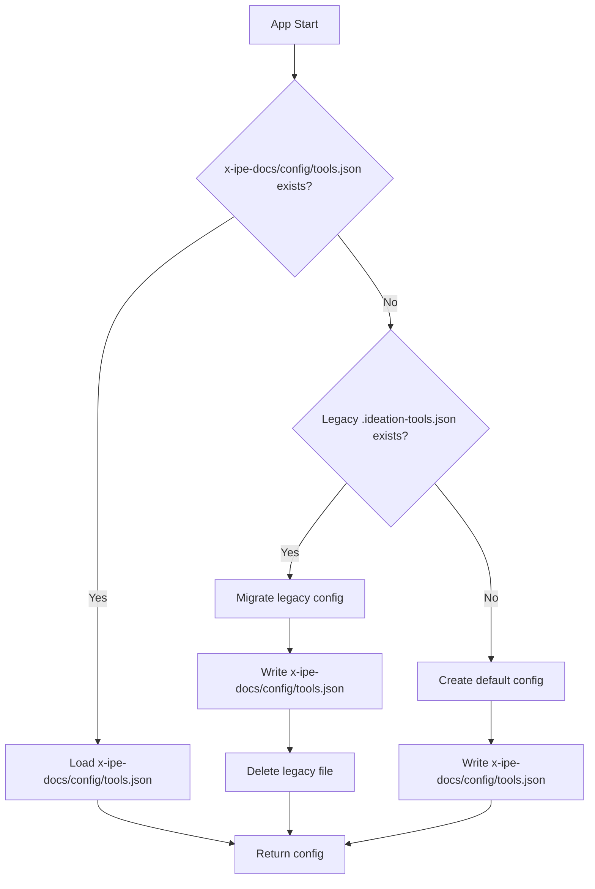
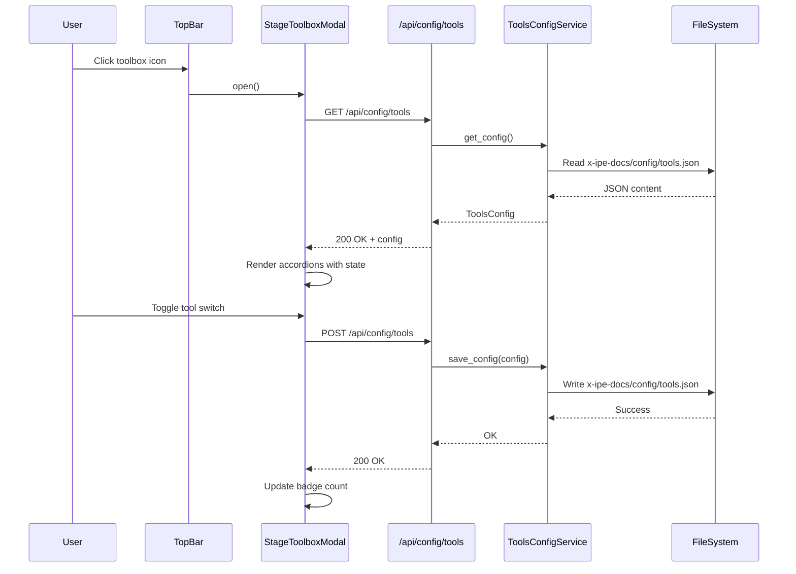

# Technical Design: Stage Toolbox

> Feature ID: FEATURE-011 | Version: v1.0 | Last Updated: 01-24-2026

---

## Version History

| Version | Date | Description |
|---------|------|-------------|
| v1.0 | 01-24-2026 | Initial design for Stage Toolbox modal |

---

## Part 1: Agent-Facing Summary

> **Purpose:** Quick reference for AI agents navigating large projects.
> **📌 AI Coders:** Focus on this section for implementation context.

### Technical Scope

- [x] Frontend (modal UI component)
- [x] Backend (new service and API endpoints)
- [ ] Database (uses file-based JSON config)

### Key Components Implemented

| Component | Responsibility | Scope/Impact | Tags |
|-----------|----------------|--------------|------|
| `ToolsConfigService` | Config CRUD, migration | Backend service | #config #service #python |
| `/api/config/tools` | GET/POST tool config | API endpoint | #api #flask #config |
| `StageToolboxModal` | Modal UI with accordions | Frontend component | #ui #modal #js |
| `tools.json` | Persisted config file | Data storage | #config #json |

### Dependencies

| Dependency | Source | Design Link | Usage Description |
|------------|--------|-------------|-------------------|
| `IdeasService` | FEATURE-008 | [technical-design.md](../FEATURE-008/technical-design.md) | Legacy `.ideation-tools.json` location for migration |
| Flask app factory | Foundation | [app.py](../../../src/app.py) | Register new API endpoint |
| Base templates | Foundation | [base.html](../../../src/templates/base.html) | Add top bar button |

### Major Flow

1. **App Start:** `ToolsConfigService.load()` → Check `x-ipe-docs/config/tools.json` → If missing, check legacy → Migrate or create default
2. **Modal Open:** User clicks top bar icon → Frontend renders `StageToolboxModal` → `GET /api/config/tools` → Populate accordion state
3. **Tool Toggle:** User toggles switch → `POST /api/config/tools` with updated config → Service writes to file → Badge updates

### Usage Example

```python
# Backend: ToolsConfigService usage
from src.services import ToolsConfigService

service = ToolsConfigService('/path/to/project')
config = service.load()  # Returns ToolsConfig or default

# Toggle a tool
config['stages']['ideation']['mockup']['frontend-design'] = True
service.save(config)
```

```javascript
// Frontend: StageToolboxModal usage
const modal = new StageToolboxModal();
modal.open();  // Fetches config and renders

// Internal toggle handler (automatic)
// Calls POST /api/config/tools on each toggle
```

---

## Part 2: Implementation Guide

> **Purpose:** Human-readable details for developers.
> **📌 Emphasis on visual diagrams for comprehension.

### Architecture Overview

```
┌─────────────────────────────────────────────────────────────┐
│                        Frontend                              │
├─────────────────────────────────────────────────────────────┤
│  Top Bar                 │  StageToolboxModal               │
│  ┌──────────┐            │  ┌─────────────────────────────┐ │
│  │ 🔧 Icon  │───────────►│  │ Accordion (5 stages)       │ │
│  └──────────┘   click    │  │ ├─ Ideation (expanded)     │ │
│                          │  │ │  ├─ ideation phase       │ │
│                          │  │ │  ├─ mockup phase         │ │
│                          │  │ │  └─ sharing phase        │ │
│                          │  │ ├─ Requirement (collapsed) │ │
│                          │  │ ├─ Feature (collapsed)     │ │
│                          │  │ ├─ Quality (collapsed)     │ │
│                          │  │ └─ Refactoring (collapsed) │ │
│                          │  └─────────────────────────────┘ │
└──────────────────────────┴──────────────────────────────────┘
                                │
                                │ GET/POST /api/config/tools
                                ▼
┌─────────────────────────────────────────────────────────────┐
│                        Backend                               │
├─────────────────────────────────────────────────────────────┤
│  app.py                  │  ToolsConfigService              │
│  ┌─────────────────────┐ │  ┌─────────────────────────────┐ │
│  │ /api/config/tools   │─┤  │ load() → migrate → save()  │ │
│  │   GET: get config   │ │  │                             │ │
│  │   POST: save config │ │  │ x-ipe-docs/config/tools.json           │ │
│  └─────────────────────┘ │  └─────────────────────────────┘ │
└──────────────────────────┴──────────────────────────────────┘
```

### Workflow Diagrams

#### Config Load Flow (App Startup)



#### Modal Interaction Flow



### Data Models

#### Config File Schema (`x-ipe-docs/config/tools.json`)

```json
{
  "version": "2.0",
  "stages": {
    "ideation": {
      "ideation": {
        "antv-infographic": false,
        "mermaid": false
      },
      "mockup": {
        "frontend-design": true
      },
      "sharing": {}
    },
    "requirement": {
      "gathering": {},
      "analysis": {}
    },
    "feature": {
      "design": {},
      "implementation": {}
    },
    "quality": {
      "testing": {},
      "review": {}
    },
    "refactoring": {
      "analysis": {},
      "execution": {}
    }
  }
}
```

#### Legacy Config Schema (`x-ipe-docs/ideas/.ideation-tools.json`)

```json
{
  "version": "1.0",
  "ideation": {
    "antv-infographic": false,
    "mermaid": false
  },
  "mockup": {
    "frontend-design": true
  },
  "sharing": {}
}
```

### API Specification

#### GET /api/config/tools

**Description:** Retrieve current tools configuration

**Response:**
```json
{
  "success": true,
  "config": {
    "version": "2.0",
    "stages": { ... }
  }
}
```

#### POST /api/config/tools

**Description:** Save tools configuration

**Request Body:**
```json
{
  "version": "2.0",
  "stages": { ... }
}
```

**Response:**
```json
{
  "success": true
}
```

**Error Response:**
```json
{
  "success": false,
  "error": "Invalid config format"
}
```

### Backend Implementation

#### ToolsConfigService (`src/services/tools_config_service.py`)

```python
"""
FEATURE-011: Stage Toolbox

ToolsConfigService: CRUD operations for tools configuration
"""
import json
import os
from pathlib import Path
from typing import Optional, Dict, Any


CONFIG_DIR = 'config'
CONFIG_FILE = 'tools.json'
LEGACY_PATH = 'x-ipe-docs/ideas/.ideation-tools.json'

DEFAULT_CONFIG = {
    "version": "2.0",
    "stages": {
        "ideation": {
            "ideation": {"antv-infographic": False, "mermaid": False},
            "mockup": {"frontend-design": True},
            "sharing": {}
        },
        "requirement": {"gathering": {}, "analysis": {}},
        "feature": {"design": {}, "implementation": {}},
        "quality": {"testing": {}, "review": {}},
        "refactoring": {"analysis": {}, "execution": {}}
    }
}


class ToolsConfigService:
    """Service for managing Stage Toolbox configuration."""
    
    def __init__(self, project_root: str):
        self.project_root = Path(project_root).resolve()
        self.config_dir = self.project_root / CONFIG_DIR
        self.config_path = self.config_dir / CONFIG_FILE
        self.legacy_path = self.project_root / LEGACY_PATH
    
    def load(self) -> Dict[str, Any]:
        """Load config, migrating from legacy if needed."""
        if self.config_path.exists():
            return self._read_config()
        
        if self.legacy_path.exists():
            return self._migrate_legacy()
        
        return self._create_default()
    
    def save(self, config: Dict[str, Any]) -> bool:
        """Save config to file."""
        self.config_dir.mkdir(parents=True, exist_ok=True)
        with open(self.config_path, 'w') as f:
            json.dump(config, f, indent=2)
        return True
    
    def _read_config(self) -> Dict[str, Any]:
        """Read existing config file."""
        try:
            with open(self.config_path, 'r') as f:
                return json.load(f)
        except (json.JSONDecodeError, IOError):
            return self._create_default()
    
    def _migrate_legacy(self) -> Dict[str, Any]:
        """Migrate from .ideation-tools.json to new format."""
        try:
            with open(self.legacy_path, 'r') as f:
                legacy = json.load(f)
            
            # Build new config preserving legacy tool states
            config = DEFAULT_CONFIG.copy()
            config['stages']['ideation']['ideation'] = legacy.get('ideation', {})
            config['stages']['ideation']['mockup'] = legacy.get('mockup', {})
            config['stages']['ideation']['sharing'] = legacy.get('sharing', {})
            
            self.save(config)
            self.legacy_path.unlink()  # Delete legacy file
            return config
        except (json.JSONDecodeError, IOError):
            return self._create_default()
    
    def _create_default(self) -> Dict[str, Any]:
        """Create and save default config."""
        self.save(DEFAULT_CONFIG)
        return DEFAULT_CONFIG
```

#### Flask Routes (`src/app.py` additions)

```python
# Add to imports
from src.services import ToolsConfigService

# Global instance
tools_config_service = None

# In create_app() after config_service init:
tools_config_service = ToolsConfigService(project_root)

# New routes
@app.route('/api/config/tools', methods=['GET'])
def get_tools_config():
    """GET /api/config/tools - Retrieve tools configuration."""
    config = tools_config_service.load()
    return jsonify({'success': True, 'config': config})

@app.route('/api/config/tools', methods=['POST'])
def save_tools_config():
    """POST /api/config/tools - Save tools configuration."""
    try:
        config = request.get_json()
        if not config or 'stages' not in config:
            return jsonify({'success': False, 'error': 'Invalid config format'}), 400
        tools_config_service.save(config)
        return jsonify({'success': True})
    except Exception as e:
        return jsonify({'success': False, 'error': str(e)}), 500
```

### Frontend Implementation

#### Top Bar Button (`src/templates/base.html` or `index.html`)

Add to top bar (right side, before settings):

```html
<button class="top-bar-btn toolbox-trigger" id="toolbox-btn" title="Stage Toolbox">
    <i class="bi bi-tools"></i>
</button>
```

#### StageToolboxModal (`static/js/features/stage-toolbox.js`)

```javascript
/**
 * Stage Toolbox Modal
 * FEATURE-011: Comprehensive tool management modal
 */
class StageToolboxModal {
    constructor() {
        this.config = null;
        this.modalEl = null;
        this.isOpen = false;
    }

    async open() {
        await this._loadConfig();
        this._render();
        this._bindEvents();
        this.isOpen = true;
    }

    close() {
        if (this.modalEl) {
            this.modalEl.remove();
            this.modalEl = null;
        }
        this.isOpen = false;
    }

    async _loadConfig() {
        const response = await fetch('/api/config/tools');
        const data = await response.json();
        this.config = data.config;
    }

    async _saveConfig() {
        await fetch('/api/config/tools', {
            method: 'POST',
            headers: { 'Content-Type': 'application/json' },
            body: JSON.stringify(this.config)
        });
    }

    _render() {
        // Create modal overlay
        const overlay = document.createElement('div');
        overlay.className = 'toolbox-modal-overlay';
        overlay.innerHTML = this._getModalHTML();
        document.body.appendChild(overlay);
        this.modalEl = overlay;
        
        // Trigger animation
        requestAnimationFrame(() => overlay.classList.add('active'));
    }

    _getModalHTML() {
        const stages = [
            { id: 'ideation', icon: '💡', title: 'Ideation Stage', subtitle: 'Brainstorm & visualize ideas', color: '#f59e0b' },
            { id: 'requirement', icon: '📋', title: 'Requirement Stage', subtitle: 'Gather & analyze requirements', color: '#3b82f6', placeholder: true },
            { id: 'feature', icon: '⚙️', title: 'Feature Stage', subtitle: 'Design & implement features', color: '#10b981', placeholder: true },
            { id: 'quality', icon: '✅', title: 'Quality Stage', subtitle: 'Test & review code quality', color: '#8b5cf6', placeholder: true },
            { id: 'refactoring', icon: '🔄', title: 'Refactoring Stage', subtitle: 'Improve & optimize code', color: '#ef4444', placeholder: true }
        ];
        
        return `
            <div class="toolbox-modal">
                <div class="toolbox-modal-header">
                    <div class="toolbox-modal-title">
                        <i class="bi bi-tools"></i> Stage Toolbox
                    </div>
                    <button class="toolbox-modal-close">&times;</button>
                </div>
                <div class="toolbox-modal-body">
                    ${stages.map((s, i) => this._renderAccordion(s, i === 0)).join('')}
                </div>
            </div>
        `;
    }

    _renderAccordion(stage, expanded) {
        const stageConfig = this.config?.stages?.[stage.id] || {};
        const activeCount = this._countActiveTools(stageConfig);
        const badgeClass = activeCount > 0 ? 'active' : '';
        
        return `
            <div class="toolbox-accordion ${expanded ? 'expanded' : ''}" data-stage="${stage.id}">
                <div class="toolbox-accordion-header">
                    <span class="toolbox-accordion-icon" style="background: ${stage.color}20; color: ${stage.color}">${stage.icon}</span>
                    <div class="toolbox-accordion-info">
                        <div class="toolbox-accordion-title">
                            ${stage.title}
                            ${stage.placeholder ? '<span class="toolbox-placeholder-badge">placeholder</span>' : ''}
                        </div>
                        <div class="toolbox-accordion-subtitle">${stage.subtitle}</div>
                    </div>
                    <span class="toolbox-accordion-badge ${badgeClass}">${activeCount} active</span>
                    <i class="bi bi-chevron-down toolbox-accordion-chevron"></i>
                </div>
                <div class="toolbox-accordion-content">
                    ${this._renderPhases(stage.id, stageConfig, stage.placeholder)}
                </div>
            </div>
        `;
    }

    _renderPhases(stageId, stageConfig, isPlaceholder) {
        const phases = Object.keys(stageConfig);
        if (phases.length === 0) return '<div class="toolbox-empty">No phases configured</div>';
        
        return phases.map(phase => {
            const tools = stageConfig[phase] || {};
            return `
                <div class="toolbox-phase">
                    <div class="toolbox-phase-label">${phase}</div>
                    ${this._renderTools(stageId, phase, tools, isPlaceholder)}
                </div>
            `;
        }).join('');
    }

    _renderTools(stageId, phase, tools, isPlaceholder) {
        const toolNames = Object.keys(tools);
        if (toolNames.length === 0 || isPlaceholder) {
            return `<div class="toolbox-empty">${isPlaceholder ? 'Coming soon...' : 'No tools configured'}</div>`;
        }
        
        return toolNames.map(tool => `
            <div class="toolbox-tool">
                <span class="toolbox-tool-name">${tool}</span>
                <label class="toolbox-toggle">
                    <input type="checkbox" 
                           data-stage="${stageId}" 
                           data-phase="${phase}" 
                           data-tool="${tool}"
                           ${tools[tool] ? 'checked' : ''}>
                    <span class="toolbox-toggle-slider"></span>
                </label>
            </div>
        `).join('');
    }

    _countActiveTools(stageConfig) {
        let count = 0;
        for (const phase of Object.values(stageConfig)) {
            for (const enabled of Object.values(phase)) {
                if (enabled) count++;
            }
        }
        return count;
    }

    _bindEvents() {
        // Close button
        this.modalEl.querySelector('.toolbox-modal-close').addEventListener('click', () => this.close());
        
        // Overlay click to close
        this.modalEl.addEventListener('click', (e) => {
            if (e.target === this.modalEl) this.close();
        });
        
        // ESC key to close
        this._escHandler = (e) => { if (e.key === 'Escape') this.close(); };
        document.addEventListener('keydown', this._escHandler);
        
        // Accordion headers
        this.modalEl.querySelectorAll('.toolbox-accordion-header').forEach(header => {
            header.addEventListener('click', () => {
                const accordion = header.parentElement;
                const wasExpanded = accordion.classList.contains('expanded');
                
                // Close all
                this.modalEl.querySelectorAll('.toolbox-accordion').forEach(a => a.classList.remove('expanded'));
                
                // Toggle clicked
                if (!wasExpanded) accordion.classList.add('expanded');
            });
        });
        
        // Toggle switches
        this.modalEl.querySelectorAll('.toolbox-toggle input').forEach(toggle => {
            toggle.addEventListener('change', async (e) => {
                const { stage, phase, tool } = e.target.dataset;
                this.config.stages[stage][phase][tool] = e.target.checked;
                await this._saveConfig();
                this._updateBadge(stage);
            });
        });
    }

    _updateBadge(stageId) {
        const accordion = this.modalEl.querySelector(`[data-stage="${stageId}"]`);
        const badge = accordion.querySelector('.toolbox-accordion-badge');
        const count = this._countActiveTools(this.config.stages[stageId]);
        badge.textContent = `${count} active`;
        badge.classList.toggle('active', count > 0);
    }
}

// Global instance
window.stageToolboxModal = new StageToolboxModal();
```

#### CSS (`static/css/features/stage-toolbox.css`)

Key styles matching mockup v2 (light theme, 680px width):

```css
.toolbox-modal-overlay {
    position: fixed;
    inset: 0;
    background: rgba(0, 0, 0, 0.4);
    backdrop-filter: blur(4px);
    display: flex;
    align-items: center;
    justify-content: center;
    z-index: 1050;
    opacity: 0;
    visibility: hidden;
    transition: all 0.3s ease;
}

.toolbox-modal-overlay.active {
    opacity: 1;
    visibility: visible;
}

.toolbox-modal {
    width: 680px;
    max-height: 85vh;
    background: #ffffff;
    border-radius: 16px;
    box-shadow: 0 25px 50px -12px rgba(0, 0, 0, 0.15);
    display: flex;
    flex-direction: column;
    overflow: hidden;
}

/* ... rest of styles from mockup */
```

### Implementation Steps

| Phase | Task | Estimated Effort |
|-------|------|------------------|
| 1 | Create `ToolsConfigService` in `src/services/tools_config_service.py` | 30 min |
| 2 | Add service to `__init__.py` exports | 5 min |
| 3 | Add API routes in `app.py` | 15 min |
| 4 | Create `static/css/features/stage-toolbox.css` from mockup | 30 min |
| 5 | Create `static/js/features/stage-toolbox.js` | 45 min |
| 6 | Add top bar button in `base.html` | 10 min |
| 7 | Initialize modal in `init.js` | 10 min |
| 8 | Remove toolbox from `workplace.js` | 15 min |
| 9 | Write tests for `ToolsConfigService` | 30 min |
| 10 | Integration testing | 20 min |

### Edge Cases & Error Handling

| Scenario | Expected Behavior | Implementation |
|----------|-------------------|----------------|
| `x-ipe-docs/config/` directory missing | Auto-create on first save | `mkdir(parents=True, exist_ok=True)` |
| `x-ipe-docs/config/tools.json` corrupted | Log warning, use defaults | Try/except in `_read_config()` |
| Legacy migration fails | Log warning, use defaults | Try/except in `_migrate_legacy()` |
| API POST with invalid JSON | Return 400 error | Validate `'stages' in config` |
| Network error on toggle | Show toast error, revert toggle | Catch fetch error, undo checkbox |

### Cleanup: Remove from Workplace

In `static/js/features/workplace.js`, remove:
- `_initToolbox()` method
- `_loadToolboxState()` method
- `_onToolboxChange()` method
- `_saveToolboxState()` method
- `toolboxConfig` property
- Any toolbox-related DOM elements in `render()`

---

## Design Change Log

| Date | Phase | Change Summary |
|------|-------|----------------|
| 01-24-2026 | Initial Design | Initial technical design created for FEATURE-011 Stage Toolbox. New ToolsConfigService, /api/config/tools endpoints, StageToolboxModal frontend component. Migration from legacy .ideation-tools.json. |

