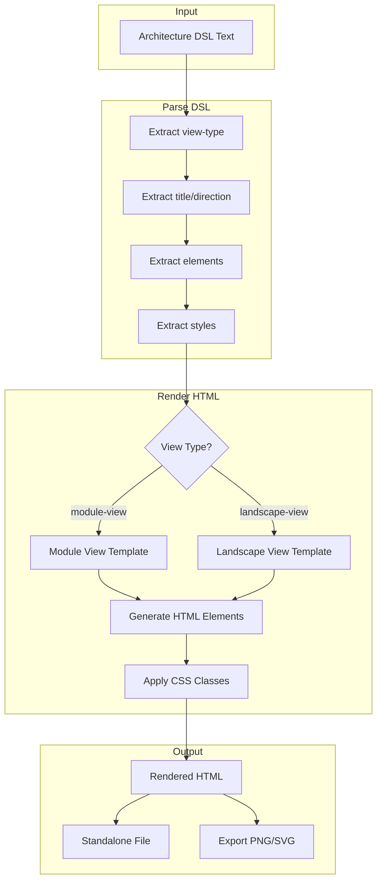
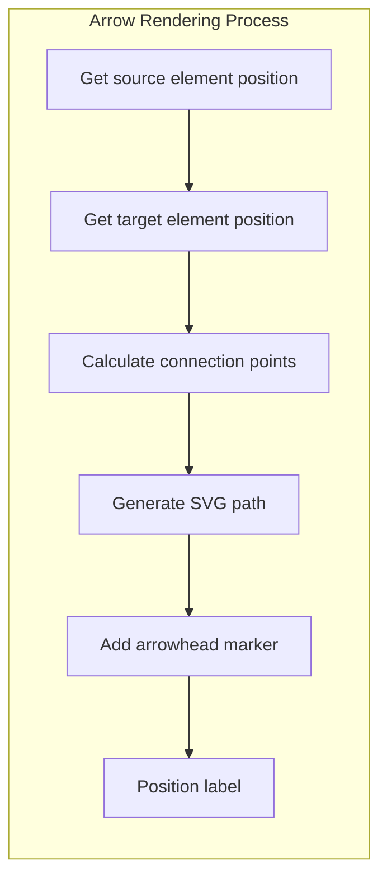

# Technical Design: Architecture Diagram Renderer

> Feature ID: FEATURE-016 | Version: v1.0 | Last Updated: 01-24-2026

## Version History

| Version | Date | Description |
|---------|------|-------------|
| v1.0 | 01-24-2026 | Initial design - tool skill for Architecture Diagram rendering |

---

## Part 1: Agent-Facing Summary

> **Purpose:** Quick reference for AI agents navigating large projects.
> **📌 AI Coders:** Focus on this section for implementation context.

### Scope & Boundaries

**In Scope:**
- Tool skill at `.github/skills/tool-architecture-draw/`
- HTML/CSS templates for rendering diagrams
- Rendering rules documentation
- Example rendered outputs
- Integration with `x-ipe-docs/config/tools.json`

**Out of Scope:**
- DSL grammar definition (handled by FEATURE-015)
- Interactive canvas editing
- Real-time collaboration
- PDF export (v1 focuses on PNG/SVG/HTML)

### Key Components Implemented

| Component | Responsibility | Scope/Impact | Tags |
|-----------|----------------|--------------|------|
| `SKILL.md` | Main skill definition with rendering workflow | Skill entry point | #skill #render #architecture |
| `templates/module-view.html` | HTML template for Module View diagrams | Rendering template | #template #module-view #html |
| `templates/landscape-view.html` | HTML template for Landscape View diagrams | Rendering template | #template #landscape-view #html |
| `templates/base-styles.css` | Shared CSS styles for all diagram types | Visual styling | #css #styles #shared |
| `references/rendering-rules.md` | Detailed rendering specifications | Implementation guide | #rules #reference #rendering |
| `examples/module-view-rendered.html` | Rendered Module View example | Learning reference | #example #module-view #output |
| `examples/landscape-view-rendered.html` | Rendered Landscape View example | Learning reference | #example #landscape-view #output |

### Dependencies

| Dependency | Source | Design Link | Usage Description |
|------------|--------|-------------|-------------------|
| `tool-architecture-dsl` | FEATURE-015 | [SKILL.md](../../.github/skills/tool-architecture-dsl/SKILL.md) | Provides DSL grammar for parsing input |
| `frontend-design` | Existing Skill | [SKILL.md](../../.github/skills/frontend-design/SKILL.md) | Reference for HTML rendering patterns |
| `x-ipe-docs/config/tools.json` | FEATURE-011 | [technical-design.md](../FEATURE-011/technical-design.md) | Tool toggle configuration |

### Major Flow

```
DSL Input → Parse DSL → Determine View Type → Select Template → Render HTML → Apply Styles → Output
```

1. **Parse DSL:** Agent receives DSL text → extracts view type, elements, styles
2. **Select Template:** Module View → `module-view.html`, Landscape View → `landscape-view.html`
3. **Render HTML:** Generate HTML elements for layers/zones/apps/components
4. **Apply Styles:** Apply flexbox properties, colors, spacing from DSL
5. **Output:** Return rendered HTML (inline or as file)

### Usage Example

```markdown
# In SKILL.md usage section:

## Rendering DSL to HTML

**Input DSL:**
```architecture-dsl
@startuml module-view
title "Simple API"

layer "API" as api {
  module "Controllers" {
    component "UserController"
    component "AuthController"
  }
}

@enduml
```

**Agent Output:**
```html
<div class="arch-diagram module-view">
  <h2 class="diagram-title">Simple API</h2>
  <div class="arch-layer">
    <div class="layer-label">API</div>
    <div class="layer-content">
      <div class="layer-title">API</div>
      <div class="modules-container jc-start">
        <div class="module-box">
          <div class="module-title">Controllers</div>
          <div class="components-container">
            <span class="component-badge">UserController</span>
            <span class="component-badge">AuthController</span>
          </div>
        </div>
      </div>
    </div>
  </div>
</div>
```
```

---

## Part 2: Implementation Guide

> **Purpose:** Human-readable details for developers.
> **📌 Emphasis on visual diagrams for comprehension.

### Workflow Diagram



### Skill Folder Structure

```
.github/skills/tool-architecture-draw/
├── SKILL.md                          # Main skill definition
├── templates/
│   ├── base-styles.css               # Shared CSS (colors, fonts, spacing)
│   ├── module-view.html              # Module View HTML template
│   └── landscape-view.html           # Landscape View HTML template  
├── references/
│   └── rendering-rules.md            # Detailed rendering specifications
└── examples/
    ├── module-view-rendered.html     # Complete rendered example
    └── landscape-view-rendered.html  # Complete rendered example
```

### Implementation Phases

#### Phase 1: Skill Structure Setup
1. Create skill folder at `.github/skills/tool-architecture-draw/`
2. Create `SKILL.md` with skill definition
3. Create folder structure (templates, references, examples)

#### Phase 2: CSS Styles (`templates/base-styles.css`)
1. Define CSS variables for colors, fonts, spacing
2. Create layout classes (layers, modules, zones)
3. Create flexbox utility classes (jc-*, ai-*, fd-*, gap-*)
4. Create component styles (badges, boxes, arrows)

#### Phase 3: Module View Template (`templates/module-view.html`)
1. Document HTML structure for layers
2. Document component badge markup
3. Document virtual-box container
4. Include style inheritance rules

#### Phase 4: Landscape View Template (`templates/landscape-view.html`)
1. Document HTML structure for zones
2. Document app box markup with status
3. Document database cylinder
4. Document SVG arrow patterns

#### Phase 5: Rendering Rules (`references/rendering-rules.md`)
1. DSL element → HTML mapping table
2. Style property → CSS class mapping
3. Error handling specifications
4. Export format details

#### Phase 6: Examples & Config
1. Create rendered Module View example
2. Create rendered Landscape View example
3. Register in `x-ipe-docs/config/tools.json`

### CSS Class Mapping

#### Flexbox Utility Classes

| DSL Style Property | CSS Class | CSS Value |
|-------------------|-----------|-----------|
| `justify-content: flex-start` | `.jc-start` | `justify-content: flex-start` |
| `justify-content: flex-end` | `.jc-end` | `justify-content: flex-end` |
| `justify-content: center` | `.jc-center` | `justify-content: center` |
| `justify-content: space-between` | `.jc-between` | `justify-content: space-between` |
| `justify-content: space-around` | `.jc-around` | `justify-content: space-around` |
| `justify-content: space-evenly` | `.jc-evenly` | `justify-content: space-evenly` |
| `align-items: flex-start` | `.ai-start` | `align-items: flex-start` |
| `align-items: flex-end` | `.ai-end` | `align-items: flex-end` |
| `align-items: center` | `.ai-center` | `align-items: center` |
| `align-items: stretch` | `.ai-stretch` | `align-items: stretch` |
| `flex-direction: row` | `.fd-row` | `flex-direction: row` |
| `flex-direction: column` | `.fd-column` | `flex-direction: column` |
| `text-align: left` | `.ta-left` | `text-align: left` |
| `text-align: center` | `.ta-center` | `text-align: center` |
| `text-align: right` | `.ta-right` | `text-align: right` |

#### Gap Classes

| DSL Gap Value | CSS Class | Notes |
|---------------|-----------|-------|
| `4px` - `6px` | `.gap-xs` | Extra small |
| `7px` - `10px` | `.gap-sm` | Small |
| `11px` - `14px` | `.gap-md` | Medium |
| `15px` - `20px` | `.gap-lg` | Large |
| `21px+` | `.gap-xl` | Extra large |

### HTML Element Mapping

#### Module View Elements

| DSL Element | HTML Output |
|-------------|-------------|
| `@startuml module-view` | `<div class="arch-diagram module-view">` |
| `title "X"` | `<h2 class="diagram-title">X</h2>` |
| `layer "X" as alias { }` | `<div class="arch-layer" data-alias="alias">` |
| `module "X" { }` | `<div class="module-box">` |
| `component "X"` | `<span class="component-badge">X</span>` |
| `component "X" <<Y>>` | `<span class="component-badge" data-stereotype="Y">X</span>` |
| `virtual-box { }` | `<div class="virtual-box">` |

#### Landscape View Elements

| DSL Element | HTML Output |
|-------------|-------------|
| `@startuml landscape-view` | `<div class="arch-diagram landscape-view">` |
| `zone "X" { }` | `<div class="zone-container"><h3>X</h3>...` |
| `app "X" as alias { }` | `<div class="app-box" data-alias="alias">` |
| `database "X" as alias` | `<div class="db-cylinder" data-alias="alias">` |
| `A --> B : "label"` | `<svg class="flow-arrow">...</svg>` |

### Color Specifications

```css
:root {
  /* Canvas */
  --canvas-bg: #ffffff;
  
  /* Layers */
  --layer-border: #1a1a1a;
  --layer-label-bg: #1a1a1a;
  --layer-label-text: #ffffff;
  
  /* Modules */
  --module-border: #999999;
  --module-title: #333333;
  
  /* Components */
  --component-bg: #1a1a1a;
  --component-text: #ffffff;
  
  /* Virtual Box */
  --vbox-border: #e0e7ff;
  --vbox-bg: rgba(224, 231, 255, 0.15);
  --vbox-label-bg: #e0e7ff;
  --vbox-label-text: #4338ca;
  
  /* Status Colors */
  --status-healthy: #22c55e;
  --status-warning: #f97316;
  --status-critical: #ef4444;
  
  /* Zones */
  --zone-border: #d1d5db;
  --zone-header-bg: #f3f4f6;
  
  /* Apps */
  --app-healthy-bg: #dcfce7;
  --app-warning-bg: #fef3c7;
  --app-critical-bg: #fee2e2;
  
  /* Arrows */
  --arrow-line: #6b7280;
  --arrow-label: #374151;
}
```

### Arrow Rendering (Landscape View)

For flow arrows between apps:



**SVG Arrow Template:**
```html
<svg class="flow-layer" style="position: absolute; inset: 0; pointer-events: none;">
  <defs>
    <marker id="arrowhead" markerWidth="10" markerHeight="7" 
            refX="9" refY="3.5" orient="auto">
      <polygon points="0 0, 10 3.5, 0 7" fill="#6b7280"/>
    </marker>
  </defs>
  <path d="M{x1},{y1} C{cx1},{cy1} {cx2},{cy2} {x2},{y2}" 
        stroke="#6b7280" stroke-width="2" fill="none"
        marker-end="url(#arrowhead)"/>
  <text x="{labelX}" y="{labelY}" class="flow-label">{label}</text>
</svg>
```

### Export Capabilities

| Format | Method | Notes |
|--------|--------|-------|
| PNG | `html2canvas` library | Rasterizes HTML to canvas, then exports |
| SVG | DOM serialization | Clone DOM, inline styles, serialize |
| HTML | Full document wrap | Add doctype, html, head with styles |
| Markdown | Original DSL | Wrap in ```architecture-dsl fence |

### Error Handling

| Error Type | Display |
|------------|---------|
| Invalid `@startuml` | Red overlay: "Invalid view type. Use 'module-view' or 'landscape-view'" |
| Missing `@enduml` | Red overlay: "DSL incomplete. Missing @enduml" |
| Unknown alias in flow | Red highlight on arrow, tooltip: "Unknown target: {alias}" |
| Invalid style property | Yellow warning, use default value |

### Config Integration

**File:** `x-ipe-docs/config/tools.json`

**Location:** `stages.ideation.ideation.tool-architecture-draw`

```json
{
  "stages": {
    "ideation": {
      "ideation": {
        "tool-architecture-dsl": true,
        "tool-architecture-draw": true
      }
    }
  }
}
```

---

## Design Change Log

| Date | Phase | Change Summary |
|------|-------|----------------|
| 01-24-2026 | Initial Design | Initial technical design created for Architecture Diagram Renderer skill. |
