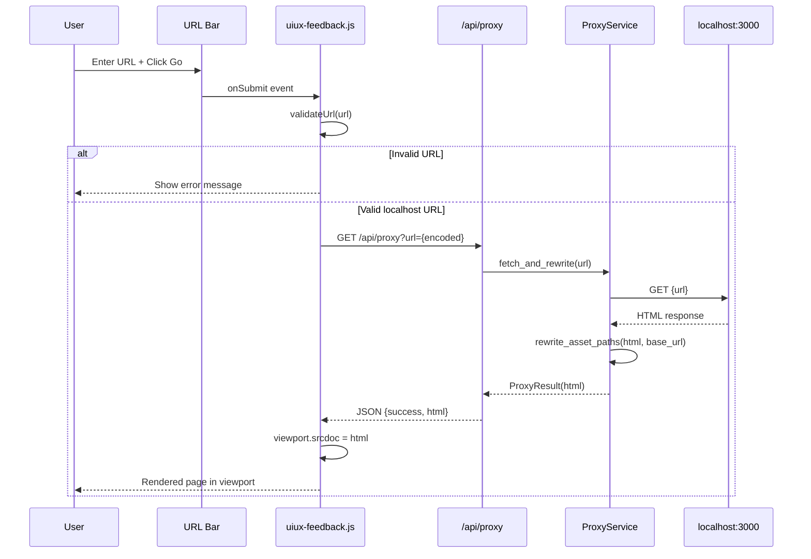
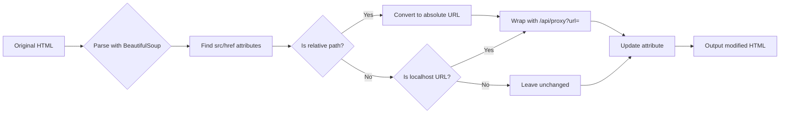

# Technical Design: Browser Simulator & Proxy

> Feature ID: FEATURE-022-A | Version: v1.0 | Last Updated: 01-28-2026

---

## Version History

| Version | Date | Description |
|---------|------|-------------|
| v1.0 | 01-28-2026 | Initial technical design |

---

## Part 1: Agent-Facing Summary

> **Purpose:** Quick reference for AI agents navigating large projects.
> **📌 AI Coders:** Focus on this section for implementation context.

### Technical Scope

- **[Backend]** - Localhost proxy service and API endpoint
- **[Frontend]** - Browser simulator UI with URL bar, toolbar, viewport
- **[Full Stack]** - Complete feature implementation

### Key Components Implemented

| Component | Responsibility | Scope/Impact | Tags |
|-----------|----------------|--------------|------|
| `ProxyService` | Localhost URL proxying and asset rewriting | Backend service | #proxy #backend #service |
| `proxy_routes.py` | `/api/proxy` endpoint | API layer | #api #routes #proxy |
| `uiux-feedbacks.html` | Browser simulator UI template | Frontend template | #frontend #template #uiux |
| `uiux-feedback.js` | Browser simulator JavaScript | Frontend logic | #frontend #javascript #simulator |
| `uiux-feedback.css` | Browser simulator styles | Frontend styles | #frontend #css #styles |

### Dependencies

| Dependency | Source | Design Link | Usage Description |
|------------|--------|-------------|-------------------|
| `FEATURE-008` | Workplace | [specification.md](../FEATURE-008/specification.md) | Sidebar submenu navigation structure |
| `base.html` | Templates | N/A | Base template with sidebar and top bar |
| `requests` | Python stdlib | N/A | HTTP client for proxy requests |
| `BeautifulSoup4` | External | N/A | HTML parsing for asset path rewriting |

### Major Flow

1. User enters localhost URL in URL bar → clicks "Go" or presses Enter
2. Frontend sends `GET /api/proxy?url={encoded_url}` to backend
3. `ProxyService` validates URL is localhost, fetches HTML from target
4. `ProxyService` rewrites relative asset paths to proxy URLs
5. Modified HTML returned to frontend
6. Frontend sets iframe `srcdoc` with proxied HTML
7. User sees rendered localhost page in viewport

### Usage Example

```python
# Backend ProxyService usage
from x_ipe.services import ProxyService

proxy = ProxyService()

# Proxy a localhost URL
result = proxy.fetch_and_rewrite("http://localhost:3000/dashboard")
# Returns: ProxyResult(success=True, html="<html>...</html>", content_type="text/html")

# Handle errors
result = proxy.fetch_and_rewrite("http://example.com")
# Returns: ProxyResult(success=False, error="Only localhost URLs supported")
```

```javascript
// Frontend browser simulator usage
const simulator = new BrowserSimulator('#viewport-container');

// Load a URL
simulator.loadUrl('http://localhost:3000');

// Refresh current page
simulator.refresh();

// Get current URL
const url = simulator.getCurrentUrl();
```

---

## Part 2: Implementation Guide

> **Purpose:** Human-readable details for developers.
> **📌 Emphasis on visual diagrams for comprehension.

### Workflow Diagram



### Asset Rewriting Flow



### Data Models

#### ProxyResult

```python
@dataclass
class ProxyResult:
    """Result from proxy fetch operation."""
    success: bool
    html: str = ""
    content_type: str = "text/html"
    error: str = ""
    status_code: int = 200
```

#### BrowserState (Frontend)

```javascript
const browserState = {
    currentUrl: string | null,
    isLoading: boolean,
    error: string | null,
    history: string[]  // Future enhancement
};
```

### API Specification

#### GET /api/proxy

**Purpose:** Proxy requests to localhost URLs and return modified HTML.

**Request:**
```
GET /api/proxy?url=http%3A%2F%2Flocalhost%3A3000%2Fdashboard
```

| Parameter | Type | Required | Description |
|-----------|------|----------|-------------|
| `url` | string | Yes | URL-encoded localhost URL |

**Response (Success):**
```json
{
    "success": true,
    "html": "<!DOCTYPE html>...",
    "content_type": "text/html"
}
```

**Response (Error - Invalid URL):**
```json
{
    "success": false,
    "error": "Only localhost URLs are supported"
}
```

**Response (Error - Connection Failed):**
```json
{
    "success": false,
    "error": "Cannot connect to localhost:3000. Is your dev server running?"
}
```

**Response (Error - Timeout):**
```json
{
    "success": false,
    "error": "Request timed out after 10 seconds"
}
```

### File Structure

```
src/x_ipe/
├── services/
│   ├── __init__.py              # Add ProxyService export
│   └── proxy_service.py         # NEW: ProxyService class (~150 lines)
├── routes/
│   ├── __init__.py              # Register proxy_bp
│   └── proxy_routes.py          # NEW: /api/proxy endpoint (~50 lines)
├── templates/
│   └── uiux-feedbacks.html      # UPDATE: Browser simulator UI
└── static/
    ├── js/
    │   └── uiux-feedback.js     # NEW: Browser simulator logic (~200 lines)
    └── css/
        └── uiux-feedback.css    # NEW: Browser simulator styles (~150 lines)
```

### Component Details

#### 1. ProxyService (`services/proxy_service.py`)

```python
"""
Proxy Service for FEATURE-022-A

Provides localhost URL proxying with asset path rewriting.
"""
import requests
from urllib.parse import urlparse, urljoin, quote
from bs4 import BeautifulSoup
from dataclasses import dataclass

ALLOWED_HOSTS = {'localhost', '127.0.0.1'}
PROXY_TIMEOUT = 10  # seconds
REWRITE_ATTRIBUTES = {
    'script': 'src',
    'link': 'href',
    'img': 'src',
    'a': 'href',
    'source': 'src',
    'video': 'src',
    'audio': 'src',
}

@dataclass
class ProxyResult:
    success: bool
    html: str = ""
    content_type: str = "text/html"
    error: str = ""
    status_code: int = 200


class ProxyService:
    """Service for proxying localhost URLs."""
    
    def validate_url(self, url: str) -> tuple[bool, str]:
        """Validate URL is localhost only."""
        try:
            parsed = urlparse(url)
            if parsed.hostname not in ALLOWED_HOSTS:
                return False, "Only localhost URLs are supported"
            if not parsed.scheme:
                return False, "URL must include protocol (http://)"
            return True, ""
        except Exception as e:
            return False, f"Invalid URL format: {str(e)}"
    
    def fetch_and_rewrite(self, url: str) -> ProxyResult:
        """Fetch URL and rewrite asset paths for proxy."""
        # Validate
        valid, error = self.validate_url(url)
        if not valid:
            return ProxyResult(success=False, error=error, status_code=400)
        
        # Fetch
        try:
            response = requests.get(url, timeout=PROXY_TIMEOUT)
            response.raise_for_status()
        except requests.exceptions.ConnectionError:
            return ProxyResult(
                success=False,
                error=f"Cannot connect to {url}. Is your dev server running?",
                status_code=502
            )
        except requests.exceptions.Timeout:
            return ProxyResult(
                success=False,
                error="Request timed out after 10 seconds",
                status_code=504
            )
        except requests.exceptions.HTTPError as e:
            return ProxyResult(
                success=False,
                error=f"HTTP error: {e.response.status_code}",
                status_code=e.response.status_code
            )
        
        content_type = response.headers.get('Content-Type', 'text/html')
        
        # Only rewrite HTML
        if 'text/html' in content_type:
            html = self._rewrite_html(response.text, url)
            return ProxyResult(success=True, html=html, content_type=content_type)
        else:
            # Return non-HTML content as-is
            return ProxyResult(
                success=True,
                html=response.text,
                content_type=content_type
            )
    
    def _rewrite_html(self, html: str, base_url: str) -> str:
        """Rewrite relative asset paths to proxy URLs."""
        soup = BeautifulSoup(html, 'html.parser')
        
        for tag, attr in REWRITE_ATTRIBUTES.items():
            for element in soup.find_all(tag):
                if element.get(attr):
                    element[attr] = self._rewrite_url(element[attr], base_url)
        
        # Handle inline CSS url() references in style tags
        for style in soup.find_all('style'):
            if style.string:
                style.string = self._rewrite_css_urls(style.string, base_url)
        
        # Strip CSP headers via meta tag
        for meta in soup.find_all('meta', attrs={'http-equiv': 'Content-Security-Policy'}):
            meta.decompose()
        
        return str(soup)
    
    def _rewrite_url(self, url: str, base_url: str) -> str:
        """Rewrite a single URL to proxy format."""
        if not url or url.startswith('data:') or url.startswith('#'):
            return url
        
        # Make absolute
        absolute_url = urljoin(base_url, url)
        parsed = urlparse(absolute_url)
        
        # Only proxy localhost URLs
        if parsed.hostname in ALLOWED_HOSTS:
            return f"/api/proxy?url={quote(absolute_url, safe='')}"
        
        return url  # External URLs unchanged
    
    def _rewrite_css_urls(self, css: str, base_url: str) -> str:
        """Rewrite url() references in CSS."""
        import re
        def replace_url(match):
            url = match.group(1).strip('\'"')
            rewritten = self._rewrite_url(url, base_url)
            return f"url('{rewritten}')"
        
        return re.sub(r'url\(([^)]+)\)', replace_url, css)
```

#### 2. Proxy Routes (`routes/proxy_routes.py`)

```python
"""
Proxy Routes Blueprint

FEATURE-022-A: Browser Simulator & Proxy

Provides localhost URL proxying endpoint.
"""
from flask import Blueprint, jsonify, request
from x_ipe.services import ProxyService

proxy_bp = Blueprint('proxy', __name__)


@proxy_bp.route('/api/proxy', methods=['GET'])
def proxy_url():
    """
    GET /api/proxy?url=<encoded_url>
    
    Proxy a localhost URL and return modified HTML.
    """
    url = request.args.get('url')
    
    if not url:
        return jsonify({
            'success': False,
            'error': 'URL parameter is required'
        }), 400
    
    service = ProxyService()
    result = service.fetch_and_rewrite(url)
    
    if result.success:
        return jsonify({
            'success': True,
            'html': result.html,
            'content_type': result.content_type
        })
    else:
        return jsonify({
            'success': False,
            'error': result.error
        }), result.status_code
```

#### 3. Frontend Template (`templates/uiux-feedbacks.html`)

Key UI structure from mockup:

```html


UI/UX Feedback - X-IPE


<link rel="stylesheet" href="{{ url_for('static', filename='css/uiux-feedback.css') }}">



<div class="uiux-app-container">
    <!-- 3-Column Layout -->
    <div class="uiux-layout">
        <!-- Left: Sidebar (from base.html) - handled by base -->
        
        <!-- Center: Browser Simulator -->
        <div class="browser-panel">
            <!-- Browser Chrome -->
            <div class="browser-chrome">
                <div class="browser-dots">
                    <span class="dot red"></span>
                    <span class="dot yellow"></span>
                    <span class="dot green"></span>
                </div>
                <div class="url-bar">
                    <input type="text" id="url-input" placeholder="http://localhost:3000" />
                    <button id="go-btn">Go</button>
                </div>
            </div>
            
            <!-- Toolbar -->
            <div class="browser-toolbar">
                <button id="refresh-btn" class="toolbar-btn">
                    <i class="bi bi-arrow-clockwise"></i> Refresh
                </button>
                <button class="toolbar-btn" disabled title="Coming in FEATURE-022-B">
                    <i class="bi bi-cursor"></i> Inspect
                </button>
                <div class="toolbar-divider"></div>
                <span class="toolbar-info" id="status-info">Ready</span>
            </div>
            
            <!-- Viewport -->
            <div class="browser-viewport">
                <iframe id="viewport-frame" sandbox="allow-scripts allow-same-origin"></iframe>
                <div id="viewport-error" class="viewport-error hidden"></div>
                <div id="viewport-loading" class="viewport-loading hidden">
                    <div class="spinner"></div>
                    <span>Loading...</span>
                </div>
            </div>
        </div>
        
        <!-- Right: Feedback Panel (Placeholder) -->
        <div class="feedback-panel">
            <div class="panel-header">
                <h3>Feedback</h3>
            </div>
            <div class="panel-placeholder">
                <i class="bi bi-chat-square-text"></i>
                <p>Feedback panel coming soon</p>
                <small>FEATURE-022-C & FEATURE-022-D</small>
            </div>
        </div>
    </div>
</div>



<script src="{{ url_for('static', filename='js/uiux-feedback.js') }}"></script>

```

#### 4. Frontend JavaScript (`static/js/uiux-feedback.js`)

```javascript
/**
 * Browser Simulator for FEATURE-022-A
 * 
 * Handles URL loading through proxy and viewport rendering.
 */
class BrowserSimulator {
    constructor() {
        this.urlInput = document.getElementById('url-input');
        this.goBtn = document.getElementById('go-btn');
        this.refreshBtn = document.getElementById('refresh-btn');
        this.viewportFrame = document.getElementById('viewport-frame');
        this.viewportError = document.getElementById('viewport-error');
        this.viewportLoading = document.getElementById('viewport-loading');
        this.statusInfo = document.getElementById('status-info');
        
        this.currentUrl = null;
        
        this.bindEvents();
    }
    
    bindEvents() {
        this.goBtn.addEventListener('click', () => this.loadUrl());
        this.urlInput.addEventListener('keypress', (e) => {
            if (e.key === 'Enter') this.loadUrl();
        });
        this.refreshBtn.addEventListener('click', () => this.refresh());
    }
    
    normalizeUrl(url) {
        url = url.trim();
        if (!url) return null;
        if (!url.startsWith('http://') && !url.startsWith('https://')) {
            url = 'http://' + url;
        }
        return url;
    }
    
    validateUrl(url) {
        try {
            const parsed = new URL(url);
            if (parsed.hostname !== 'localhost' && parsed.hostname !== '127.0.0.1') {
                return { valid: false, error: 'Only localhost URLs are supported' };
            }
            return { valid: true };
        } catch (e) {
            return { valid: false, error: 'Invalid URL format' };
        }
    }
    
    async loadUrl(url = null) {
        url = url || this.normalizeUrl(this.urlInput.value);
        if (!url) {
            this.showError('Please enter a URL');
            return;
        }
        
        const validation = this.validateUrl(url);
        if (!validation.valid) {
            this.showError(validation.error);
            return;
        }
        
        this.showLoading();
        this.currentUrl = url;
        
        try {
            const response = await fetch(`/api/proxy?url=${encodeURIComponent(url)}`);
            const data = await response.json();
            
            if (data.success) {
                this.renderPage(data.html);
                this.updateStatus('Loaded');
            } else {
                this.showError(data.error);
            }
        } catch (e) {
            this.showError('Failed to load page: ' + e.message);
        }
    }
    
    refresh() {
        if (this.currentUrl) {
            this.loadUrl(this.currentUrl);
        }
    }
    
    renderPage(html) {
        this.hideError();
        this.hideLoading();
        this.viewportFrame.srcdoc = html;
    }
    
    showLoading() {
        this.viewportLoading.classList.remove('hidden');
        this.viewportError.classList.add('hidden');
        this.updateStatus('Loading...');
    }
    
    hideLoading() {
        this.viewportLoading.classList.add('hidden');
    }
    
    showError(message) {
        this.hideLoading();
        this.viewportError.innerHTML = `
            <div class="error-icon">⚠️</div>
            <div class="error-title">Error</div>
            <div class="error-message">${message}</div>
            <button onclick="simulator.refresh()" class="retry-btn">Try Again</button>
        `;
        this.viewportError.classList.remove('hidden');
        this.updateStatus('Error');
    }
    
    hideError() {
        this.viewportError.classList.add('hidden');
    }
    
    updateStatus(text) {
        this.statusInfo.textContent = text;
    }
    
    getCurrentUrl() {
        return this.currentUrl;
    }
}

// Initialize on DOM ready
let simulator;
document.addEventListener('DOMContentLoaded', () => {
    simulator = new BrowserSimulator();
});
```

### Implementation Steps

1. **Backend Service Layer**
   - Create `services/proxy_service.py` with `ProxyService` class
   - Add `ProxyResult` dataclass
   - Implement URL validation, fetching, and HTML rewriting
   - Export in `services/__init__.py`

2. **Backend Routes Layer**
   - Create `routes/proxy_routes.py` with `proxy_bp` Blueprint
   - Implement `GET /api/proxy` endpoint
   - Register Blueprint in `app.py`

3. **Frontend Template**
   - Update `templates/uiux-feedbacks.html` with browser simulator layout
   - Add 3-column grid structure
   - Include browser chrome, toolbar, and viewport elements

4. **Frontend Styles**
   - Create `static/css/uiux-feedback.css`
   - Style browser chrome with traffic light dots
   - Style URL bar, toolbar, and viewport
   - Add loading and error state styles

5. **Frontend JavaScript**
   - Create `static/js/uiux-feedback.js`
   - Implement `BrowserSimulator` class
   - Handle URL input, validation, proxy requests
   - Manage viewport rendering and error states

6. **Integration**
   - Verify sidebar submenu navigation works (from FEATURE-008 v1.4)
   - Test with various localhost ports
   - Test error scenarios (server not running, timeout, invalid URL)

### Edge Cases & Error Handling

| Scenario | Detection | User Feedback |
|----------|-----------|---------------|
| Empty URL | `!url.trim()` | "Please enter a URL" |
| Non-localhost URL | URL hostname check | "Only localhost URLs are supported" |
| Server not running | `ConnectionError` | "Cannot connect to [url]. Is your dev server running?" |
| Timeout | `Timeout` exception | "Request timed out after 10 seconds" |
| Invalid port | URL parsing fails | "Invalid URL format" |
| HTML parse error | BeautifulSoup fallback | Return raw HTML without rewriting |
| Large page | No specific limit | May be slow, no error |

### Security Considerations

1. **Localhost-Only Restriction**
   - Strict host validation before any request
   - Whitelist: `localhost`, `127.0.0.1`
   - Reject internal network IPs (192.168.x.x, 10.x.x.x)

2. **CSP Handling**
   - Strip `Content-Security-Policy` meta tags
   - Required for injected scripts in future features
   - Acceptable for localhost-only usage

3. **No Credential Forwarding**
   - Proxy does NOT forward cookies
   - Proxy does NOT forward auth headers
   - Each request is isolated

4. **Sandbox Attribute**
   - iframe uses `sandbox="allow-scripts allow-same-origin"`
   - Allows JavaScript execution for page functionality
   - Restricts forms, popups, navigation

---

## Design Change Log

| Date | Phase | Change Summary |
|------|-------|----------------|
| 01-28-2026 | Initial Design | Initial technical design for Browser Simulator & Proxy (MVP). Designed ProxyService with URL validation and HTML rewriting, proxy_routes Blueprint, frontend BrowserSimulator class. |

---
