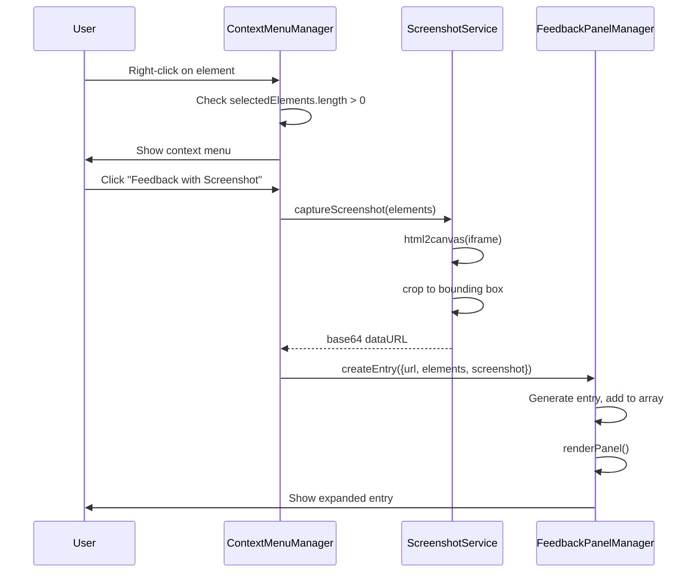
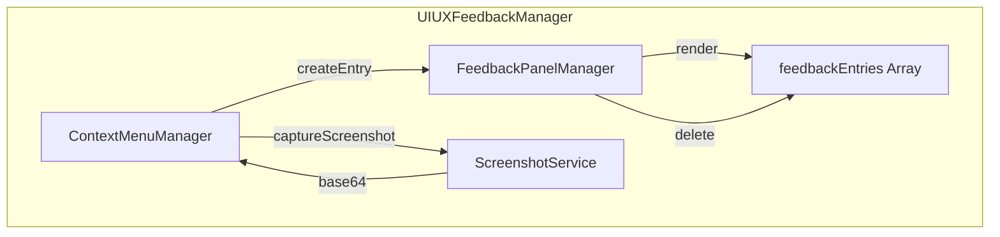

# Technical Design: Feedback Capture & Panel

> Feature ID: FEATURE-022-C | Version: v1.0 | Last Updated: 01-28-2026

---

## Part 1: Agent-Facing Summary

### Key Components Implemented

| Component | Responsibility | Scope/Impact | Tags |
|-----------|----------------|--------------|------|
| `ContextMenuManager` | Show/hide context menu on right-click | UIUXFeedbackManager extension | #contextmenu #ui |
| `ScreenshotService` | Capture element screenshot with html2canvas | Browser viewport | #screenshot #canvas |
| `FeedbackPanelManager` | Render feedback entries list | Right panel UI | #panel #entries |
| `FeedbackEntry` | Data model for feedback items | State management | #model #data |

### Dependencies

| Dependency | Source | Usage Description |
|------------|--------|-------------------|
| `UIUXFeedbackManager` | FEATURE-022-A | Parent manager class |
| `InspectorManager.selectedElements` | FEATURE-022-B | Get current element selection |
| `html2canvas` | CDN | Screenshot capture library |

### Scope & Boundaries

**In Scope:**
- Context menu on right-click
- Screenshot capture with html2canvas
- Feedback panel with expandable entries
- Entry CRUD (create, read, delete)

**Out of Scope:**
- Submission to backend (FEATURE-022-D)
- Persistence (localStorage, server)

### Major Flow

```
1. User selects element(s) via FEATURE-022-B
2. User right-clicks → ContextMenuManager shows menu
3. User clicks "Feedback with Screenshot"
   → ScreenshotService.capture(selectedElements)
   → FeedbackPanelManager.createEntry({url, elements, screenshot})
4. Entry appears in panel, expanded
5. User types description
6. User clicks Submit → triggers FEATURE-022-D
```

### Usage Example

```javascript
// Context menu selection
contextMenu.show(event, {
    items: [
        { label: 'Provide Feedback', action: () => createEntry(false) },
        { label: 'Feedback with Screenshot', action: () => createEntry(true) },
        { divider: true },
        { label: 'Copy Element Selector', action: () => copySelector() }
    ]
});

// Create entry
async function createEntry(withScreenshot) {
    const entry = {
        id: generateEntryId(),
        name: `Feedback-${formatTimestamp()}`,
        url: currentUrl,
        elements: [...selectedElements],
        screenshot: withScreenshot ? await captureScreenshot() : null,
        description: '',
        createdAt: Date.now()
    };
    feedbackEntries.push(entry);
    renderPanel();
}
```

---

## Part 2: Implementation Guide

### Workflow Diagram



### Data Models

#### FeedbackEntry

```typescript
interface FeedbackEntry {
    id: string;              // Unique ID (UUID or timestamp)
    name: string;            // "Feedback-YYYYMMDD-HHMMSS"
    url: string;             // Page URL when captured
    elements: string[];      // CSS selectors
    screenshot: string|null; // Base64 data URL or null
    screenshotDimensions: {width: number, height: number} | null;
    description: string;     // User-entered text
    createdAt: number;       // Unix timestamp
    status: 'draft'|'submitted'|'failed';
}
```

#### ContextMenuItem

```typescript
interface ContextMenuItem {
    label?: string;
    icon?: string;
    action?: () => void;
    divider?: boolean;
    highlighted?: boolean;
    disabled?: boolean;
}
```

### Component Architecture



### Implementation Steps

#### 1. Add html2canvas CDN

**File:** `src/x_ipe/templates/base.html`

```html
<!-- html2canvas for screenshot capture -->
<script src="https://cdn.jsdelivr.net/npm/html2canvas@1.4.1/dist/html2canvas.min.js"></script>
```

#### 2. Context Menu Manager

**File:** `src/x_ipe/static/js/uiux-feedback.js` (extend UIUXFeedbackManager)

```javascript
// Add to constructor
this.contextMenu = {
    visible: false,
    element: null
};
this.feedbackEntries = [];

// Context menu methods
_showContextMenu(event) {
    event.preventDefault();
    
    if (this.inspector.selectedElements.length === 0) {
        return; // No elements selected
    }
    
    const menu = this._getOrCreateContextMenu();
    menu.style.display = 'block';
    menu.style.left = `${event.clientX}px`;
    menu.style.top = `${event.clientY}px`;
    this.contextMenu.visible = true;
}

_hideContextMenu() {
    const menu = document.getElementById('context-menu');
    if (menu) {
        menu.style.display = 'none';
    }
    this.contextMenu.visible = false;
}

_getOrCreateContextMenu() {
    let menu = document.getElementById('context-menu');
    if (!menu) {
        menu = document.createElement('div');
        menu.id = 'context-menu';
        menu.className = 'context-menu';
        menu.innerHTML = `
            <div class="context-menu-item" data-action="feedback">
                <i class="bi bi-pencil-square"></i>
                <span>Provide Feedback</span>
            </div>
            <div class="context-menu-item highlight" data-action="screenshot">
                <i class="bi bi-camera"></i>
                <span>Feedback with Screenshot</span>
            </div>
            <div class="context-menu-divider"></div>
            <div class="context-menu-item" data-action="copy">
                <i class="bi bi-clipboard"></i>
                <span>Copy Element Selector</span>
            </div>
        `;
        document.body.appendChild(menu);
        
        menu.addEventListener('click', (e) => {
            const item = e.target.closest('.context-menu-item');
            if (item) {
                this._handleContextMenuAction(item.dataset.action);
            }
        });
    }
    return menu;
}

_handleContextMenuAction(action) {
    this._hideContextMenu();
    
    switch (action) {
        case 'feedback':
            this._createFeedbackEntry(false);
            break;
        case 'screenshot':
            this._createFeedbackEntry(true);
            break;
        case 'copy':
            this._copyElementSelector();
            break;
    }
}
```

#### 3. Screenshot Service

```javascript
async _captureScreenshot() {
    const iframe = this.elements.iframe;
    if (!iframe || !iframe.contentDocument) {
        return null;
    }
    
    try {
        // Calculate bounding box of all selected elements
        const rects = this.inspector.selectedElements.map(selector => {
            const el = iframe.contentDocument.querySelector(selector);
            return el ? el.getBoundingClientRect() : null;
        }).filter(r => r);
        
        if (rects.length === 0) return null;
        
        const bounds = this._getUnionBoundingBox(rects);
        
        // Capture iframe content
        const canvas = await html2canvas(iframe.contentDocument.body, {
            x: bounds.x,
            y: bounds.y,
            width: bounds.width,
            height: bounds.height,
            useCORS: true,
            logging: false
        });
        
        return {
            dataUrl: canvas.toDataURL('image/png'),
            width: bounds.width,
            height: bounds.height
        };
    } catch (e) {
        console.error('Screenshot capture failed:', e);
        return null;
    }
}

_getUnionBoundingBox(rects) {
    const left = Math.min(...rects.map(r => r.left));
    const top = Math.min(...rects.map(r => r.top));
    const right = Math.max(...rects.map(r => r.right));
    const bottom = Math.max(...rects.map(r => r.bottom));
    
    return {
        x: left,
        y: top,
        width: right - left,
        height: bottom - top
    };
}
```

#### 4. Feedback Entry Creation

```javascript
async _createFeedbackEntry(withScreenshot) {
    const now = new Date();
    const timestamp = now.toISOString().replace(/[-:T]/g, '').slice(0, 15);
    
    let screenshot = null;
    if (withScreenshot) {
        this.updateStatus('Capturing screenshot...');
        screenshot = await this._captureScreenshot();
    }
    
    const entry = {
        id: `entry-${Date.now()}`,
        name: `Feedback-${timestamp}`,
        url: this.state.currentUrl || 'Unknown URL',
        elements: [...this.inspector.selectedElements],
        screenshot: screenshot?.dataUrl || null,
        screenshotDimensions: screenshot ? { width: screenshot.width, height: screenshot.height } : null,
        description: '',
        createdAt: now.getTime(),
        status: 'draft'
    };
    
    this.feedbackEntries.unshift(entry); // Add to beginning
    this._renderFeedbackPanel();
    this._expandEntry(entry.id);
    this.updateStatus(withScreenshot ? 'Feedback entry created with screenshot' : 'Feedback entry created');
}
```

#### 5. Feedback Panel Rendering

```javascript
_renderFeedbackPanel() {
    const panel = document.getElementById('feedback-panel');
    if (!panel) return;
    
    const count = this.feedbackEntries.length;
    const badge = panel.querySelector('.panel-badge');
    if (badge) badge.textContent = count;
    
    const list = panel.querySelector('.feedback-list');
    if (!list) return;
    
    if (count === 0) {
        list.innerHTML = `
            <div class="empty-feedback">
                <i class="bi bi-chat-square-text"></i>
                <p>No feedback yet</p>
                <small>Right-click on selected elements to add feedback</small>
            </div>
        `;
        return;
    }
    
    list.innerHTML = this.feedbackEntries.map(entry => this._renderEntry(entry)).join('');
    this._bindEntryEvents();
}

_renderEntry(entry) {
    const isExpanded = this.expandedEntryId === entry.id;
    const timeAgo = this._formatTimeAgo(entry.createdAt);
    const elementsText = entry.elements.map(s => `&lt;${s}&gt;`).join(', ');
    
    return `
        <div class="feedback-entry ${isExpanded ? 'expanded' : ''}" data-entry-id="${entry.id}">
            <div class="feedback-entry-header">
                <div class="feedback-entry-title">
                    <i class="bi bi-chat-square-text"></i>
                    <div>
                        <div class="feedback-name">${entry.name}</div>
                        <div class="feedback-time">${timeAgo}</div>
                    </div>
                </div>
                <button class="feedback-delete" data-entry-id="${entry.id}">
                    <i class="bi bi-trash"></i>
                </button>
            </div>
            ${isExpanded ? `
            <div class="feedback-content">
                <div class="feedback-info">
                    <div class="feedback-info-row">
                        <span class="feedback-info-label">URL</span>
                        <span class="feedback-info-value">${entry.url}</span>
                    </div>
                    <div class="feedback-info-row">
                        <span class="feedback-info-label">Elements</span>
                        <span class="feedback-info-value">${elementsText}</span>
                    </div>
                </div>
                ${entry.screenshot ? `
                <div class="feedback-screenshot">
                    
                    <span class="screenshot-badge">${entry.screenshotDimensions.width} × ${entry.screenshotDimensions.height}</span>
                </div>
                ` : ''}
                <textarea class="feedback-textarea" data-entry-id="${entry.id}" 
                    placeholder="Enter your feedback here...">${entry.description}</textarea>
                <div class="feedback-actions">
                    <button class="submit-btn" data-entry-id="${entry.id}">
                        <i class="bi bi-send"></i>
                        Submit Feedback
                    </button>
                </div>
            </div>
            ` : ''}
        </div>
    `;
}
```

#### 6. CSS for Context Menu and Panel

**File:** `src/x_ipe/static/css/uiux-feedback.css` (extend)

```css
/* Context Menu */
.context-menu {
    position: fixed;
    background: white;
    border: 1px solid var(--uiux-slate-200);
    border-radius: 12px;
    box-shadow: 0 20px 25px -5px rgba(0,0,0,0.1), 0 8px 10px -6px rgba(0,0,0,0.1);
    min-width: 220px;
    z-index: 2000;
    display: none;
    overflow: hidden;
}

.context-menu-item {
    display: flex;
    align-items: center;
    gap: 12px;
    padding: 12px 16px;
    cursor: pointer;
    transition: background 0.15s;
}

.context-menu-item:hover {
    background: var(--uiux-slate-100);
}

.context-menu-item.highlight {
    background: #eff6ff;
    color: #3b82f6;
}

.context-menu-item.highlight:hover {
    background: #dbeafe;
}

.context-menu-divider {
    height: 1px;
    background: var(--uiux-slate-200);
    margin: 4px 0;
}

/* Feedback Panel */
.feedback-panel {
    width: 380px;
    background: white;
    border-left: 1px solid var(--uiux-slate-200);
    display: flex;
    flex-direction: column;
    height: 100%;
}

.feedback-entry {
    border-bottom: 1px solid var(--uiux-slate-200);
}

.feedback-entry.expanded {
    background: var(--uiux-slate-50);
}

.feedback-entry-header {
    display: flex;
    justify-content: space-between;
    align-items: center;
    padding: 12px 16px;
    cursor: pointer;
}

.feedback-content {
    padding: 0 16px 16px;
}

.feedback-textarea {
    width: 100%;
    min-height: 80px;
    border: 1px solid var(--uiux-slate-300);
    border-radius: 8px;
    padding: 12px;
    font-family: inherit;
    font-size: 13px;
    resize: vertical;
}

.screenshot-thumb {
    max-width: 100%;
    border-radius: 8px;
    border: 1px solid var(--uiux-slate-200);
}

.submit-btn {
    display: flex;
    align-items: center;
    gap: 8px;
    background: #10b981;
    color: white;
    border: none;
    padding: 10px 20px;
    border-radius: 8px;
    font-weight: 600;
    cursor: pointer;
    width: 100%;
    justify-content: center;
}

.submit-btn:hover {
    background: #059669;
}
```

### File Changes Summary

| File | Change Type | Description |
|------|-------------|-------------|
| `src/x_ipe/templates/base.html` | Modify | Add html2canvas CDN |
| `src/x_ipe/static/js/uiux-feedback.js` | Modify | Add ContextMenu, Screenshot, Panel managers |
| `src/x_ipe/static/css/uiux-feedback.css` | Modify | Add context menu and panel styles |
| `tests/test_feedback_panel.py` | Create | Frontend feedback panel tests |

---

## Design Change Log

| Date | Phase | Change Summary |
|------|-------|----------------|
| 01-28-2026 | Initial Design | Context menu, html2canvas screenshot, feedback panel with expandable entries |

---
