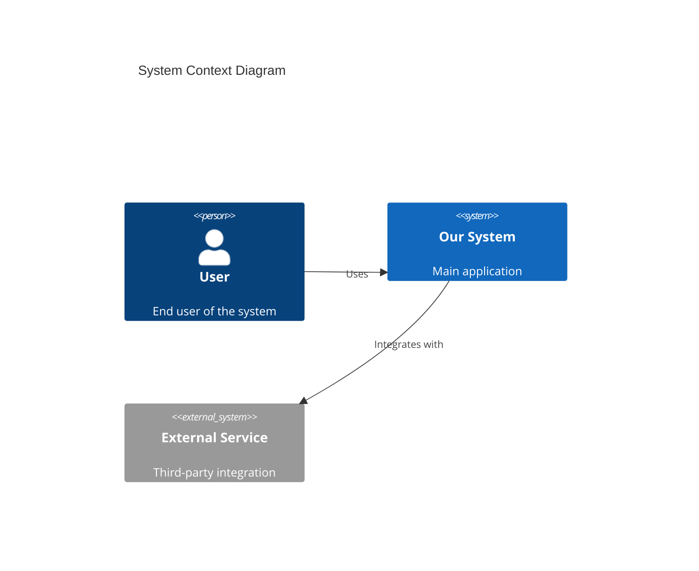
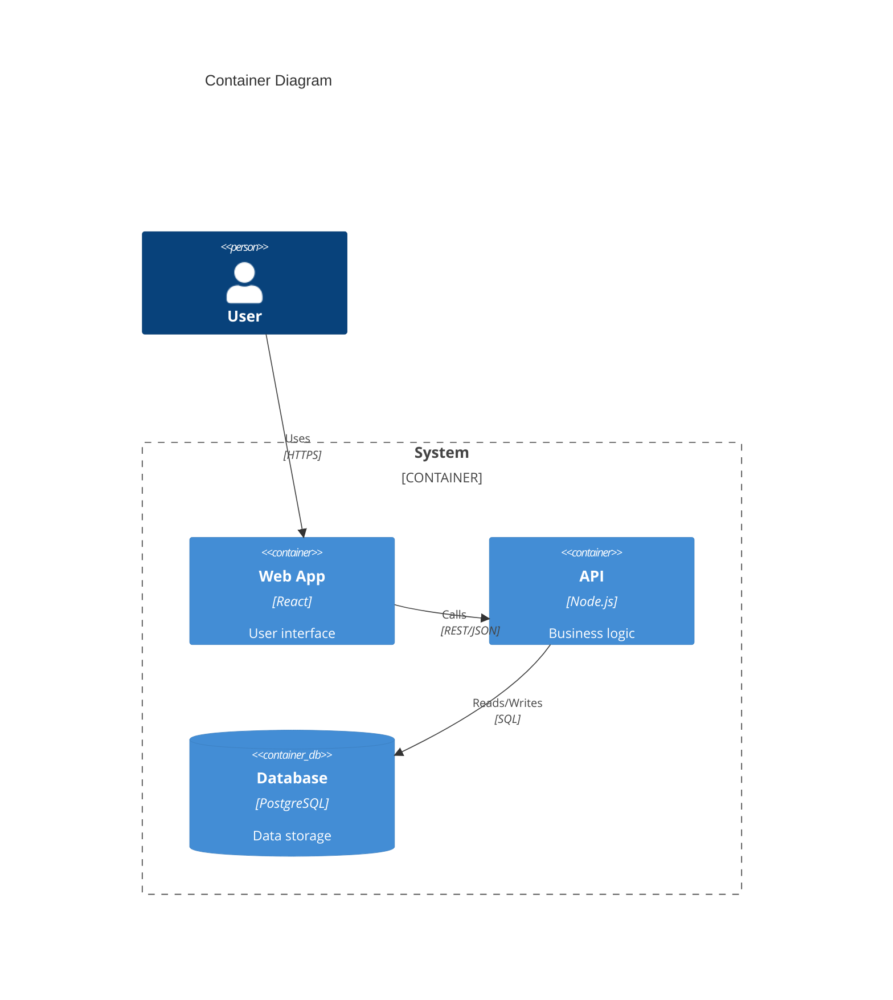
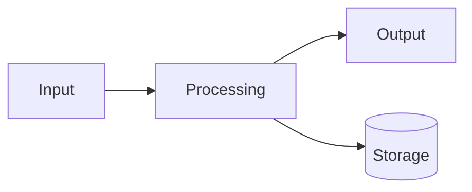
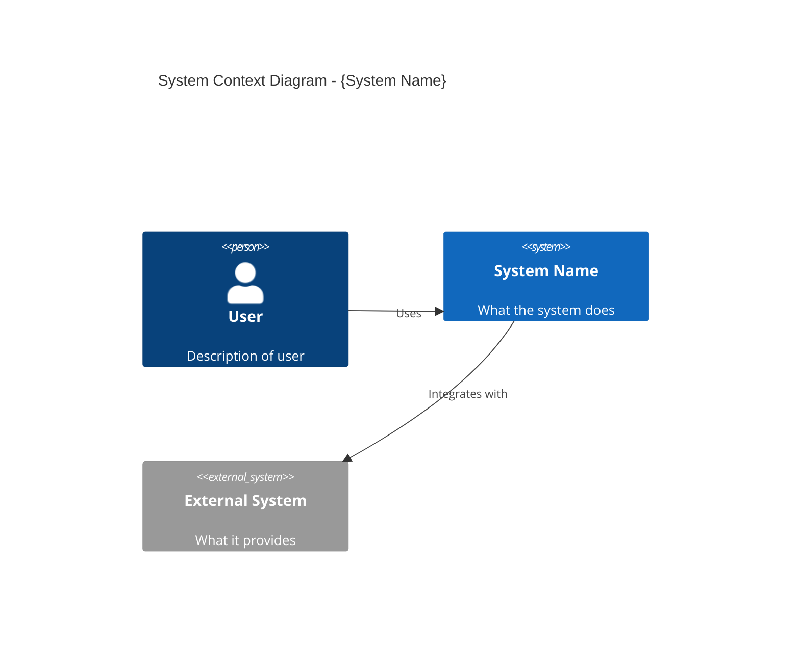
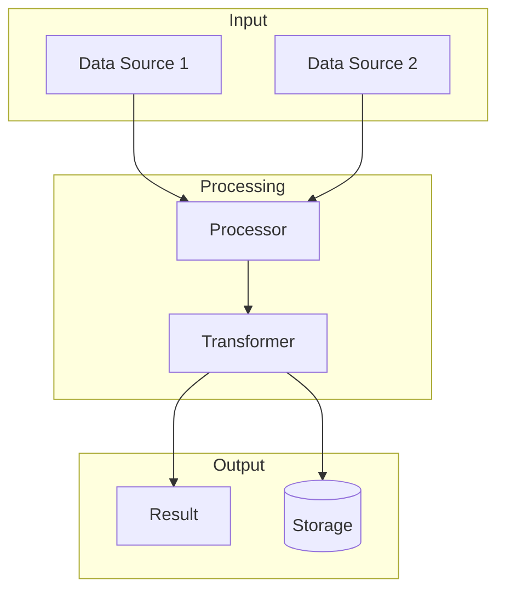
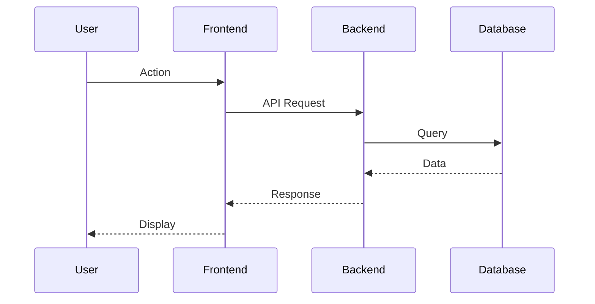

# Task Type: Idea to Architecture

## Purpose

Create architecture diagrams and system design visualizations for refined ideas by:
1. Reading the idea summary from ideation task
2. Loading architecture tools from `x-ipe-docs/config/tools.json` config
3. Creating architecture diagrams (system architecture, component diagrams, data flow)
4. Saving artifacts to the idea folder
5. Preparing for Requirement Gathering

---

## Important Notes

### Skill Prerequisite
- If you HAVE NOT learned `task-execution-guideline` and `task-board-management` skill, please learn them first before executing this skill.

**Important:** If Agent DO NOT have skill capability, can directly go to `.github/skills/` folder to learn skills. And SKILL.md file is the entry point to understand each skill.

### ⚠️ High-Level Architecture Focus

**When generating architecture diagrams, focus on system-level design:**

| Focus On | Ignore |
|----------|--------|
| System components and their relationships | Implementation details (code structure) |
| Data flow between components | UI/UX design elements |
| Integration points and APIs | Visual styling and colors |
| Technology stack overview | Database schema details |
| Scalability considerations | Specific library choices |
| Security boundaries | Deployment scripts |

**Rationale:** Architecture diagrams provide a bird's-eye view of the system, not implementation specifics. Detailed design comes later during Technical Design.

**Example:**
```
Idea mentions: "E-commerce platform with payment processing"

Architecture should show:
✓ Frontend, Backend, Database components
✓ Payment gateway integration
✓ User authentication service
✓ Data flow between services

Architecture should NOT include:
✗ React component hierarchy
✗ Database table definitions
✗ CSS styling decisions
```

---

## Task Type Default Attributes

| Attribute | Value |
|-----------|-------|
| Task Type | Idea to Architecture |
| Category | ideation-stage |
| Standalone | No |
| Next Task | Requirement Gathering |
| Auto-advance | No |
| Human Review | Yes |

---

## Task Type Required Input Attributes

| Attribute | Default Value | Description |
|-----------|---------------|-------------|
| Auto Proceed | False | Auto-advance to next task |
| Ideation Toolbox Meta | `{project_root}/x-ipe-docs/config/tools.json` | Config file for enabled tools |
| Current Idea Folder | N/A | **Required from context** - path to current idea folder (e.g., `x-ipe-docs/ideas/mobile-app-idea`) |
| Extra Instructions | N/A | Additional context or requirements for architecture diagram creation |

### Extra Instructions Attribute

**Purpose:** Provides additional context or requirements for the architecture diagram creation process.

**Source:** This value can be obtained from:
1. Human input (explicit instructions provided)
2. `x-ipe-docs/config/tools.json` → `stages.ideation.architecture._extra_instruction` field
3. Default: N/A (no extra instructions)

**Loading Logic:**
```
1. IF human provides explicit Extra Instructions:
   → Use human-provided value

2. ELSE IF x-ipe-docs/config/tools.json exists:
   a. Read stages.ideation.architecture._extra_instruction field
   b. IF field exists AND is not empty:
      → Use value from config
   c. ELSE:
      → Use default: N/A

3. IF Extra Instructions != N/A:
   → Apply these instructions when identifying architecture needs
   → Consider them when selecting diagram types
   → Factor them into system component identification
   → Reference them during diagram creation
```

**Usage:** When Extra Instructions are provided, the agent MUST incorporate them into the architecture creation workflow, particularly when identifying system components and creating diagram relationships.

### Current Idea Folder Attribute

**Source:** This value MUST be obtained from context:
- From previous Ideation task output (`idea_folder` field)
- From task board (associated idea folder)
- From human input if not available in context

**Validation:**
```
1. IF Current Idea Folder == N/A:
   → Ask human: "Which idea folder should I create architecture diagrams for?"
   → List available folders under x-ipe-docs/ideas/
   → Wait for human selection

2. IF Current Idea Folder provided:
   → Validate folder exists
   → Verify idea-summary-vN.md exists in folder
   → Proceed with architecture creation
```

**Usage:**
- All diagrams are saved to `{Current Idea Folder}/architecture/`
- Idea summary updates reference `{Current Idea Folder}/idea-summary-vN.md`
- Output links use `{Current Idea Folder}` as base path

### Ideation Toolbox Meta File

**Location:** `x-ipe-docs/config/tools.json` (relative to project root)

**Relevant Config Section:**
```json
{
  "version": "2.0",
  "stages": {
    "ideation": {
      "architecture": {
        "mermaid": true,
        "excalidraw": false
      }
    }
  }
}
```

**Tool Loading Rules:**

1. **File exists:** Load and parse the JSON configuration
2. **File missing:** Inform user architecture tools not configured, proceed with manual description
3. **Tool enabled (`true`):** Use the tool for diagram generation
4. **Tool disabled (`false`):** Skip the tool
5. **Tool unavailable:** Log limitation and provide alternative

---

## Definition of Ready (DoR)

| # | Checkpoint | Required |
|---|------------|----------|
| 1 | `Current Idea Folder` is set (not N/A) | Yes |
| 2 | Refined idea summary exists (`{Current Idea Folder}/idea-summary-vN.md`) | Yes |
| 3 | `x-ipe-docs/config/tools.json` accessible | Yes |
| 4 | At least one architecture tool enabled OR manual mode accepted | Yes |

---

## Execution Flow

Execute Idea to Architecture by following these steps in order:

| Step | Name | Action | Gate to Next |
|------|------|--------|--------------|
| 1 | Validate Folder | Verify Current Idea Folder exists | Folder validated |
| 2 | Load Config | Read `x-ipe-docs/config/tools.json` architecture section | Config loaded |
| 3 | Read Idea Summary | Load latest idea-summary-vN.md from folder | Summary loaded |
| 4 | Identify Architecture Needs | Extract system components from idea | Needs identified |
| 5 | Create Diagrams | Generate diagrams using enabled tools | Diagrams created |
| 6 | Save Artifacts | Store diagrams in `{Current Idea Folder}/architecture/` | Artifacts saved |
| 7 | Update Summary | Add diagram links to idea summary | Summary updated |
| 8 | Complete | Request human review and approval | Human approves |

**⛔ BLOCKING RULES:**
- Step 1: BLOCKED if Current Idea Folder is N/A → Ask human for folder path
- Step 5: BLOCKED if no architecture tools available AND human doesn't accept manual mode
- Step 8 → Human Review: Human MUST approve diagrams before proceeding

---

## Execution Procedure

### Step 1: Validate Current Idea Folder

**Action:** Verify the Current Idea Folder input and ensure it exists

```
1. Check if Current Idea Folder is set:
   IF Current Idea Folder == N/A:
     → List available folders under x-ipe-docs/ideas/
     → Ask human: "Which idea folder should I create architecture diagrams for?"
     → Options: [list of folders]
     → Wait for selection
     → Set Current Idea Folder = selected folder

2. Validate folder exists:
   IF folder does NOT exist:
     → Error: "Idea folder not found: {Current Idea Folder}"
     → STOP execution

3. Verify idea summary exists:
   IF no idea-summary-vN.md in folder:
     → Error: "No idea summary found. Run Ideation task first."
     → STOP execution

4. Log: "Working with idea folder: {Current Idea Folder}"
```

**Output:** Validated `Current Idea Folder` path

### Step 2: Load Architecture Tool Configuration

**Action:** Read and parse the architecture section from tools config

**Default Path:** `x-ipe-docs/config/tools.json`

```
1. Check if x-ipe-docs/config/tools.json exists
2. If exists:
   a. Parse JSON file
   b. Extract stages.ideation.architecture section configuration
   c. Identify enabled tools (value = true)
   d. Extract _extra_instruction from stages.ideation.architecture section (if exists)
3. If NOT exists:
   a. Inform user: "No architecture tools configured"
   b. Ask: "Proceed with manual architecture description? (Y/N)"
4. Load Extra Instructions:
   a. IF human provided explicit Extra Instructions → Use human value
   b. ELSE IF _extra_instruction field exists and is not empty → Use config value
   c. ELSE → Set Extra Instructions = N/A
5. Log active architecture tool configuration and Extra Instructions (if any)
```

**Architecture Tool Mapping:**

| Config Key | Tool/Capability | What It Creates |
|------------|-----------------|-----------------|
| `stages.ideation.architecture.mermaid` | Mermaid diagrams | Flowcharts, sequence diagrams, C4 diagrams |
| `stages.ideation.architecture.excalidraw` | Excalidraw integration | Hand-drawn style architecture diagrams |

**Output:** List of enabled architecture tools

### Step 3: Read Idea Summary

**Action:** Load the latest idea summary from Current Idea Folder

```
1. Navigate to {Current Idea Folder}/
2. Find latest idea-summary-vN.md (highest version number)
3. Parse the summary content
4. Extract:
   - Overview and description
   - Key Features list
   - Technical mentions (if any)
   - Integration requirements
   - Data/information flow
```

**Output:** Parsed idea summary with architecture-relevant sections

### Step 4: Identify Architecture Needs

**Action:** Analyze idea summary to determine what architecture diagrams to create

**Analysis Questions:**
```
1. Does the idea describe multiple system components?
   → If yes, identify components for system architecture diagram
   
2. Does the idea mention data processing or flow?
   → If yes, identify data flow diagram needs
   
3. Does the idea describe user interactions with multiple systems?
   → If yes, identify sequence diagram needs
   
4. Does the idea mention integrations or external services?
   → If yes, identify integration architecture needs
```

**Architecture Diagram Types to Consider:**

| Idea Contains | Diagram Type | Priority |
|---------------|--------------|----------|
| Multiple services/components | System Architecture (C4 Context/Container) | High |
| Data processing pipeline | Data Flow Diagram | High |
| User-system interactions | Sequence Diagram | Medium |
| External integrations | Integration Architecture | Medium |
| Microservices mentions | Component Diagram | Medium |
| Database mentions | Entity Relationship (high-level) | Low |

**Output:** Prioritized list of diagrams to create

### Step 5: Create Architecture Diagrams

**Action:** Generate diagrams using enabled architecture tools

**IF `stages.ideation.architecture.mermaid: true`:**

Generate Mermaid diagrams embedded in markdown files:

```markdown
# System Architecture

## Context Diagram (C4 Level 1)



## Container Diagram (C4 Level 2)



## Data Flow


```

**IF `stages.ideation.architecture.excalidraw: true`:**
```
1. Check Excalidraw integration availability
2. Create architecture diagram using Excalidraw
3. Export as .excalidraw file and/or PNG
4. Save to architecture folder
```

**IF no tools enabled (Manual Mode):**
```
1. Create detailed architecture description in markdown
2. Include text-based component listing
3. Document relationships and data flow
4. Save as architecture-description.md in {Current Idea Folder}/architecture/
```

**Output:** Generated diagram files

### Step 6: Save Artifacts

**Action:** Store all architecture artifacts in the Current Idea Folder

**Directory Structure:**
```
{Current Idea Folder}/
├── idea-summary-vN.md
├── architecture/
│   ├── system-architecture-v1.md    (mermaid diagrams in markdown)
│   ├── data-flow-v1.md              (data flow diagrams)
│   ├── sequence-v1.md               (sequence diagrams)
│   ├── architecture.excalidraw      (if excalidraw used)
│   └── architecture-description.md  (if manual mode)
└── files/
    └── (original idea files)
```

**Naming Convention:**
```
{diagram-type}-v{version}.{extension}

Examples:
- system-architecture-v1.md
- data-flow-v1.md
- sequence-v1.md
- integration-v1.md
```

**Output:** List of saved artifact paths (relative to Current Idea Folder)

### Step 7: Update Idea Summary

**Action:** Add architecture diagram references to the idea summary

**DO NOT modify existing idea-summary files.**
Instead, create a new version: `{Current Idea Folder}/idea-summary-v{N+1}.md`

**Add to Summary:**
```markdown
## Architecture Diagrams

| Diagram | Type | Path | Tool Used |
|---------|------|------|-----------|
| System Architecture | C4 Context/Container | architecture/system-architecture-v1.md | mermaid |
| Data Flow | Flowchart | architecture/data-flow-v1.md | mermaid |

### Viewing Instructions
- Open .md files to view mermaid diagrams (renders in most markdown viewers)
- Excalidraw files can be opened at excalidraw.com
```

**Output:** Updated idea summary version

---

## Definition of Done (DoD)

| # | Checkpoint | Required |
|---|------------|----------|
| 1 | `Current Idea Folder` validated and exists | Yes |
| 2 | `x-ipe-docs/config/tools.json` loaded and architecture section parsed | Yes |
| 3 | Idea summary read and analyzed | Yes |
| 4 | Architecture needs identified and prioritized | Yes |
| 5 | Diagrams created using enabled tools (or manual description) | Yes |
| 6 | Artifacts saved to `{Current Idea Folder}/architecture/` | Yes |
| 7 | New idea summary version created with diagram links | Yes |
| 8 | Human has reviewed and approved diagrams | Yes |

**Important:** After completing this skill, always return to `task-execution-guideline` skill to continue the task execution flow and validate the DoD defined there.

---

## Skill/Task Completion Output

This skill MUST return these attributes to the Task Data Model upon task completion:
```yaml
category: ideation-stage
task_type: Idea to Architecture
auto_proceed: {from input Auto Proceed}
idea_id: IDEA-XXX
current_idea_folder: {Current Idea Folder}   # e.g., x-ipe-docs/ideas/mobile-app-idea
architecture_tools_used:
  - mermaid
diagrams_created:
  - type: system-architecture
    path: {Current Idea Folder}/architecture/system-architecture-v1.md
  - type: data-flow
    path: {Current Idea Folder}/architecture/data-flow-v1.md
idea_summary_version: vN+1
next_task_type: Requirement Gathering
require_human_review: true
task_output_links:
  - {Current Idea Folder}/architecture/system-architecture-v1.md
  - {Current Idea Folder}/architecture/data-flow-v1.md
  - {Current Idea Folder}/idea-summary-v{N+1}.md
```

**Output Links:** All paths in `task_output_links` are clickable/viewable:
- Markdown files with mermaid render in most editors/viewers
- Idea summary is markdown viewable in editor

---

## Mermaid Diagram Templates

### System Architecture (C4 Context)



### Container Diagram (C4 Container)


### Data Flow Diagram



### Sequence Diagram



---

## Patterns

### Pattern: Microservices Architecture

**When:** Idea describes multiple independent services
**Then:**
```
1. Create C4 Context showing all services
2. Create Container diagram for each service
3. Show inter-service communication
4. Document API boundaries
5. Include message queue if async communication mentioned
```

### Pattern: Simple Web Application

**When:** Idea is a straightforward web app
**Then:**
```
1. Create simple 3-tier architecture (Frontend, Backend, Database)
2. Add external integrations if mentioned
3. Keep diagram minimal and clear
4. Focus on main data flows
```

### Pattern: Data Pipeline

**When:** Idea focuses on data processing
**Then:**
```
1. Create data flow diagram as primary
2. Show data sources, transformations, and destinations
3. Include storage components
4. Document data formats at each stage
```

### Pattern: No Technical Details in Idea

**When:** Idea summary lacks technical information
**Then:**
```
1. Ask clarifying questions about system needs
2. Suggest common architecture patterns
3. Create minimal viable architecture
4. Request feedback before expanding
```

---

## Anti-Patterns

| Anti-Pattern | Why Bad | Do Instead |
|--------------|---------|------------|
| Creating diagrams before reading idea | May miss requirements | Always analyze idea first |
| Ignoring x-ipe-docs/config/tools.json config | Inconsistent tool usage | Always check config |
| Too much detail in initial diagrams | Overwhelms review | Start with high-level, add detail if requested |
| Skipping human review | May create wrong architecture | Always get approval |
| Using disabled tools | Violates config rules | Only use enabled tools |
| Including implementation details | Architecture is high-level | Focus on components and relationships |
| Creating only one diagram type | May miss important views | Consider multiple perspectives |

---

## Example

See [references/examples.md](references/examples.md) for detailed execution examples including:
- Architecture with mermaid tool enabled
- Architecture without tools (manual mode)
- Missing idea folder (blocked scenario)
- No idea summary (blocked scenario)
