# Idea Summary

> Idea ID: IDEA-018
> Folder: 006. CR-Idea Folder Tree
> Version: v1
> Created: 2026-01-31
> Status: Refined

## Overview

Enhance the Ideas folder tree UX to support advanced file/folder management operations including drag-and-drop reorganization, detailed folder view panel, inline file actions, and search/filter functionality.

## Problem Statement

As the ideation page sees increased usage, the current folder tree UX becomes limiting:
- No way to reorganize files/folders without manual file operations
- Limited folder management capabilities
- No search/filter to find items quickly
- Preview section doesn't support full folder management

## Target Users

- X-IPE users managing multiple ideas and files
- Power users who need efficient folder organization
- Users with large idea collections needing search/filter

## Proposed Solution

Add three major enhancements to the Ideas folder tree:
1. **Drag-and-drop** for file/folder reorganization
2. **Detailed folder view** replacing preview panel with full management interface
3. **Search bar** for filtering tree items

## Key Features

### Design Changes from Current UI

| Current UI Element | Change | Reason |
|-------------------|--------|--------|
| Remove icon on folder tree | **Remove** | Folder deletion now available in detailed folder view |
| Overall ideation page styling | **Upgrade** to match mockup aesthetics | Consistency and improved UX |

### Key Features

### Feature Overview

```mermaid
flowchart TB
    subgraph Tree["Folder Tree Panel"]
        Search["🔍 Search Bar"]
        Tree1["📁 Folder 1"]
        Tree2["📁 Folder 2"]
        Pin["📌 Pin Button"]
    end
    
    subgraph Actions["File/Folder Actions"]
        Rename["✏️ Rename"]
        Delete["🗑️ Delete"]
        Duplicate["📋 Duplicate"]
        Download["⬇️ Download"]
        DragDrop["↔️ Drag to Move"]
    end
    
    subgraph FolderView["Detailed Folder View Panel"]
        PathBar["📂 Folder Path Bar"]
        ActionBar["+ File | + Folder | ⚙️ Actions"]
        Contents["Files & Subfolders List"]
    end
    
    Tree1 -->|"Click >"| FolderView
    Tree2 -->|"Click file"| Preview["File Preview"]
    FolderView --> Actions
```

### 1. Drag-and-Drop Reorganization

| Aspect | Behavior |
|--------|----------|
| Selection | Single item only (simpler, less error-prone) |
| Visual feedback | Drop target highlights on hover |
| Invalid action | Red border + shake animation (e.g., folder into itself) |
| Confirmation | None for move (non-destructive) |

### 2. Folder View Panel

**Entry Point:** Click ">" icon on right side of folder row in tree

**Panel Components:**
| Component | Location | Description |
|-----------|----------|-------------|
| Path Bar | Top | Shows full folder path (breadcrumb style) |
| Action Bar | Top-right | Add file, Add folder, Rename, Delete folder |
| Contents List | Body | Files and subfolders with inline actions |

**Navigation Behavior:**
- Click ">" on folder → Opens folder view (replaces preview)
- Click file in tree → Returns to file preview
- Click another folder ">" → Refreshes folder view with new folder

**Subfolder Handling:**
- Expand in place (nested list below folder)
- No separate navigation, just expandable hierarchy

### 3. Search/Filter Bar

| Aspect | Behavior |
|--------|----------|
| Location | Next to Pin button in tree header |
| Filter logic | Show matching items + their parent folders for context |
| Match scope | Both files and folders |
| Clear | X button or empty input restores full tree |

```mermaid
flowchart LR
    Input["User types 'design'"] --> Filter["Filter Engine"]
    Filter --> Result1["📁 Project A/"]
    Filter --> Result2["   └─ 📄 design-spec.md"]
    Filter --> Result3["📁 Ideas/"]
    Filter --> Result4["   └─ 📁 Design Concepts/"]
```

### 4. File Actions (in Folder View)

Each file/folder row shows action icons on hover:

| Action | Icon | Behavior |
|--------|------|----------|
| Rename | ✏️ | Inline text edit |
| Delete | 🗑️ | Confirmation dialog required |
| Duplicate | 📋 | Creates copy with "-copy" suffix |
| Download | ⬇️ | Browser download for files |
| Drag handle | ⋮⋮ | Drag to move (same as tree drag) |

### 5. Confirmation Dialogs

All destructive actions require confirmation:
- Delete file → "Delete 'filename'? This cannot be undone."
- Delete folder → "Delete 'folder' and all contents? This cannot be undone."

## Success Criteria

- [ ] Files can be dragged between folders with visual feedback
- [ ] Invalid drag operations show red border + shake
- [ ] ">" icon opens detailed folder view panel
- [ ] Folder view shows path bar and action toolbar
- [ ] Files in folder view have rename, delete, duplicate, download actions
- [ ] Subfolders expand in place within folder view
- [ ] Search bar filters tree showing matching items with parent context
- [ ] Delete actions show confirmation dialog
- [ ] Clicking file returns to preview mode, clicking folder ">" refreshes folder view

## Constraints & Considerations

- **Performance:** Large folder structures may need lazy loading
- **Drag precision:** Need clear drop target indicators for nested folders
- **Mobile:** Touch drag-and-drop needs special handling
- **Accessibility:** Keyboard navigation for all actions

## Brainstorming Notes

Key decisions made during ideation:
1. Single-item drag only to reduce complexity and errors
2. Explicit icon-based actions (no context menus) for efficiency
3. Folder view persists until file click - not modal-like
4. Search shows parent folders for context, not just flat results
5. All destructive actions need confirmation dialog

## Ideation Artifacts

- [Mockup v1](./mockup-v1.html) - Interactive HTML prototype showing:
  - Folder tree with search bar and ">" icons
  - Detailed folder view panel with breadcrumb and actions
  - File/folder list with hover actions (rename, delete, duplicate, download)
  - Drag-and-drop interactions with visual feedback
  - Delete confirmation dialog

## Source Files

- new idea.md

## Next Steps

- [ ] Proceed to Requirement Gathering
  - Change Request to existing FEATURE-008 (Ideation Workspace)
  - Scope: Upgrade entire ideation page UI based on mockup
  - Remove: Folder tree remove icon
  - Add: Search, Drag-drop, Folder View Panel

## References & Common Principles

### Applied Principles

- **Fitts's Law:** Action icons visible on hover reduce movement distance
- **Progressive Disclosure:** Detailed folder view only shown when needed
- **Feedback Principle:** Visual feedback for all drag operations (valid/invalid)
- **Confirmation for Destructive Actions:** Prevent accidental data loss

### Related Patterns

- File explorer patterns (Finder, Windows Explorer)
- IDE project tree (VS Code, IntelliJ)
- Cloud storage UX (Google Drive, Dropbox)
