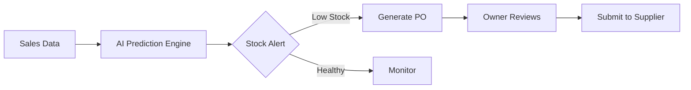
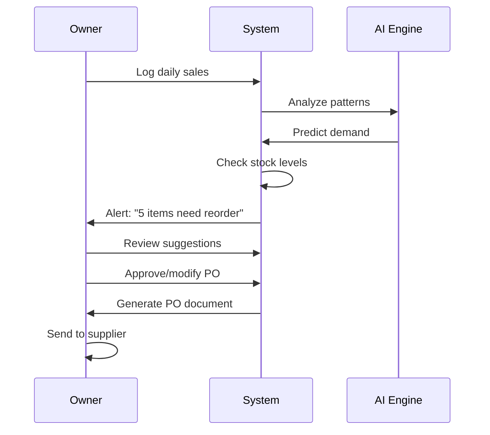

# Idea Summary

> Idea ID: IDEA-014
> Folder: Sample - Replishment system
> Version: v1
> Created: 2026-01-26
> Status: Refined

## Overview

A **Smart Product Replenishment System** designed for boutique store owners/managers that uses AI-powered demand prediction to automatically generate purchase orders when inventory needs restocking. The system provides real-time inventory visibility and eliminates manual stock monitoring.

## Problem Statement

Boutique store owners face challenges with:
- **Stockouts:** Missing sales opportunities due to empty shelves
- **Overstocking:** Capital tied up in slow-moving inventory
- **Manual Monitoring:** Time-consuming inventory checks and guesswork ordering
- **Reactive Ordering:** Only reordering after problems occur, not before

## Target Users

**Primary:** Boutique store owners and managers who:
- Manage inventory for small to medium retail stores
- Want to reduce time spent on manual stock checks
- Need smarter ordering decisions without hiring inventory specialists
- Prefer web-based tools accessible from desktop/laptop

## Proposed Solution

A web-based application that:
1. **Tracks Inventory** in real-time
2. **Predicts Demand** using AI/ML based on sales history, seasonality, and trends
3. **Generates Smart Alerts** when products need reordering (before stockout)
4. **Creates Purchase Orders** automatically for manual review and submission



## Key Features

```infographic
list-grid-badge-card
data
  title Core Features
  lists
    - label Smart Inventory Dashboard
      desc Real-time view of all products, stock levels, and health indicators
      icon dashboard
    - label AI Demand Forecasting
      desc Predicts future demand based on sales history and seasonal trends
      icon brain
    - label Auto-Replenishment Alerts
      desc Proactive notifications before stockouts occur
      icon bell alert
    - label Purchase Order Generator
      desc Automatically creates optimized orders for review
      icon document check
    - label Product Catalog Management
      desc Organize products with categories, suppliers, and reorder settings
      icon archive
    - label Analytics & Reports
      desc Insights on inventory turnover, forecast accuracy, and savings
      icon chart line
```

## System Architecture

```architecture-dsl
@startuml module-view
title "Replenishment System Architecture"
theme "theme-default"
direction top-to-bottom
grid 12 x 8

layer "Presentation Layer" {
  color "#dbeafe"
  border-color "#3b82f6"
  rows 2
  module "Web Application" {
    cols 12
    rows 2
    grid 3 x 1
    component "Dashboard" { cols 1, rows 1 }
    component "Inventory" { cols 1, rows 1 }
    component "Orders" { cols 1, rows 1 }
  }
}

layer "Business Logic Layer" {
  color "#dcfce7"
  border-color "#22c55e"
  rows 3
  module "Core Services" {
    cols 8
    rows 3
    grid 2 x 2
    component "Inventory Service" { cols 1, rows 1 }
    component "Prediction Engine" { cols 1, rows 1 }
    component "Alert Service" { cols 1, rows 1 }
    component "Order Service" { cols 1, rows 1 }
  }
  module "AI Module" {
    cols 4
    rows 3
    grid 1 x 2
    component "Demand Forecasting" { cols 1, rows 1 }
    component "Trend Analysis" { cols 1, rows 1 }
  }
}

layer "Data Layer" {
  color "#fef3c7"
  border-color "#f59e0b"
  rows 2
  module "Storage" {
    cols 12
    rows 2
    grid 3 x 1
    component "Product DB" { cols 1, rows 1 }
    component "Sales History" { cols 1, rows 1 }
    component "Orders DB" { cols 1, rows 1 }
  }
}

@enduml
```

## User Workflow



## Success Criteria

- [ ] Reduce stockouts by 70% compared to manual monitoring
- [ ] Save 5+ hours/week on inventory management tasks
- [ ] Achieve 85%+ forecast accuracy within 3 months of use
- [ ] Generate actionable purchase orders with minimal manual editing
- [ ] Support 500+ SKUs per store

## Constraints & Considerations

- **Standalone System:** No external integrations in v1 (manual data entry)
- **Web Only:** Desktop/laptop browser access (no mobile app initially)
- **Owner-Only Access:** Single user role (no staff permissions)
- **Manual Ordering:** System generates POs, but owner manually contacts suppliers
- **Brand Theme:** Must use configured brand theme for consistent visual identity

## MVP Feature Scope

```infographic
sequence-funnel-simple
data
  title MVP Roadmap
  sequences
    - label Phase 1: Foundation
      desc Product catalog, manual stock entry, basic dashboard
    - label Phase 2: Intelligence
      desc Sales tracking, demand forecasting, reorder alerts
    - label Phase 3: Automation
      desc Auto PO generation, analytics, export features
```

## Brainstorming Notes

### Key Decisions Made
1. **AI-Powered Prediction** chosen over simple thresholds for smarter ordering
2. **Internal PO Generation** keeps v1 simple without supplier API complexity
3. **Web-Only Platform** prioritizes desktop workflow for boutique managers
4. **Owner-Only Access** simplifies auth and permissions for v1

### Future Enhancements (Post-MVP)
- Supplier portal integration for direct ordering
- Mobile app for on-the-go inventory checks
- Multi-store support
- Barcode scanning for faster data entry
- Integration with POS systems

## Source Files

- new idea.md (original idea input)

## Next Steps

- [ ] Proceed to **Idea Mockup** (create UI wireframes for key screens)
- [ ] Or proceed to **Idea to Architecture** (detailed technical architecture)

## References & Common Principles

### Applied Principles

- **Demand Forecasting:** Use sales data, seasonality, and trends to predict future needs
- **Reorder Point Calculation:** Dynamic triggers based on lead time and sales velocity  
- **Safety Stock:** Buffer inventory to handle demand variability
- **ABC Analysis:** Prioritize fast-moving/high-margin SKUs
- **Real-Time Visibility:** Instant access to current stock levels

### Further Reading

- [ShipBob - Inventory Replenishment Best Practices](https://www.shipbob.com/blog/inventory-replenishment/)
- [Exotec - Replenishment Methods & Best Practices](https://www.exotec.com/insights/what-is-inventory-replenishment-methods-best-practices/)
- [Leafio - Inventory Replenishment Guide](https://www.leafio.ai/blog/inventory-replenishment-system-explanation-definition-and-methods/)
