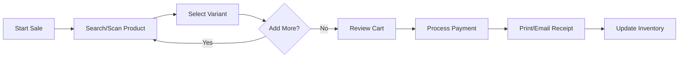

# Idea Summary

> Idea ID: IDEA-013
> Folder: Sample
> Version: v1
> Created: 2026-01-26
> Status: Refined

## Overview

A **web-based Point of Sale (POS) application** designed specifically for **clothing/apparel boutique stores**. The system targets single store owner-operators who need a simple, effective way to manage daily sales, track inventory (sizes, colors, styles), and generate basic business reports with integrated card payment processing.

## Problem Statement

Small boutique clothing store owners often struggle with:
- Managing inventory across multiple variants (size, color, style)
- Processing payments efficiently without expensive enterprise solutions
- Tracking sales performance and making data-driven decisions
- Finding affordable POS solutions tailored to boutique retail needs

## Target Users

- **Primary:** Single-store boutique clothing shop owners/operators
- **Secondary:** Small retail staff managing daily checkout operations

## Proposed Solution

A lightweight, web-based POS application that runs in any modern browser, offering:
- Fast checkout with variant-aware product management
- Real-time inventory tracking for clothing items
- Integrated Stripe/Square payment processing
- Simple sales reports and dashboards

## Key Features (V1 - Basic Scope)

```infographic
infographic list-grid-badge-card
data
  title Core Features for V1
  desc Essential functionality for boutique clothing sales
  lists
    - label Quick Checkout
      desc Fast product lookup, variant selection (size/color), and sale completion
      icon cart shopping
    - label Inventory Management
      desc Track stock levels by SKU, size, color with low-stock alerts
      icon archive box
    - label Payment Processing
      desc Integrated Stripe/Square for card payments, cash tracking
      icon credit card
    - label Sales Reports
      desc Daily/weekly/monthly sales summaries and top products
      icon chart line
```

## User Workflow



## System Architecture (High-Level)

```architecture-dsl
@startuml module-view
title "Boutique POS Architecture"
theme "theme-default"
direction top-to-bottom
grid 12 x 6

layer "Presentation" {
  color "#fce7f3"
  border-color "#ec4899"
  rows 2
  module "Web App" { cols 12, rows 2, grid 2 x 1, component "Checkout UI" { cols 1, rows 1 }, component "Admin Dashboard" { cols 1, rows 1 } }
}

layer "Business Logic" {
  color "#dbeafe"
  border-color "#3b82f6"
  rows 2
  module "API Services" { cols 12, rows 2, grid 4 x 1, component "Sales API" { cols 1, rows 1 }, component "Inventory API" { cols 1, rows 1 }, component "Payment API" { cols 1, rows 1 }, component "Reports API" { cols 1, rows 1 } }
}

layer "Data & External" {
  color "#dcfce7"
  border-color "#22c55e"
  rows 2
  module "Storage & Services" { cols 12, rows 2, grid 3 x 1, component "Database" { cols 1, rows 1 }, component "Stripe/Square" { cols 1, rows 1 }, component "Receipt Service" { cols 1, rows 1 } }
}

@enduml
```

## Success Criteria

- [ ] Complete a checkout in under 30 seconds
- [ ] Accurate real-time inventory counts
- [ ] Successful payment processing with receipts
- [ ] Daily sales summary available instantly
- [ ] System accessible from tablet/desktop browsers

## Constraints & Considerations

- **V1 Scope:** Single store only (no multi-location)
- **Online Sales:** In-store only (no e-commerce sync for V1)
- **Payment Provider:** Start with Stripe for simplicity
- **Tech Stack:** Web-based (browser) accessible from any device

## Brainstorming Notes

**From Brainstorming Session:**
- Platform: Web-based (browser) for accessibility
- Product Type: Clothing/Apparel with variant management (sizes, colors, styles)
- Business Size: Single store owner/operator
- Feature Scope: Basic (checkout, inventory, reports)
- Payments: Integrated card payments (Stripe/Square)

**Key Insight:** User wants to move quickly - prefers action over extensive planning. Suggest iterative development approach.

## Source Files

- `new idea.md` - Original idea description

## Implementation Roadmap (Suggested)

```infographic
infographic sequence-roadmap-vertical-simple
data
  title Implementation Steps
  desc Suggested development phases
  sequences
    - label Phase 1: Foundation
      desc Set up project, database schema, basic UI framework
      icon foundation
    - label Phase 2: Product Management
      desc Build inventory module with variant support
      icon box
    - label Phase 3: Checkout System
      desc Implement cart and checkout flow
      icon cart
    - label Phase 4: Payment Integration
      desc Connect Stripe/Square for payments
      icon credit card
    - label Phase 5: Reports & Dashboard
      desc Add sales reporting and analytics
      icon chart bar
    - label Phase 6: Polish & Launch
      desc Testing, UI refinements, deployment
      icon rocket
```

## Next Steps

- [ ] **Proceed to Idea Mockup** - Create UI/UX mockups for the checkout and admin screens
- [ ] OR **Proceed to Idea to Architecture** - Detail system architecture and technical design

## References & Common Principles

### Applied POS Best Practices

| Principle | Description | Source |
|-----------|-------------|--------|
| **User-Friendly Interface** | Clean UI, quick navigation, role-based workflows | [Hashmato](https://hashmato.com/point-of-sale-system-design-principles-tactics/) |
| **Real-Time Inventory** | Instant stock updates, low-stock alerts | [Final POS](https://finalpos.com/implementing-a-pos-system-for-retail-stores-a-step-by-step-guide/) |
| **PCI-DSS Compliance** | Secure payment handling, end-to-end encryption | [Tidal Commerce](https://www.tidalcommerce.com/learn/best-practices-for-pos-in-retail-from-data-security-to-customer-loyalty) |
| **Cloud-Native Architecture** | Scalable, accessible from any device | [SPD Technology](https://spd.tech/fintech-development/the-detailed-guide-to-pos-point-of-sale-software-development/) |
| **Offline Support** | Works with limited connectivity, syncs when online | [ConnectPOS](https://www.connectpos.com/how-to-build-a-pos-system/) |

### Further Reading

- [How To Build A POS System](https://www.connectpos.com/how-to-build-a-pos-system/) - Step-by-step guideline
- [POS Software Architecture Guide](https://www.retailgear.com/pos-software-architecture) - Technical architecture patterns
- [Retail POS Implementation Tips](https://multidev.com/blog/all-in-one-retail-pos-systems/) - Features and benefits overview
