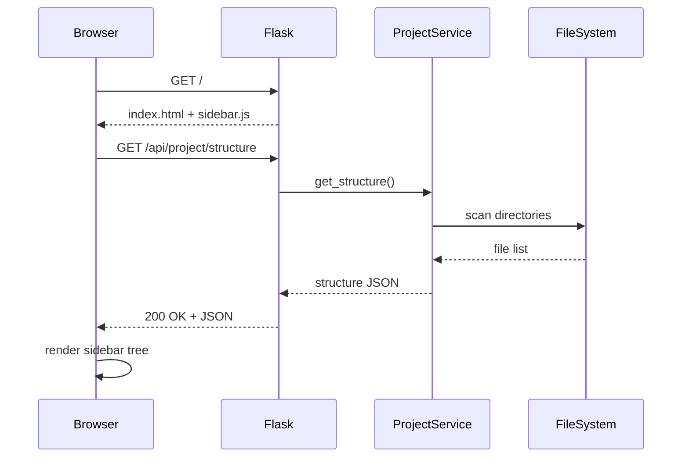
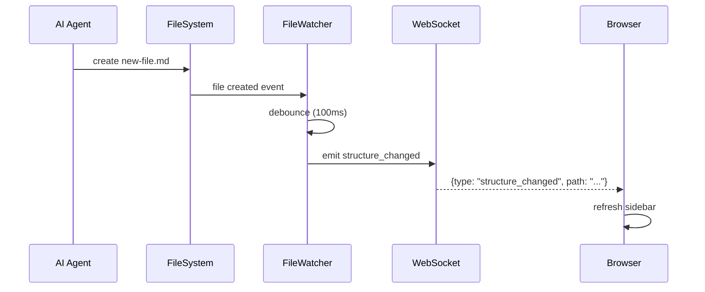

# Technical Design: Project Navigation

> Feature ID: FEATURE-001 | Version: v1.0 | Last Updated: 01-18-2026

---

## Part 1: Agent-Facing Summary

> **Purpose:** Quick reference for AI agents navigating large projects.
> **📌 AI Coders:** Focus on this section for implementation context.

### Key Components Implemented

| Component | Responsibility | Scope/Impact | Tags |
|-----------|----------------|--------------|------|
| `ProjectService` | Scan project structure, return folder tree | Backend core service | #navigation #filesystem #api |
| `FileWatcher` | Monitor file system changes, emit events | Real-time updates | #websocket #watchdog #realtime |
| `GET /api/project/structure` | API endpoint for project tree | REST API | #api #navigation #tree |
| `WebSocket /ws` | Real-time file change notifications | WebSocket endpoint | #websocket #realtime |
| `sidebar.js` | Frontend sidebar tree component | UI component | #frontend #navigation #bootstrap |
| `app.py` | Flask application entry point | Application setup | #flask #main #setup |

### Scope & Boundaries

**In Scope:**
- Backend API to scan and return project structure
- WebSocket for real-time file change notifications
- Frontend sidebar with expandable folder tree
- Three fixed sections: Project Plan, Requirements, Code

**Out of Scope:**
- Content rendering (FEATURE-002)
- File editing (FEATURE-003)
- Full-text search
- Custom sections

### Dependencies

| Dependency | Source | Design Link | Usage Description |
|------------|--------|-------------|-------------------|
| Flask | External | [flask.palletsprojects.com](https://flask.palletsprojects.com) | Web framework for API endpoints |
| Flask-SocketIO | External | [flask-socketio.readthedocs.io](https://flask-socketio.readthedocs.io) | WebSocket support for real-time updates |
| watchdog | External | [pypi.org/project/watchdog](https://pypi.org/project/watchdog) | Cross-platform file system monitoring |
| Bootstrap 5 | External | [getbootstrap.com](https://getbootstrap.com) | Frontend UI framework |

### Major Flow

1. **Page Load:** Browser requests `/` → Flask serves `index.html` → JS calls `GET /api/project/structure` → Sidebar renders tree
2. **File Selection:** User clicks file → JS emits `file-selected` event → Content area loads file (FEATURE-002)
3. **Real-time Updates:** File system change → `watchdog` detects → `FileWatcher` emits via WebSocket → JS updates sidebar tree

### Usage Example

```python
# Backend: Get project structure
from src.services import ProjectService

service = ProjectService(project_root="/path/to/project")
structure = service.get_structure()
# Returns: {"sections": [{"id": "planning", "label": "Project Plan", ...}]}

# Backend: Start file watcher
from src.services import FileWatcher

watcher = FileWatcher(project_root="/path/to/project", socketio=socketio)
watcher.start()
```

```javascript
// Frontend: Initialize sidebar
const sidebar = new ProjectSidebar('#sidebar-container');
sidebar.load();  // Fetches from /api/project/structure

// Handle file selection
sidebar.onFileSelect((filePath) => {
    contentViewer.load(filePath);  // FEATURE-002
});

// Handle real-time updates
socket.on('structure_changed', (data) => {
    sidebar.refresh();
});
```

---

## Part 2: Implementation Guide

> **Purpose:** Human-readable details for developers.
> **📌 Emphasis on visual diagrams for comprehension.

### Architecture Overview

```
┌─────────────────────────────────────────────────────────────┐
│                        Browser                               │
│  ┌──────────────┐    ┌──────────────────────────────────┐   │
│  │   Sidebar    │    │        Content Area               │   │
│  │  (Bootstrap) │    │       (FEATURE-002)               │   │
│  │              │    │                                    │   │
│  │ - Tree View  │───>│                                    │   │
│  │ - 3 Sections │    │                                    │   │
│  └──────────────┘    └──────────────────────────────────┘   │
│         │ WebSocket                                          │
└─────────│───────────────────────────────────────────────────┘
          │
          ▼
┌─────────────────────────────────────────────────────────────┐
│                    Flask Backend                             │
│  ┌──────────────┐    ┌──────────────┐    ┌──────────────┐   │
│  │   Routes     │    │ ProjectService│    │ FileWatcher  │   │
│  │  /api/...    │───>│   get_structure│   │  (watchdog)  │   │
│  └──────────────┘    └──────────────┘    └──────────────┘   │
│                              │                    │          │
│                              ▼                    ▼          │
│                      ┌──────────────────────────────┐       │
│                      │       File System             │       │
│                      │  x-ipe-docs/planning, x-ipe-docs/req, src │       │
│                      └──────────────────────────────┘       │
└─────────────────────────────────────────────────────────────┘
```

### Workflow Diagrams

#### Page Load Flow



#### Real-time Update Flow



### Data Models

#### Project Structure Response

```python
@dataclass
class FileNode:
    name: str          # "task-board.md"
    type: str          # "file" | "folder"
    path: str          # "x-ipe-docs/planning/task-board.md"
    children: list     # Only for folders

@dataclass
class Section:
    id: str            # "planning"
    label: str         # "Project Plan"
    path: str          # "x-ipe-docs/planning"
    icon: str          # "bi-kanban"
    children: list[FileNode]

@dataclass
class ProjectStructure:
    project_root: str
    sections: list[Section]
```

#### WebSocket Event

```python
@dataclass
class StructureChangedEvent:
    type: str = "structure_changed"
    action: str  # "created" | "modified" | "deleted"
    path: str    # Relative path from project root
```

### API Specifications

#### GET /api/project/structure

**Purpose:** Return project folder structure for sidebar

**Response:**
```json
{
  "project_root": "/path/to/project",
  "sections": [
    {
      "id": "planning",
      "label": "Project Plan",
      "path": "x-ipe-docs/planning",
      "icon": "bi-kanban",
      "children": [
        {
          "name": "task-board.md",
          "type": "file",
          "path": "x-ipe-docs/planning/task-board.md"
        },
        {
          "name": "features.md",
          "type": "file",
          "path": "x-ipe-docs/planning/features.md"
        }
      ]
    },
    {
      "id": "requirements",
      "label": "Requirements",
      "path": "x-ipe-docs/requirements",
      "icon": "bi-file-text",
      "children": [...]
    },
    {
      "id": "code",
      "label": "Code",
      "path": "src",
      "icon": "bi-code-slash",
      "children": [...]
    }
  ]
}
```

#### WebSocket Events

| Event | Direction | Payload |
|-------|-----------|---------|
| `connect` | Client→Server | - |
| `structure_changed` | Server→Client | `{type, action, path}` |

### File Structure

```
src/
├── __init__.py
├── app.py              # Flask app, routes, WebSocket
├── services/           # Services package
│   ├── __init__.py     # Re-exports all services
│   └── file_service.py # ProjectService, FileWatcher, FileNode, Section, ContentService
├── config.py           # Configuration (project root)
└── templates/
    ├── base.html       # Base template with Bootstrap
    └── index.html      # Main page with sidebar
static/
├── css/
│   └── style.css       # Custom styles
└── js/
    └── sidebar.js      # Sidebar component
```

### Implementation Steps

1. **Backend - Core Setup:**
   - Create `src/config.py` with project root configuration
   - Create `src/app.py` with Flask + Flask-SocketIO setup
   - Create base HTML template with Bootstrap 5

2. **Backend - ProjectService:**
   - Create `src/services/file_service.py`
   - Implement `ProjectService.get_structure()` to scan directories
   - Add file type filtering (md, py, js, etc.)
   - Add hidden file exclusion

3. **Backend - API Endpoint:**
   - Add `GET /api/project/structure` route
   - Return JSON structure

4. **Backend - FileWatcher:**
   - Implement `FileWatcher` class using watchdog
   - Add debouncing for rapid file changes
   - Emit WebSocket events on changes

5. **Frontend - HTML Template:**
   - Create `templates/index.html` with sidebar layout
   - Add Bootstrap 5 accordion for sections
   - Add tree styling

6. **Frontend - Sidebar JS:**
   - Create `static/js/sidebar.js`
   - Implement tree rendering from API response
   - Add expand/collapse functionality
   - Add file click handler (emit event)

7. **Frontend - WebSocket:**
   - Connect to WebSocket on page load
   - Listen for `structure_changed` events
   - Refresh sidebar on changes

### Edge Cases & Error Handling

| Scenario | Expected Behavior |
|----------|-------------------|
| Project root doesn't exist | Return 400 with error message |
| Empty directory | Show section with "No files" message |
| Permission denied | Log error, skip inaccessible files |
| Rapid file changes | Debounce events (100ms) |
| WebSocket disconnect | Auto-reconnect with exponential backoff |
| Very large project (1000+ files) | Paginate or lazy-load subdirectories |

### Security Considerations

- Validate all file paths to prevent directory traversal
- Only serve files within configured project root
- Sanitize file names in API responses

---

## Design Change Log

| Date | Phase | Change Summary |
|------|-------|----------------|
| 01-18-2026 | Initial Design | Initial technical design created for Project Navigation feature. Covers backend API, WebSocket for real-time updates, and frontend sidebar component. |
| 01-23-2026 | Refactoring | Updated file paths: `src/services.py` split into `src/services/` package. ProjectService, FileWatcher, FileNode, Section, ContentService now in `src/services/file_service.py`. Imports via `from src.services import X` still work due to `__init__.py` re-exports. |

---
