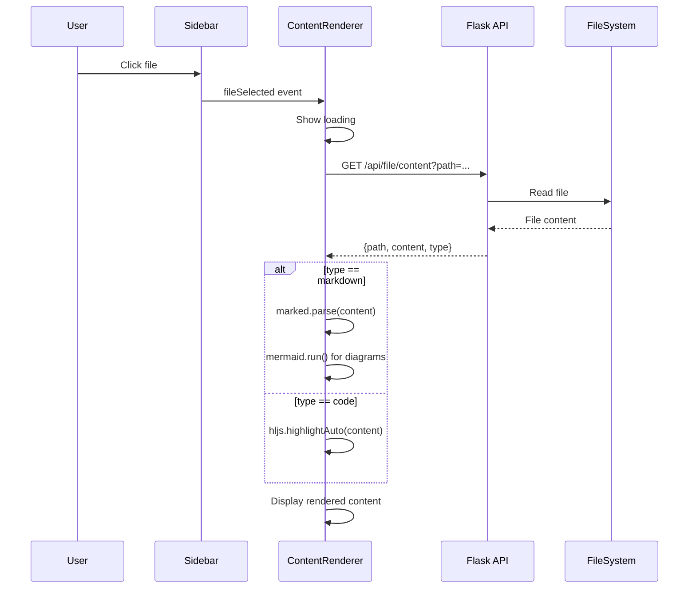
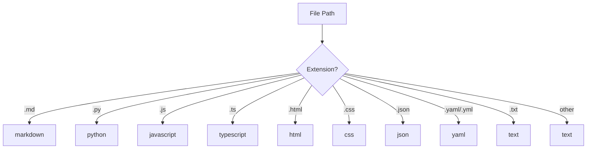

# Technical Design: Content Viewer

> Feature ID: FEATURE-002 | Version: v1.0 | Last Updated: 01-18-2026

---

## Part 1: Agent-Facing Summary

> **Purpose:** Quick reference for AI agents navigating large projects.
> **📌 AI Coders:** Focus on this section for implementation context.

### Key Components Implemented

| Component | Responsibility | Scope/Impact | Tags |
|-----------|----------------|--------------|------|
| `GET /api/file/content` | Fetch file content from filesystem | Backend API | #api #content #file |
| `ContentRenderer` | Frontend class to render content | UI component | #frontend #markdown #code |
| `renderMarkdown()` | Parse and render markdown to HTML | Content processing | #markdown #marked |
| `renderMermaid()` | Render Mermaid diagrams | Diagram visualization | #mermaid #diagrams |
| `renderCode()` | Apply syntax highlighting | Code display | #highlight #syntax |

### Scope & Boundaries

**In Scope:**
- Backend API to read file content
- Markdown rendering with marked.js
- Mermaid diagram rendering
- Code syntax highlighting with highlight.js
- Integration with sidebar file selection

**Out of Scope:**
- File editing (FEATURE-003)
- Auto-refresh (FEATURE-004)
- Binary file preview
- PDF rendering

### Dependencies

| Dependency | Source | Design Link | Usage Description |
|------------|--------|-------------|-------------------|
| `ProjectService` | FEATURE-001 | [technical-design.md](../FEATURE-001/technical-design.md) | Uses same project root configuration |
| File Selection Event | FEATURE-001 | [technical-design.md](../FEATURE-001/technical-design.md) | Listens for `fileSelected` custom event |
| marked.js | External | [marked.js.org](https://marked.js.org) | Markdown to HTML conversion |
| highlight.js | External | [highlightjs.org](https://highlightjs.org) | Code syntax highlighting |
| Mermaid.js | External | [mermaid.js.org](https://mermaid.js.org) | Diagram rendering |

### Major Flow

1. **File Selection:** User clicks file in sidebar → `fileSelected` event fired
2. **Content Fetch:** ContentRenderer calls `GET /api/file/content?path=...`
3. **Type Detection:** API returns content with file type (markdown/code/text)
4. **Rendering:** Based on type, apply appropriate renderer
5. **Display:** Update content area with rendered HTML

### Usage Example

```python
# Backend: Get file content
@app.route('/api/file/content')
def get_file_content():
    path = request.args.get('path')
    content = read_file(project_root / path)
    file_type = detect_type(path)
    return jsonify({'path': path, 'content': content, 'type': file_type})
```

```javascript
// Frontend: Render content
const renderer = new ContentRenderer('#content-body');

document.addEventListener('fileSelected', (e) => {
    renderer.load(e.detail.path);
});

// Rendering flow
renderer.load('x-ipe-docs/planning/task-board.md');
// → Fetches content
// → Detects markdown
// → Renders with marked.js
// → Processes Mermaid blocks
// → Displays in content area
```

---

## Part 2: Implementation Guide

> **Purpose:** Human-readable details for developers.
> **📌 Emphasis on visual diagrams for comprehension.

### Workflow Diagram



### Content Type Detection



### API Specification

#### GET /api/file/content

**Request:**
```
GET /api/file/content?path=x-ipe-docs/planning/task-board.md
```

**Response (Success):**
```json
{
  "path": "x-ipe-docs/planning/task-board.md",
  "content": "# Task Board\n\n> Task tracking...",
  "type": "markdown",
  "extension": ".md",
  "size": 2048
}
```

**Response (Error):**
```json
{
  "error": "File not found",
  "path": "x-ipe-docs/missing.md"
}
```

**Status Codes:**
| Code | Description |
|------|-------------|
| 200 | Success |
| 400 | Missing path parameter |
| 403 | Path outside project root |
| 404 | File not found |

### File Type Mapping

```python
FILE_TYPES = {
    '.md': 'markdown',
    '.py': 'python',
    '.js': 'javascript',
    '.ts': 'typescript',
    '.jsx': 'jsx',
    '.tsx': 'tsx',
    '.html': 'html',
    '.css': 'css',
    '.json': 'json',
    '.yaml': 'yaml',
    '.yml': 'yaml',
    '.txt': 'text'
}
```

### Frontend Components

#### ContentRenderer Class

```javascript
class ContentRenderer {
    constructor(containerId) {
        this.container = document.getElementById(containerId);
        this.currentPath = null;
    }
    
    async load(path) {
        this.showLoading();
        try {
            const response = await fetch(`/api/file/content?path=${encodeURIComponent(path)}`);
            const data = await response.json();
            this.render(data);
        } catch (error) {
            this.showError(error);
        }
    }
    
    render(data) {
        if (data.type === 'markdown') {
            this.renderMarkdown(data.content);
        } else {
            this.renderCode(data.content, data.type);
        }
    }
    
    renderMarkdown(content) {
        const html = marked.parse(content);
        this.container.innerHTML = `<div class="markdown-body">${html}</div>`;
        mermaid.run();  // Render any mermaid diagrams
    }
    
    renderCode(content, language) {
        const highlighted = hljs.highlight(content, {language}).value;
        this.container.innerHTML = `<pre><code class="hljs">${highlighted}</code></pre>`;
    }
}
```

### Markdown Rendering Configuration

```javascript
// Configure marked.js
marked.setOptions({
    gfm: true,           // GitHub Flavored Markdown
    breaks: true,        // Line breaks as <br>
    headerIds: true,     // Add IDs to headers
    mangle: false,       // Don't mangle email links
    highlight: function(code, lang) {
        if (lang && hljs.getLanguage(lang)) {
            return hljs.highlight(code, {language: lang}).value;
        }
        return hljs.highlightAuto(code).value;
    }
});

// Custom renderer for Mermaid blocks
const renderer = new marked.Renderer();
renderer.code = function(code, language) {
    if (language === 'mermaid') {
        return `<div class="mermaid">${code}</div>`;
    }
    const highlighted = hljs.highlight(code, {language: language || 'plaintext'}).value;
    return `<pre><code class="hljs language-${language}">${highlighted}</code></pre>`;
};
```

### CSS Styling

```css
/* Markdown content styling */
.markdown-body {
    font-family: -apple-system, BlinkMacSystemFont, 'Segoe UI', Roboto, sans-serif;
    font-size: 16px;
    line-height: 1.6;
    color: #24292e;
    max-width: 900px;
}

.markdown-body h1 { font-size: 2rem; border-bottom: 1px solid #eaecef; }
.markdown-body h2 { font-size: 1.5rem; border-bottom: 1px solid #eaecef; }
.markdown-body h3 { font-size: 1.25rem; }

.markdown-body pre {
    background: #f6f8fa;
    padding: 16px;
    border-radius: 6px;
    overflow-x: auto;
}

.markdown-body code {
    font-family: 'SFMono-Regular', Consolas, monospace;
    font-size: 85%;
}

.markdown-body table {
    border-collapse: collapse;
    width: 100%;
}

.markdown-body th, .markdown-body td {
    border: 1px solid #dfe2e5;
    padding: 8px 12px;
}

/* Mermaid diagrams */
.mermaid {
    text-align: center;
    margin: 1rem 0;
}
```

### Implementation Steps

1. **Backend - File Content API:**
   - Update `/api/file/content` endpoint (already exists from FEATURE-001)
   - Add file type detection
   - Add file size to response

2. **Frontend - Add Libraries:**
   - Add marked.js CDN to base.html
   - Add highlight.js CDN to base.html
   - Add Mermaid.js CDN to base.html

3. **Frontend - ContentRenderer:**
   - Create ContentRenderer class in index.html
   - Implement load(), render(), renderMarkdown(), renderCode()
   - Add loading and error states

4. **Frontend - Styling:**
   - Add markdown-body CSS styles
   - Add code block styling
   - Add Mermaid diagram styling

5. **Frontend - Integration:**
   - Listen for fileSelected event
   - Call ContentRenderer.load() on file selection
   - Update breadcrumb

### Edge Cases & Error Handling

| Scenario | Expected Behavior |
|----------|-------------------|
| File not found | Show error message with path |
| Empty file | Show "File is empty" message |
| Binary file | Show "Cannot display binary file" |
| Large file (>1MB) | Show warning, load anyway |
| Invalid Mermaid | Show Mermaid error message |
| Network error | Show retry button |

---

## Design Change Log

| Date | Phase | Change Summary |
|------|-------|----------------|
| 01-18-2026 | Initial Design | Initial technical design for Content Viewer. Covers markdown rendering with marked.js, Mermaid diagrams, and code highlighting with highlight.js. |
| 01-23-2026 | Refactoring | Updated file paths: `src/services.py` split into `src/services/` package. ContentService now in `src/services/file_service.py`. Imports via `from src.services import X` still work due to `__init__.py` re-exports. |

---
