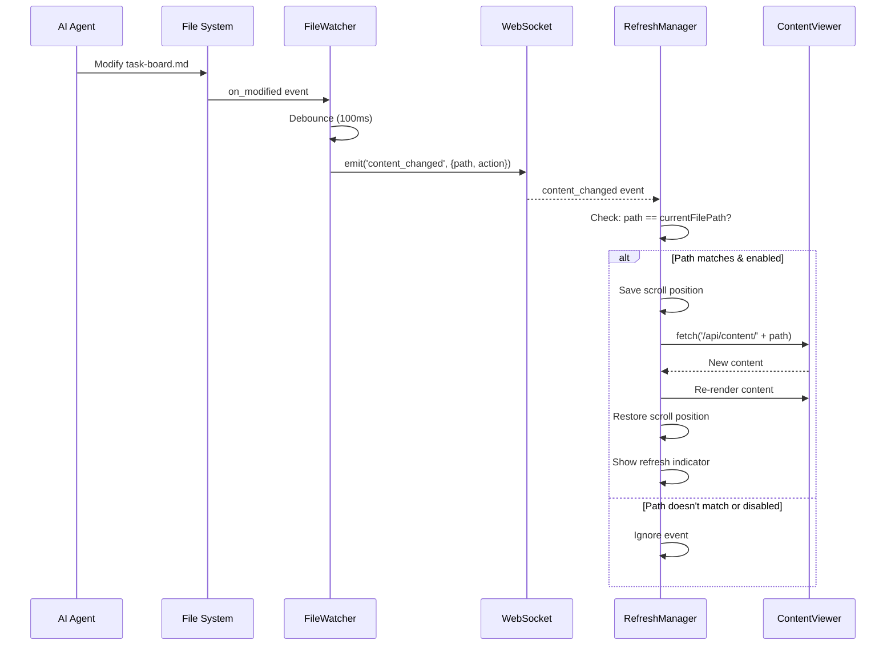
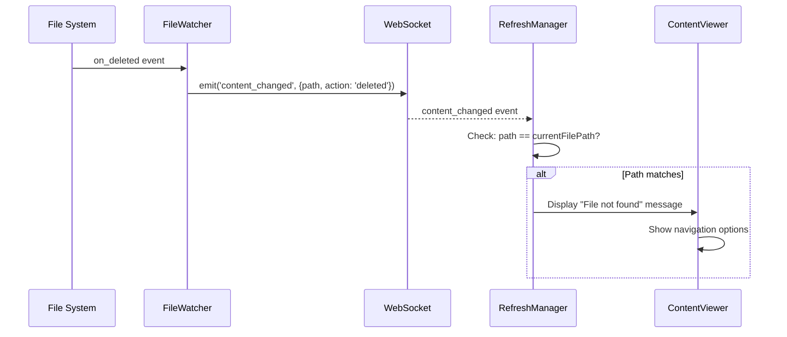

# Technical Design: Live Refresh

> Feature ID: FEATURE-004 | Version: v1.0 | Last Updated: 01-19-2026

---

## Part 1: Agent-Facing Summary

> **Purpose:** Quick reference for AI agents navigating large projects.
> **📌 AI Coders:** Focus on this section for implementation context.

### Key Components Implemented

| Component | Responsibility | Scope/Impact | Tags |
|-----------|----------------|--------------|------|
| `FileWatcher` (extended) | Emit `content_changed` events for file modifications | Backend service | #websocket #watchdog #realtime |
| `content_changed` event | WebSocket event for content updates | WebSocket | #websocket #event #content |
| `ContentRefreshManager` | Frontend JS class managing refresh logic | Frontend module | #frontend #refresh #javascript |
| Toggle UI control | Enable/disable auto-refresh | UI component | #frontend #toggle #settings |
| Refresh indicator | Visual feedback on content update | UI component | #frontend #indicator #ux |

### Scope & Boundaries

**In Scope:**
- Extend FileWatcher to emit `content_changed` alongside `structure_changed`
- Frontend listener for `content_changed` events
- Auto-refresh content when currently viewed file changes
- Scroll position preservation
- Toggle control for auto-refresh
- Visual refresh indicator (toast)
- File deletion handling

**Out of Scope:**
- Diff view (FEATURE-007: Git Integration)
- Conflict resolution with editing (FEATURE-003)
- Notifications for non-viewed files

### Dependencies

| Dependency | Source | Design Link | Usage Description |
|------------|--------|-------------|-------------------|
| `FileWatcher` | FEATURE-001 | [technical-design.md](../FEATURE-001/technical-design.md) | Existing file monitoring, extended to emit content events |
| `ContentService` | FEATURE-002 | [technical-design.md](../FEATURE-002/technical-design.md) | File content API for re-fetching |
| `/api/content/<path>` | FEATURE-002 | [technical-design.md](../FEATURE-002/technical-design.md) | Endpoint for fetching file content |
| Flask-SocketIO | External | [flask-socketio.readthedocs.io](https://flask-socketio.readthedocs.io) | WebSocket for real-time events |
| watchdog | External | [pypi.org/project/watchdog](https://pypi.org/project/watchdog) | File system monitoring |

### Major Flow

1. **File Modified:** External process modifies file → watchdog detects → FileWatcher emits `content_changed` via WebSocket
2. **Frontend Receives:** `ContentRefreshManager` receives event → Compares path to current file → If match, triggers refresh
3. **Refresh:** Save scroll position → Fetch `/api/content/<path>` → Re-render content → Restore scroll → Show indicator

### Usage Example

```python
# Backend: FileWatcher already running (FEATURE-001)
# Extended to emit content_changed for modified files:
socketio.emit('content_changed', {
    'type': 'content_changed',
    'path': 'x-ipe-docs/planning/task-board.md',
    'action': 'modified'
})
```

```javascript
// Frontend: ContentRefreshManager
const refreshManager = new ContentRefreshManager({
    socket: socket,
    contentViewer: contentViewer,
    enabled: true
});

// Auto-refresh is handled internally when content_changed events arrive

// Toggle auto-refresh
refreshManager.setEnabled(false);  // Disable
refreshManager.setEnabled(true);   // Enable

// Manual refresh
refreshManager.refresh();
```

---

## Part 2: Implementation Guide

> **Purpose:** Human-readable details for developers.
> **📌 Emphasis on visual diagrams for comprehension.

### Architecture Overview

```
┌─────────────────────────────────────────────────────────────────┐
│                          Browser                                 │
│  ┌──────────────────────────────────────────────────────────┐   │
│  │                    Content Viewer                         │   │
│  │  ┌─────────────────────────────────────────────────────┐ │   │
│  │  │  [🔄 Auto-refresh: ON]            [Refresh Toast]   │ │   │
│  │  ├─────────────────────────────────────────────────────┤ │   │
│  │  │                                                     │ │   │
│  │  │          Rendered Content (Markdown/Code)           │ │   │
│  │  │                                                     │ │   │
│  │  └─────────────────────────────────────────────────────┘ │   │
│  │         ▲                                                 │   │
│  │         │ ContentRefreshManager                           │   │
│  │         │   - currentFilePath                             │   │
│  │         │   - scrollPosition                              │   │
│  │         │   - enabled (localStorage)                      │   │
│  └─────────│────────────────────────────────────────────────┘   │
│            │ WebSocket: content_changed                          │
└────────────│────────────────────────────────────────────────────┘
             │
             ▼
┌─────────────────────────────────────────────────────────────────┐
│                       Flask Backend                              │
│  ┌────────────────────────────────────────────────────────────┐ │
│  │  FileWatcher (extended)                                     │ │
│  │    - on_modified → emit structure_changed                   │ │
│  │    - on_modified → emit content_changed  ← NEW              │ │
│  └────────────────────────────────────────────────────────────┘ │
│                              ▲                                   │
│                              │ watchdog                          │
│                      ┌───────┴───────┐                          │
│                      │  File System   │                          │
│                      └───────────────┘                          │
└─────────────────────────────────────────────────────────────────┘
```

### Workflow Diagrams

#### Live Refresh Flow



#### File Deletion Flow



### Data Models

#### WebSocket Event: content_changed

```python
# Emitted by FileWatcher when a file is modified
{
    "type": "content_changed",
    "path": "x-ipe-docs/planning/task-board.md",  # Relative path
    "action": "modified"  # "modified" | "deleted"
}
```

#### Frontend State: ContentRefreshManager

```javascript
class ContentRefreshManager {
    currentFilePath: string | null;  // Currently viewed file
    enabled: boolean;                 // Auto-refresh toggle (localStorage)
    scrollPosition: number;           // Saved scroll position
    debounceTimer: number | null;     // Debounce rapid refreshes
    
    constructor(options: {
        socket: SocketIO,
        contentViewer: ContentViewer,
        enabled?: boolean  // Default: true
    });
    
    setCurrentFile(path: string): void;
    setEnabled(enabled: boolean): void;
    refresh(): Promise<void>;
}
```

### Implementation Steps

#### Step 1: Extend FileWatcher to emit content_changed

**File:** `src/services/file_service.py`

Modify `FileWatcherHandler._add_event()` to emit both event types:

```python
def _add_event(self, event_type: str, src_path: str):
    """Add event to pending queue if not ignored"""
    if self._should_ignore(src_path):
        return
    
    with self._lock:
        self._pending_events[src_path] = {
            'type': 'structure_changed',  # Existing
            'action': event_type,
            'path': src_path
        }
        # NEW: Also queue content_changed event
        self._pending_content_events[src_path] = {
            'type': 'content_changed',
            'action': event_type,
            'path': src_path
        }
    self._schedule_callback()
```

Update `_emit_events()` to emit both:

```python
def _emit_events(self):
    """Emit all pending events"""
    with self._lock:
        structure_events = list(self._pending_events.values())
        content_events = list(self._pending_content_events.values())
        self._pending_events.clear()
        self._pending_content_events.clear()
    
    for event in structure_events:
        self.callback(event)
    
    for event in content_events:
        self.content_callback(event)  # NEW callback
```

**Alternative (Simpler):** Emit content_changed from FileWatcher._emit_event():

```python
def _emit_event(self, event_data: Dict):
    """Emit file system event via WebSocket"""
    if self.socketio:
        # Convert to relative path
        try:
            abs_path = Path(event_data['path'])
            rel_path = abs_path.relative_to(self.project_root)
            event_data['path'] = str(rel_path)
        except ValueError:
            pass
        
        # Emit structure_changed (existing)
        self.socketio.emit('structure_changed', event_data)
        
        # Emit content_changed (NEW)
        content_event = {
            'type': 'content_changed',
            'path': event_data['path'],
            'action': event_data['action']
        }
        self.socketio.emit('content_changed', content_event)
```

#### Step 2: Create ContentRefreshManager in Frontend

**File:** `src/templates/index.html` (or separate JS file)

```javascript
class ContentRefreshManager {
    constructor(options) {
        this.socket = options.socket;
        this.contentViewer = options.contentViewer;
        this.currentFilePath = null;
        this.enabled = this._loadEnabledState();
        this.scrollPosition = 0;
        this.debounceTimer = null;
        
        this._setupSocketListener();
    }
    
    _loadEnabledState() {
        const saved = localStorage.getItem('autoRefreshEnabled');
        return saved === null ? true : saved === 'true';
    }
    
    _saveEnabledState() {
        localStorage.setItem('autoRefreshEnabled', this.enabled.toString());
    }
    
    _setupSocketListener() {
        this.socket.on('content_changed', (data) => {
            this._handleContentChanged(data);
        });
    }
    
    _handleContentChanged(data) {
        if (!this.enabled) return;
        if (!this.currentFilePath) return;
        if (data.path !== this.currentFilePath) return;
        
        if (data.action === 'deleted') {
            this._handleFileDeletion();
            return;
        }
        
        // Debounce rapid changes
        clearTimeout(this.debounceTimer);
        this.debounceTimer = setTimeout(() => {
            this.refresh();
        }, 150);
    }
    
    _handleFileDeletion() {
        this.contentViewer.showError(
            'File Not Found',
            'The file you were viewing has been deleted or moved.',
            [
                { label: 'Browse Files', action: () => this._browseFiles() }
            ]
        );
    }
    
    async refresh() {
        // Save scroll position
        const contentArea = document.getElementById('content-area');
        this.scrollPosition = contentArea ? contentArea.scrollTop : 0;
        
        try {
            // Fetch new content
            await this.contentViewer.loadFile(this.currentFilePath);
            
            // Restore scroll position
            if (contentArea) {
                contentArea.scrollTop = this.scrollPosition;
            }
            
            // Show refresh indicator
            this._showRefreshIndicator();
        } catch (error) {
            console.error('Refresh failed:', error);
        }
    }
    
    _showRefreshIndicator() {
        // Create toast notification
        const toast = document.createElement('div');
        toast.className = 'refresh-toast';
        toast.innerHTML = '🔄 Content updated';
        toast.style.cssText = `
            position: fixed;
            bottom: 80px;
            right: 20px;
            background: #28a745;
            color: white;
            padding: 8px 16px;
            border-radius: 4px;
            font-size: 14px;
            z-index: 1050;
            animation: fadeInOut 2s ease-in-out;
        `;
        
        document.body.appendChild(toast);
        setTimeout(() => toast.remove(), 2000);
    }
    
    setCurrentFile(path) {
        this.currentFilePath = path;
    }
    
    setEnabled(enabled) {
        this.enabled = enabled;
        this._saveEnabledState();
        this._updateToggleUI();
    }
    
    _updateToggleUI() {
        const toggle = document.getElementById('auto-refresh-toggle');
        if (toggle) {
            toggle.checked = this.enabled;
        }
    }
}
```

#### Step 3: Add Toggle UI Control

**File:** `src/templates/index.html`

Add toggle in content header area:

```html
<div class="content-header d-flex justify-content-between align-items-center">
    <h5 id="current-file-name">Select a file</h5>
    <div class="d-flex align-items-center gap-2">
        <label class="form-check-label small text-muted" for="auto-refresh-toggle">
            Auto-refresh
        </label>
        <div class="form-check form-switch mb-0">
            <input class="form-check-input" type="checkbox" 
                   id="auto-refresh-toggle" checked>
        </div>
    </div>
</div>
```

Wire up toggle:

```javascript
document.getElementById('auto-refresh-toggle').addEventListener('change', (e) => {
    refreshManager.setEnabled(e.target.checked);
});
```

#### Step 4: Add CSS for Refresh Animation

**File:** `src/templates/base.html` or `static/css/style.css`

```css
@keyframes fadeInOut {
    0% { opacity: 0; transform: translateY(10px); }
    15% { opacity: 1; transform: translateY(0); }
    85% { opacity: 1; transform: translateY(0); }
    100% { opacity: 0; transform: translateY(-10px); }
}

.refresh-toast {
    animation: fadeInOut 2s ease-in-out forwards;
}

/* Subtle pulse on content area during refresh */
.content-refreshing {
    animation: pulse 0.3s ease-in-out;
}

@keyframes pulse {
    0% { opacity: 1; }
    50% { opacity: 0.7; }
    100% { opacity: 1; }
}
```

### Edge Cases

| Edge Case | Handling |
|-----------|----------|
| Rapid file modifications | Debounce with 150ms delay |
| File deleted | Show "File not found" message with navigation options |
| WebSocket disconnected | Graceful degradation - feature disabled until reconnection |
| Large file refresh | Show loading indicator during fetch |
| Scroll position invalid | If content shortened, scroll to bottom or top |
| User actively scrolling | Brief delay (100ms) before refresh |

### Testing Strategy

| Test Category | Test Cases |
|---------------|------------|
| Unit: FileWatcher | Verify `content_changed` event emitted on file modification |
| Unit: RefreshManager | Test path matching, enabled/disabled states |
| Integration: WebSocket | End-to-end event flow from file change to frontend |
| UI: Toggle | Verify localStorage persistence, UI state sync |
| UI: Indicator | Toast appears and disappears correctly |
| Edge: Deletion | File not found message displays correctly |
| Edge: Debounce | Rapid changes result in single refresh |

---

## Implementation Checklist

- [ ] Extend `FileWatcher._emit_event()` in `services/file_service.py` to emit `content_changed`
- [ ] Create `ContentRefreshManager` JavaScript class
- [ ] Add toggle UI control in content header
- [ ] Implement scroll position preservation
- [ ] Add refresh indicator (toast notification)
- [ ] Handle file deletion gracefully
- [ ] Add CSS animations
- [ ] Wire up toggle to localStorage
- [ ] Write unit tests for new backend functionality
- [ ] Write integration tests for WebSocket event flow
