# Technical Design: Ideation (formerly Workplace)

> Feature ID: FEATURE-008 | Version: v1.5 | Last Updated: 01-31-2026

---

## Version History

| Version | Date | Description |
|---------|------|-------------|
| v1.5 | 01-31-2026 | CR-006: Folder tree UX - drag-drop move, folder view panel, search, UI upgrade |
| v1.4 | 01-28-2026 | CR-004: Sidebar submenu, rename to Ideation, Copilot hover menu |
| v1.3 | 01-23-2026 | CR-003: Add Ideation Toolbox for skill configuration |
| v1.2 | 01-23-2026 | CR-002: Add drag-drop file upload to existing folders |
| v1.1 | 01-22-2026 | CR-001: Added Copilot button technical design |
| v1.0 | 01-22-2026 | Initial design |

---

## Part 1: Agent-Facing Summary

> **Purpose:** Quick reference for AI agents navigating large projects.
> **📌 AI Coders:** Focus on this section for implementation context.

### Key Components Implemented

| Component | Responsibility | Scope/Impact | Tags |
|-----------|----------------|--------------|------|
| `IdeasService` | CRUD operations for idea files/folders | Backend service class | #ideas #service #backend |
| `IdeasService.get_tree()` | Scan and return x-ipe-docs/ideas/ structure | Read idea tree | #ideas #tree |
| `IdeasService.upload()` | Handle file upload to new or existing folder | Create/update idea folders | #ideas #upload |
| `IdeasService.rename_folder()` | Rename idea folder on disk | Folder management | #ideas #rename |
| `POST /api/ideas/tree` | API endpoint for idea tree | REST API | #ideas #api |
| `POST /api/ideas/upload` | API endpoint for file upload | REST API | #ideas #api #upload |
| `POST /api/ideas/rename` | API endpoint for folder rename | REST API | #ideas #api |
| `WorkplaceView` | Frontend two-column layout component | UI component | #ideas #frontend #workplace |
| `IdeaTree` | Frontend tree navigation component | UI component | #ideas #frontend #tree |
| `IdeaEditor` | File editor with auto-save (5s debounce) | UI component | #ideas #frontend #editor |
| `IdeaUploader` | Drag-drop and file picker component | UI component | #ideas #frontend #upload |
| `ContentRenderer._handleCopilotClick()` | Copilot button click handler (CR-001) | UI component | #ideas #copilot #terminal |
| `TerminalManager.sendCopilotRefineCommand()` | Send refine command to terminal (CR-001) | Terminal integration | #terminal #copilot |
| `TerminalManager._isInCopilotMode()` | Detect if terminal in Copilot CLI mode (CR-001) | Terminal integration | #terminal #copilot |
| `TerminalManager._sendWithTypingEffect()` | Simulate human typing (CR-001) | Terminal integration | #terminal #typing |
| `WorkplaceManager._setupFolderDragDrop()` | Setup drag-drop handlers on folder nodes (CR-002) | UI component | #ideas #frontend #dragdrop |
| `WorkplaceManager._uploadToFolder()` | Upload files to specific folder (CR-002) | UI component | #ideas #frontend #upload |
| `IdeasService.get_toolbox()` | Read toolbox config from JSON file (CR-003) | Backend service | #ideas #toolbox #config |
| `IdeasService.save_toolbox()` | Save toolbox config to JSON file (CR-003) | Backend service | #ideas #toolbox #config |
| `GET /api/ideas/toolbox` | API endpoint for reading toolbox config (CR-003) | REST API | #ideas #api #toolbox |
| `POST /api/ideas/toolbox` | API endpoint for saving toolbox config (CR-003) | REST API | #ideas #api #toolbox |
| `WorkplaceManager._initToolbox()` | Initialize toolbox dropdown UI (CR-003) | UI component | #ideas #frontend #toolbox |
| `WorkplaceManager._loadToolboxState()` | Load toolbox state from backend (CR-003) | UI component | #ideas #frontend #toolbox |
| `WorkplaceManager._saveToolboxState()` | Save toolbox state to backend (CR-003) | UI component | #ideas #frontend #toolbox |
| `SidebarNav._renderSubmenu()` | Render nested submenu items (CR-004) | UI component | #sidebar #navigation #submenu |
| `SidebarNav._setupSubmenuBehavior()` | Handle parent item no-action click (CR-004) | UI component | #sidebar #navigation |
| `ContentRenderer._initCopilotHoverMenu()` | Initialize hover dropdown for Copilot button (CR-004) | UI component | #copilot #hover #menu |
| `ContentRenderer._handleCopilotMenuAction()` | Handle Copilot menu item selection (CR-004) | UI component | #copilot #hover #menu |
| `FolderViewManager` | **NEW MODULE** - Detailed folder view panel (CR-006) | Standalone module ~400 lines | #ideas #frontend #folderview |
| `FolderViewManager.render()` | Render folder view with path bar + contents (CR-006) | UI component | #ideas #folderview |
| `FolderViewManager._renderPathBar()` | Breadcrumb path bar at top (CR-006) | UI component | #ideas #folderview #pathbar |
| `FolderViewManager._renderActionBar()` | Add File/Folder, Rename, Delete buttons (CR-006) | UI component | #ideas #folderview #actions |
| `FolderViewManager._renderContents()` | File/folder list with actions (CR-006) | UI component | #ideas #folderview #contents |
| `FolderViewManager._handleItemAction()` | Rename/delete/duplicate/download actions (CR-006) | UI component | #ideas #folderview #actions |
| `TreeDragManager` | **NEW MODULE** - Drag-drop file/folder reorganization (CR-006) | Standalone module ~250 lines | #ideas #frontend #dragdrop |
| `TreeDragManager.init()` | Setup drag handlers on tree items (CR-006) | UI component | #ideas #dragdrop |
| `TreeDragManager._validateDrop()` | Check if drop target is valid (CR-006) | UI component | #ideas #dragdrop #validation |
| `TreeDragManager._showInvalidFeedback()` | Red border + shake animation (CR-006) | UI component | #ideas #dragdrop #feedback |
| `TreeSearchManager` | **NEW MODULE** - Search/filter tree (CR-006) | Standalone module ~150 lines | #ideas #frontend #search |
| `TreeSearchManager.init()` | Setup search bar and filter logic (CR-006) | UI component | #ideas #search |
| `TreeSearchManager._filterTree()` | Filter tree items showing matches + parents (CR-006) | UI component | #ideas #search #filter |
| `IdeasService.move_item()` | Move file/folder to new location (CR-006) | Backend service | #ideas #service #move |
| `IdeasService.duplicate_item()` | Duplicate file/folder with -copy suffix (CR-006) | Backend service | #ideas #service #duplicate |
| `IdeasService.delete_item()` | Delete file/folder with confirmation (CR-006) | Backend service | #ideas #service #delete |
| `IdeasService.download_file()` | Generate download response for file (CR-006) | Backend service | #ideas #service #download |
| `POST /api/ideas/move` | API endpoint for moving items (CR-006) | REST API | #ideas #api #move |
| `POST /api/ideas/duplicate` | API endpoint for duplicating items (CR-006) | REST API | #ideas #api #duplicate |
| `DELETE /api/ideas/item` | API endpoint for deleting items (CR-006) | REST API | #ideas #api #delete |
| `GET /api/ideas/download` | API endpoint for file download (CR-006) | REST API | #ideas #api #download |
| `ConfirmDialog` | Reusable confirmation modal component (CR-006) | UI component | #ideas #frontend #dialog |

### Dependencies

| Dependency | Source | Design Link | Usage Description |
|------------|--------|-------------|-------------------|
| `ContentService` | FEATURE-002 | [technical-design.md](../FEATURE-002/technical-design.md) | Reuse `save_content()` for auto-save, `get_content()` for file loading |
| `ProjectService` | FEATURE-001 | [technical-design.md](../FEATURE-001/technical-design.md) | Reference tree scanning pattern for `IdeasService.get_tree()` |
| `FileNode` | FEATURE-001 | [file_service.py](../../../src/services/file_service.py) | Reuse dataclass for tree structure |
| `TerminalManager` | FEATURE-005 | [terminal.js](../../../static/js/terminal.js) | Terminal management for Copilot button (CR-001) |
| `TerminalPanel` | FEATURE-005 | [terminal.js](../../../static/js/terminal.js) | Panel expand/collapse for Copilot button (CR-001) |

### Major Flow

1. **Tree Load:** User clicks Workplace → Frontend calls `GET /api/ideas/tree` → `IdeasService.get_tree()` scans `x-ipe-docs/ideas/` → Returns tree structure
2. **File View/Edit:** User clicks file → Frontend calls `GET /api/file/content?path=...` → Existing ContentService returns content → Display in editor
3. **Auto-save:** User edits → 5s debounce → Frontend calls `POST /api/file/save` → Existing ContentService saves → Show "Saved" indicator
4. **Upload:** User drops files → Frontend calls `POST /api/ideas/upload` → `IdeasService.upload()` creates folder + saves files → Refresh tree
5. **Upload to Existing (CR-002):** User drags files to folder → Frontend calls `POST /api/ideas/upload` with `target_folder` → `IdeasService.upload()` saves to existing folder → Refresh tree
6. **Rename:** User double-clicks folder → Edit name → Frontend calls `POST /api/ideas/rename` → `IdeasService.rename_folder()` → Refresh tree
7. **Copilot Refine (CR-001):** User clicks Copilot button → Expand terminal → Check if in Copilot mode → Create new terminal if needed → Send `copilot` command → Wait 1.5s → Send `refine the idea {path}` command
8. **Toolbox Load (CR-003):** User clicks Workplace → Frontend calls `GET /api/ideas/toolbox` → `IdeasService.get_toolbox()` reads `.ideation-tools.json` → Returns config (or defaults) → Update checkbox states
9. **Toolbox Save (CR-003):** User toggles checkbox → Frontend calls `POST /api/ideas/toolbox` with updated config → `IdeasService.save_toolbox()` writes JSON file → Returns success
10. **Sidebar Submenu (CR-004):** User sees "Workplace" parent in sidebar → Click does nothing → Always-visible nested items "Ideation" and "UIUX Feedbacks" shown indented
11. **Copilot Hover Menu (CR-004):** User hovers/clicks Copilot button → Dropdown menu appears → "Refine idea" at top + 3 existing options → Click "Refine idea" → Original Copilot behavior triggered
12. **Drag-Drop Move (CR-006):** User drags file/folder → Target folder highlights green → Drop triggers `POST /api/ideas/move` → `IdeasService.move_item()` moves on disk → Refresh tree
13. **Invalid Drag (CR-006):** User drags folder into itself/child → Target shows red border + shake → Drop ignored
14. **Open Folder View (CR-006):** User clicks ">" on folder → `FolderViewManager.render()` replaces preview panel → Shows path bar + action bar + contents list
15. **Folder View Actions (CR-006):** User clicks action icon (rename/delete/duplicate/download) → `FolderViewManager._handleItemAction()` → Backend API call → Refresh view
16. **Search Filter (CR-006):** User types in search bar → `TreeSearchManager._filterTree()` → Shows matching items + parent folders → Empty input restores full tree
17. **Delete Confirmation (CR-006):** User clicks delete → `ConfirmDialog.show()` → User confirms → Backend DELETE call → Refresh tree/view

### Usage Example

```python
# Backend: IdeasService usage
ideas = IdeasService(project_root)
tree = ideas.get_tree()  # Returns list of FileNode

# Upload files
result = ideas.upload(files=[('notes.md', b'# My Idea')], date='2026-01-22')
# Creates: x-ipe-docs/ideas/Draft Idea - 01222026 HHMMSS/notes.md

# Upload to existing folder (CR-002)
result = ideas.upload(files=[('extra.md', b'# More')], target_folder='mobile-app-idea')
# Saves to: x-ipe-docs/ideas/mobile-app-idea/extra.md

# Rename folder
result = ideas.rename_folder('temp idea - 2026-01-22', 'mobile-app-idea')
# Renames: x-ipe-docs/ideas/mobile-app-idea/
```

```javascript
// Frontend: WorkplaceView integration
// 1. Load tree
const tree = await fetch('/api/ideas/tree').then(r => r.json());

// 2. Auto-save with debounce
const editor = new IdeaEditor({
    saveDelay: 5000,
    onSave: async (path, content) => {
        await fetch('/api/file/save', { 
            method: 'POST', 
            body: JSON.stringify({ path, content }) 
        });
    }
});

// 3. Upload files
const uploader = new IdeaUploader({
    onUpload: async (files) => {
        const formData = new FormData();
        files.forEach(f => formData.append('files', f));
        await fetch('/api/ideas/upload', { method: 'POST', body: formData });
    }
});

// 4. Drag-drop move (CR-006)
const dragManager = new TreeDragManager({
    onMove: async (sourcePath, targetFolder) => {
        await fetch('/api/ideas/move', {
            method: 'POST',
            body: JSON.stringify({ source_path: sourcePath, target_folder: targetFolder })
        });
    }
});

// 5. Open folder view (CR-006)
const folderView = new FolderViewManager({
    onAction: (action, path) => {
        switch(action) {
            case 'delete': return fetch(`/api/ideas/item?path=${path}`, { method: 'DELETE' });
            case 'duplicate': return fetch('/api/ideas/duplicate', { method: 'POST', body: JSON.stringify({ path }) });
            case 'download': return window.location.href = `/api/ideas/download?path=${path}`;
        }
    }
});

// 6. Search filter (CR-006)
const searchManager = new TreeSearchManager({
    treeContainer: document.getElementById('workplace-tree'),
    onFilter: (query) => { /* filter tree items */ }
});
```

---

## Part 2: Implementation Guide

> **Purpose:** Human-readable details for developers.
> **📌 Emphasis on visual diagrams for comprehension.

### Workflow Diagrams

#### Tree Load Flow

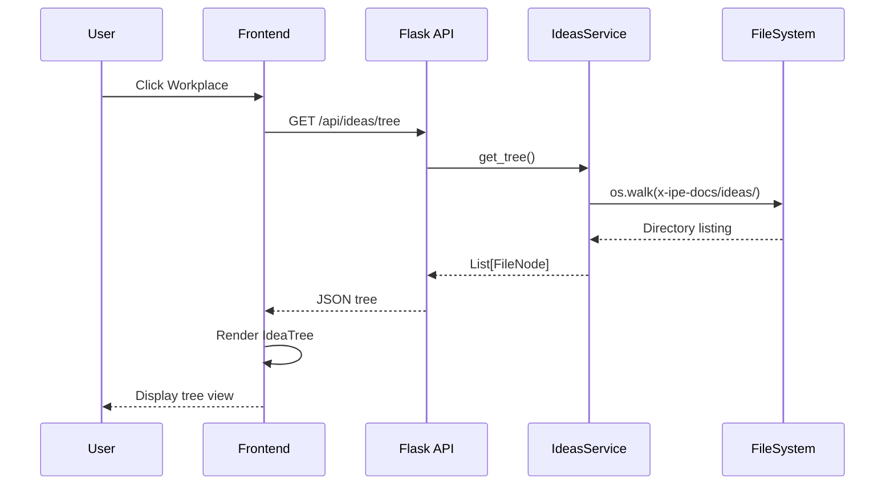

#### Auto-Save Flow

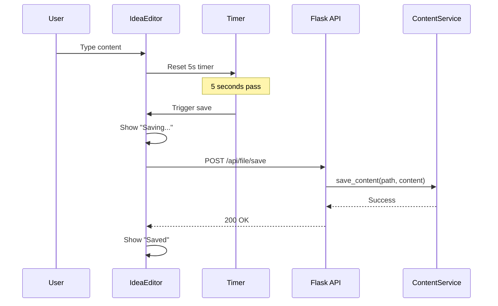

#### Upload Flow

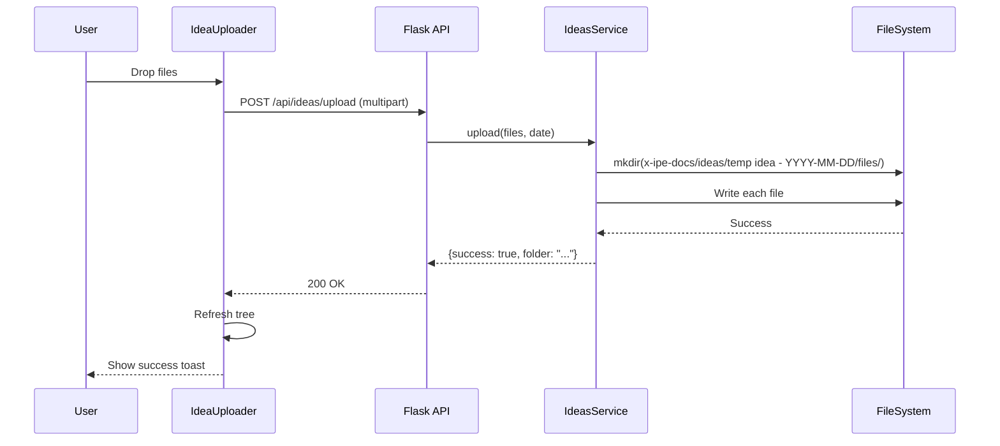

#### Upload to Existing Folder Flow (CR-002)

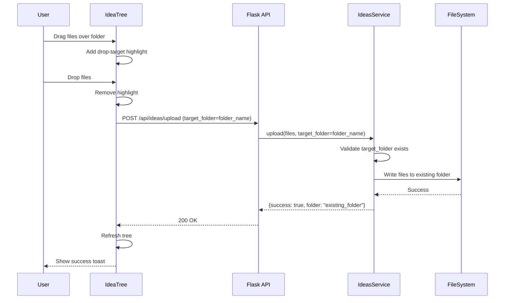

#### Folder Rename Flow

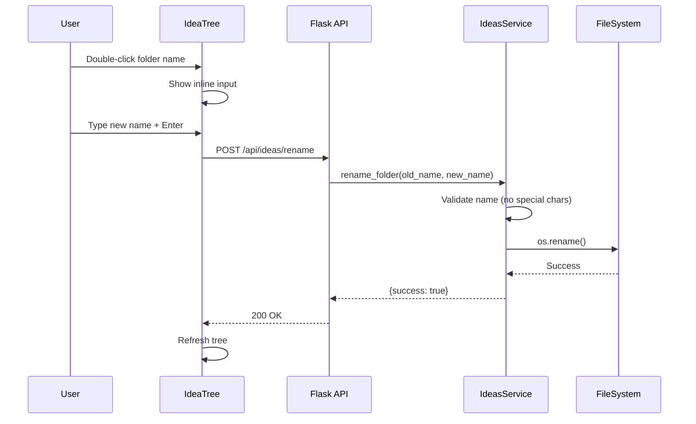

#### Copilot Refine Flow (CR-001)

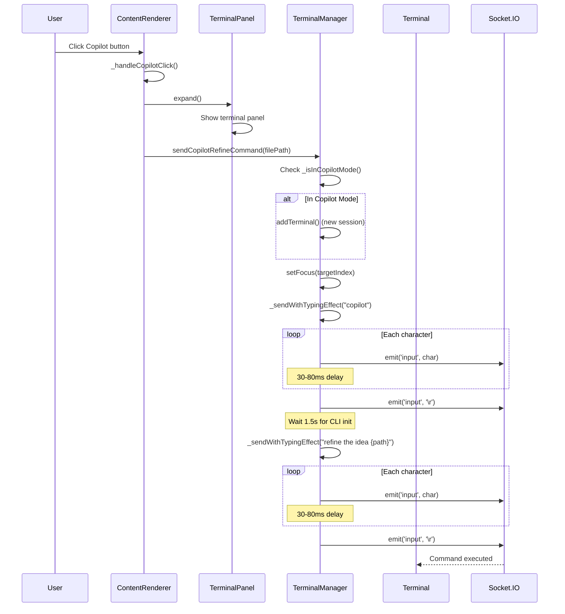

### Data Models

#### Backend: IdeasService

```python
class IdeasService:
    """
    Service for managing idea files and folders.
    Location: src/services/ideas_service.py
    """
    
    IDEAS_PATH = 'x-ipe-docs/ideas'
    
    def __init__(self, project_root: str):
        self.project_root = Path(project_root).resolve()
        self.ideas_root = self.project_root / self.IDEAS_PATH
    
    def get_tree(self) -> List[FileNode]:
        """
        Scan x-ipe-docs/ideas/ and return tree structure.
        Creates x-ipe-docs/ideas/ if it doesn't exist.
        """
        pass
    
    def upload(self, files: List[Tuple[str, bytes]], date: str = None, target_folder: str = None) -> Dict:
        """
        Upload files to new or existing idea folder.
        
        Args:
            files: List of (filename, content_bytes) tuples
            date: Optional datetime string for new folder naming
            target_folder: Optional existing folder name to upload into (CR-002)
        
        If target_folder is provided: Upload to existing folder
        If target_folder is None: Create new timestamped folder
        
        Returns: {success, folder_name, folder_path, files_uploaded}
        """
        pass
    
    def rename_folder(self, old_name: str, new_name: str) -> Dict:
        """
        Rename idea folder.
        Validates: no special characters, unique name.
        Returns: {success, old_name, new_name}
        """
        pass
    
    def _validate_folder_name(self, name: str) -> Tuple[bool, str]:
        """
        Validate folder name for filesystem.
        Invalid chars: / \ : * ? " < > |
        Max length: 255
        """
        pass
    
    def _generate_unique_name(self, base_name: str) -> str:
        """
        Generate unique folder name if exists.
        Appends (2), (3), etc.
        """
        pass
```

#### Frontend: Components

```javascript
// WorkplaceView: Main container
class WorkplaceView {
    constructor(container) {
        this.container = container;
        this.tree = new IdeaTree();
        this.editor = new IdeaEditor();
        this.uploader = new IdeaUploader();
    }
    
    render() {
        // Two-column layout: left=tree+controls, right=content
    }
    
    showUploadView() {
        // Replace right panel with uploader
    }
    
    showEditor(path) {
        // Load file and show in editor
    }
}

// IdeaTree: Tree navigation
class IdeaTree {
    constructor() {
        this.items = [];
        this.selectedPath = null;
    }
    
    async loadTree() {
        const res = await fetch('/api/ideas/tree');
        this.items = await res.json();
        this.render();
    }
    
    onFileClick(path) {
        // Trigger file load in editor
    }
    
    onFolderDoubleClick(name) {
        // Enter inline rename mode
    }
    
    async renameFolder(oldName, newName) {
        // Call API and refresh tree
    }
}

// IdeaEditor: Auto-save editor
class IdeaEditor {
    constructor(options = {}) {
        this.saveDelay = options.saveDelay || 5000;
        this.saveTimer = null;
        this.status = 'idle'; // idle | saving | saved
    }
    
    loadFile(path) {
        // Load content from API
    }
    
    onContentChange(content) {
        this.status = 'modified';
        clearTimeout(this.saveTimer);
        this.saveTimer = setTimeout(() => this.save(), this.saveDelay);
    }
    
    async save() {
        this.status = 'saving';
        this.updateStatusUI();
        await this.saveToServer();
        this.status = 'saved';
        this.updateStatusUI();
        setTimeout(() => { this.status = 'idle'; this.updateStatusUI(); }, 2000);
    }
}

// IdeaUploader: Drag-drop + file picker
class IdeaUploader {
    constructor(options = {}) {
        this.onUploadComplete = options.onUploadComplete;
    }
    
    render() {
        // Render dropzone with dashed border
        // Include file input for click-to-browse
    }
    
    async handleFiles(files) {
        const formData = new FormData();
        for (const file of files) {
            formData.append('files', file);
        }
        const res = await fetch('/api/ideas/upload', {
            method: 'POST',
            body: formData
        });
        if (res.ok) {
            this.onUploadComplete?.();
        }
    }
}
```

### API Specifications

#### GET /api/ideas/tree

**Response:**
```json
{
    "success": true,
    "tree": [
        {
            "name": "mobile-app-idea",
            "type": "folder",
            "path": "x-ipe-docs/ideas/mobile-app-idea",
            "children": [
                {
                    "name": "files",
                    "type": "folder",
                    "path": "x-ipe-docs/ideas/mobile-app-idea/files",
                    "children": [
                        {
                            "name": "notes.md",
                            "type": "file",
                            "path": "x-ipe-docs/ideas/mobile-app-idea/files/notes.md"
                        }
                    ]
                }
            ]
        }
    ]
}
```

#### POST /api/ideas/upload

**Request:** `multipart/form-data`
- `files`: Multiple file uploads
- `target_folder` (optional, CR-002): Existing folder name to upload into

**New Folder Upload (default):**
```json
// Request: multipart/form-data with files only
// Response:
{
    "success": true,
    "folder_name": "Draft Idea - 01232026 125500",
    "folder_path": "x-ipe-docs/ideas/Draft Idea - 01232026 125500",
    "files_uploaded": ["notes.md", "sketch.png"]
}
```

**Existing Folder Upload (CR-002):**
```json
// Request: multipart/form-data with files + target_folder
// Response:
{
    "success": true,
    "folder_name": "mobile-app-idea",
    "folder_path": "x-ipe-docs/ideas/mobile-app-idea",
    "files_uploaded": ["extra-notes.md"]
}
```

**Error Responses:**
```json
// File too large
{
    "success": false,
    "error": "File too large (max 10MB)"
}

// Target folder not found (CR-002)
{
    "success": false,
    "error": "Target folder 'nonexistent' does not exist"
}
```

#### POST /api/ideas/rename

**Request:**
```json
{
    "old_name": "temp idea - 2026-01-22",
    "new_name": "mobile-app-idea"
}
```

**Response:**
```json
{
    "success": true,
    "old_name": "temp idea - 2026-01-22",
    "new_name": "mobile-app-idea",
    "new_path": "x-ipe-docs/ideas/mobile-app-idea"
}
```

**Error Response:**
```json
{
    "success": false,
    "error": "Folder name contains invalid characters"
}
```

### Implementation Steps

**Phase 1: Backend (IdeasService + API)**

1. Add `IdeasService` class to `src/services/ideas_service.py`
   - `get_tree()` - scan x-ipe-docs/ideas/
   - `upload()` - create folder + save files
   - `rename_folder()` - rename with validation
   - `_validate_folder_name()` - check invalid chars
   - `_generate_unique_name()` - handle duplicates

2. Add API endpoints to `src/app.py`
   - `GET /api/ideas/tree`
   - `POST /api/ideas/upload`
   - `POST /api/ideas/rename`

**Phase 2: Frontend (WorkplaceView)**

3. Add `WorkplaceView` class to `src/templates/index.html`
   - Two-column layout HTML/CSS
   - Mount point for tree and content

4. Add `IdeaTree` class
   - Tree rendering (reuse existing tree patterns)
   - File click handler → load in editor
   - Folder double-click → inline rename

5. Add `IdeaEditor` class
   - Load file content
   - 5-second debounce auto-save
   - Status indicators (Saving.../Saved)

6. Add `IdeaUploader` class
   - Drag-drop zone
   - File picker button
   - Upload progress/success feedback

**Phase 3: Sidebar Integration**

7. Update sidebar navigation in `src/templates/index.html`
   - Add Workplace as first item
   - Click handler to show WorkplaceView
   - Update existing items to follow Workplace

### Edge Cases & Error Handling

| Scenario | Expected Behavior |
|----------|-------------------|
| `x-ipe-docs/ideas/` doesn't exist | `get_tree()` creates it and returns empty array |
| Upload file > 10MB | Return error: "File too large (max 10MB)" |
| Rename to invalid name (has `/`) | Return error: "Folder name contains invalid characters" |
| Rename to existing name | Auto-append counter: `name (2)` |
| Save while previous save in progress | Queue save, debounce handles this |
| Network error during save | Show error toast, retry on next edit |
| Empty idea folder | Show in tree but no children |

### CSS Classes

```css
/* Workplace layout */
.workplace-container {
    display: flex;
    height: 100%;
}

.workplace-sidebar {
    width: 280px;
    border-right: 1px solid var(--bs-border-color);
    display: flex;
    flex-direction: column;
}

.workplace-content {
    flex: 1;
    overflow: auto;
    padding: 1rem;
}

/* Upload button */
.upload-btn {
    margin: 1rem;
}

/* Save status */
.save-status {
    font-size: 0.85rem;
    color: var(--bs-secondary);
}

.save-status.saving {
    color: var(--bs-warning);
}

.save-status.saved {
    color: var(--bs-success);
}

/* Upload dropzone */
.upload-dropzone {
    border: 2px dashed var(--bs-border-color);
    border-radius: 8px;
    padding: 3rem;
    text-align: center;
    cursor: pointer;
    transition: border-color 0.2s;
}

.upload-dropzone.dragover {
    border-color: var(--bs-primary);
    background: rgba(var(--bs-primary-rgb), 0.05);
}

/* Inline rename */
.folder-name-input {
    border: 1px solid var(--bs-primary);
    border-radius: 4px;
    padding: 2px 4px;
    font-size: inherit;
}

/* Copilot button (CR-001) */
.workplace-copilot-btn {
    /* Uses Bootstrap btn-outline-info */
}

/* Folder drop target (CR-002) */
.idea-folder-node {
    transition: background-color 0.2s, outline 0.2s;
}

.idea-folder-node.drop-target {
    background-color: rgba(var(--bs-primary-rgb), 0.1);
    outline: 2px dashed var(--bs-primary);
    outline-offset: -2px;
}

.idea-folder-node.drop-target .bi-folder,
.idea-folder-node.drop-target .bi-folder2 {
    color: var(--bs-primary);
}
```

---

## CR-001: Copilot Button Implementation

> Added: 01-22-2026

### Overview

The Copilot button provides one-click integration with Copilot CLI for idea refinement. When clicked, it automatically opens the terminal and sends the appropriate commands to start a Copilot refinement session.

### Components Modified

| File | Component | Changes |
|------|-----------|---------|
| `src/templates/index.html` | `ContentRenderer` | Added Copilot button HTML, `_handleCopilotClick()` method |
| `static/js/terminal.js` | `TerminalManager` | Added `sendCopilotRefineCommand()`, `_isInCopilotMode()`, `_sendWithTypingEffect()` |

### Implementation Details

#### ContentRenderer._handleCopilotClick()

```javascript
/**
 * Handle Copilot button click - open terminal and send refine command
 * Location: src/templates/index.html (ContentRenderer class)
 */
_handleCopilotClick() {
    if (!this.currentPath) return;
    
    // Expand terminal panel
    if (window.terminalPanel) {
        window.terminalPanel.expand();
    }
    
    // Send copilot command to terminal with typing simulation
    if (window.terminalManager) {
        window.terminalManager.sendCopilotRefineCommand(this.currentPath);
    }
}
```

#### TerminalManager.sendCopilotRefineCommand()

```javascript
/**
 * Send Copilot refine command with typing simulation
 * Location: static/js/terminal.js (TerminalManager class)
 * @param {string} filePath - Path to the idea file to refine
 */
sendCopilotRefineCommand(filePath) {
    let targetIndex = this.activeIndex;
    
    // Create terminal if none exists
    if (this.terminals.length === 0) {
        targetIndex = this.addTerminal();
    } else if (targetIndex < 0) {
        targetIndex = 0;
    }
    
    // Check if current terminal is in Copilot mode
    const needsNewTerminal = this._isInCopilotMode(targetIndex);
    if (needsNewTerminal && this.terminals.length < MAX_TERMINALS) {
        targetIndex = this.addTerminal();
    }
    
    this.setFocus(targetIndex);
    
    // Send commands with typing simulation
    const copilotCommand = 'copilot';
    const refineCommand = `refine the idea ${filePath}`;
    
    this._sendWithTypingEffect(targetIndex, copilotCommand, () => {
        setTimeout(() => {
            this._sendWithTypingEffect(targetIndex, refineCommand);
        }, 1500); // Wait for copilot CLI to initialize
    });
}
```

#### TerminalManager._isInCopilotMode()

```javascript
/**
 * Check if terminal appears to be in Copilot CLI mode
 * Detects by checking terminal buffer for Copilot prompt indicators
 */
_isInCopilotMode(index) {
    if (index < 0 || index >= this.terminals.length) return false;
    
    const terminal = this.terminals[index];
    if (!terminal) return false;
    
    // Check last few lines for copilot indicators
    const buffer = terminal.buffer.active;
    for (let i = Math.max(0, buffer.cursorY - 5); i <= buffer.cursorY; i++) {
        const line = buffer.getLine(i);
        if (line) {
            const text = line.translateToString(true);
            // Copilot CLI prompt indicators
            if (text.includes('copilot>') || text.includes('Copilot') || text.includes('⏺')) {
                return true;
            }
        }
    }
    return false;
}
```

#### TerminalManager._sendWithTypingEffect()

```javascript
/**
 * Send text with typing simulation effect
 * Random delay 30-80ms between characters for realistic typing
 */
_sendWithTypingEffect(index, text, callback) {
    if (index < 0 || index >= this.sockets.length) return;
    
    const socket = this.sockets[index];
    if (!socket || !socket.connected) return;
    
    const chars = text.split('');
    let i = 0;
    
    const typeChar = () => {
        if (i < chars.length) {
            socket.emit('input', chars[i]);
            i++;
            const delay = 30 + Math.random() * 50;
            setTimeout(typeChar, delay);
        } else {
            setTimeout(() => {
                socket.emit('input', '\r'); // Enter key
                if (callback) callback();
            }, 100);
        }
    };
    
    typeChar();
}
```

### Button HTML

```html
<button class="btn btn-sm btn-outline-info workplace-copilot-btn" 
        id="workplace-copilot-btn" 
        title="Refine with Copilot">
    <i class="bi bi-robot"></i> Copilot
</button>
```

### Edge Cases

| Scenario | Behavior |
|----------|----------|
| No terminal exists | Creates new terminal first |
| Already in Copilot mode | Creates new terminal session (if < MAX_TERMINALS) |
| At MAX_TERMINALS and in Copilot mode | Uses existing terminal (may cause issues) |
| Terminal disconnected | Command not sent (socket check) |
| No file selected | Button click does nothing (currentPath check) |

---

## CR-002: Drag-Drop Upload to Existing Folders

> Added: 01-23-2026

### Overview

This change request enables users to drag and drop files directly onto existing idea folders in the tree view. Files are uploaded directly into the target folder without creating a new subfolder.

### Components Modified

| File | Component | Changes |
|------|-----------|---------|
| `src/services/ideas_service.py` | `IdeasService.upload()` | Added optional `target_folder` parameter |
| `src/app.py` | `upload_ideas()` | Extract `target_folder` from form data, pass to service |
| `static/js/app.js` | `WorkplaceManager` | Added `_setupFolderDragDrop()`, `_uploadToFolder()` methods |

### Implementation Details

#### Backend: IdeasService.upload() Changes

```python
def upload(self, files: List[tuple], date: str = None, target_folder: str = None) -> Dict[str, Any]:
    """
    Upload files to a new or existing idea folder.
    
    Args:
        files: List of (filename, content_bytes) tuples
        date: Optional datetime string for new folder naming
        target_folder: Optional existing folder name to upload into (CR-002)
    
    Returns:
        Dict with success, folder_name, folder_path, files_uploaded
    """
    if not files:
        return {'success': False, 'error': 'No files provided'}
    
    # CR-002: Upload to existing folder if target_folder provided
    if target_folder:
        folder_path = self.ideas_root / target_folder
        if not folder_path.exists():
            return {
                'success': False,
                'error': f"Target folder '{target_folder}' does not exist"
            }
        folder_name = target_folder
    else:
        # Original behavior: create new timestamped folder
        if date is None:
            date = datetime.now().strftime('%m%d%Y %H%M%S')
        base_name = f'Draft Idea - {date}'
        folder_name = self._generate_unique_name(base_name)
        folder_path = self.ideas_root / folder_name
        folder_path.mkdir(parents=True, exist_ok=True)
    
    # Save files to folder
    uploaded_files = []
    for filename, content in files:
        file_path = folder_path / filename
        file_path.write_bytes(content)
        uploaded_files.append(filename)
    
    return {
        'success': True,
        'folder_name': folder_name,
        'folder_path': str(folder_path.relative_to(self.project_root)),
        'files_uploaded': uploaded_files
    }
```

#### Backend: API Endpoint Changes

```python
@app.route('/api/ideas/upload', methods=['POST'])
def upload_ideas():
    """POST /api/ideas/upload - Upload files to new or existing folder"""
    project_root = app.config.get('PROJECT_ROOT', os.getcwd())
    service = IdeasService(project_root)
    
    if 'files' not in request.files:
        return jsonify({'success': False, 'error': 'No files provided'}), 400
    
    uploaded_files = request.files.getlist('files')
    if not uploaded_files or all(f.filename == '' for f in uploaded_files):
        return jsonify({'success': False, 'error': 'No files provided'}), 400
    
    # CR-002: Get optional target_folder from form data
    target_folder = request.form.get('target_folder', None)
    
    # Convert to (filename, content) tuples
    files = []
    for f in uploaded_files:
        if f.filename:
            files.append((f.filename, f.read()))
    
    result = service.upload(files, target_folder=target_folder)
    
    if result.get('success'):
        return jsonify(result)
    else:
        return jsonify(result), 400
```

#### Frontend: WorkplaceManager._setupFolderDragDrop()

```javascript
/**
 * Setup drag-drop handlers on folder nodes in the tree
 * Called after tree render
 */
_setupFolderDragDrop() {
    const folderNodes = document.querySelectorAll('.idea-folder-node');
    
    folderNodes.forEach(node => {
        const folderName = node.dataset.folderName;
        
        // Prevent default to allow drop
        node.addEventListener('dragover', (e) => {
            e.preventDefault();
            e.stopPropagation();
            node.classList.add('drop-target');
        });
        
        node.addEventListener('dragleave', (e) => {
            e.preventDefault();
            e.stopPropagation();
            node.classList.remove('drop-target');
        });
        
        node.addEventListener('drop', async (e) => {
            e.preventDefault();
            e.stopPropagation();
            node.classList.remove('drop-target');
            
            if (e.dataTransfer.files.length > 0) {
                await this._uploadToFolder(e.dataTransfer.files, folderName);
            }
        });
    });
}
```

#### Frontend: WorkplaceManager._uploadToFolder()

```javascript
/**
 * Upload files to a specific existing folder
 * @param {FileList} files - Files to upload
 * @param {string} folderName - Target folder name
 */
async _uploadToFolder(files, folderName) {
    try {
        const formData = new FormData();
        for (const file of files) {
            formData.append('files', file);
        }
        formData.append('target_folder', folderName);
        
        const response = await fetch('/api/ideas/upload', {
            method: 'POST',
            body: formData
        });
        
        const result = await response.json();
        
        if (result.success) {
            this._showToast(
                `Uploaded ${result.files_uploaded.length} file(s) to ${folderName}`,
                'success'
            );
            await this.loadTree();
        } else {
            this._showToast(result.error || 'Upload failed', 'error');
        }
    } catch (error) {
        console.error('Upload to folder failed:', error);
        this._showToast('Upload failed: ' + error.message, 'error');
    }
}
```

### Tree Node HTML Structure

```html
<!-- Folder node with drag-drop support -->
<div class="tree-item idea-folder-node" 
     data-folder-name="mobile-app-idea"
     data-path="x-ipe-docs/ideas/mobile-app-idea">
    <span class="tree-toggle" onclick="toggleFolder(this)">
        <i class="bi bi-chevron-right"></i>
    </span>
    <i class="bi bi-folder2"></i>
    <span class="tree-name">mobile-app-idea</span>
</div>
```

### Edge Cases

| Scenario | Behavior |
|----------|----------|
| Drop on file node | Ignored (only folders are drop targets) |
| Drop on tree root/empty space | Ignored (must target specific folder) |
| Target folder deleted during drag | Error toast: "Target folder does not exist" |
| Drop same-named file | Overwrites existing file in folder |
| Drop multiple files | All files uploaded to same folder |
| Network error | Error toast with message, tree not refreshed |

---

## CR-006: Folder Tree UX Enhancement (v1.5)

### Overview

Major UX upgrade to the Ideas folder tree, adding drag-drop reorganization, detailed folder view panel, search/filter, and UI styling refresh.

### Architecture Decision: New Standalone Modules

**Rationale:** `workplace.js` is currently ~2200 lines. Per the 800-line threshold rule, new CR-006 functionality is implemented as standalone modules:

| Module | Est. Lines | Responsibility |
|--------|-----------|----------------|
| `folder-view.js` | ~400 | Folder view panel component |
| `tree-drag.js` | ~250 | Drag-drop reorganization |
| `tree-search.js` | ~150 | Search/filter functionality |
| `confirm-dialog.js` | ~100 | Reusable confirmation modal |

### Drag-Drop Move Flow

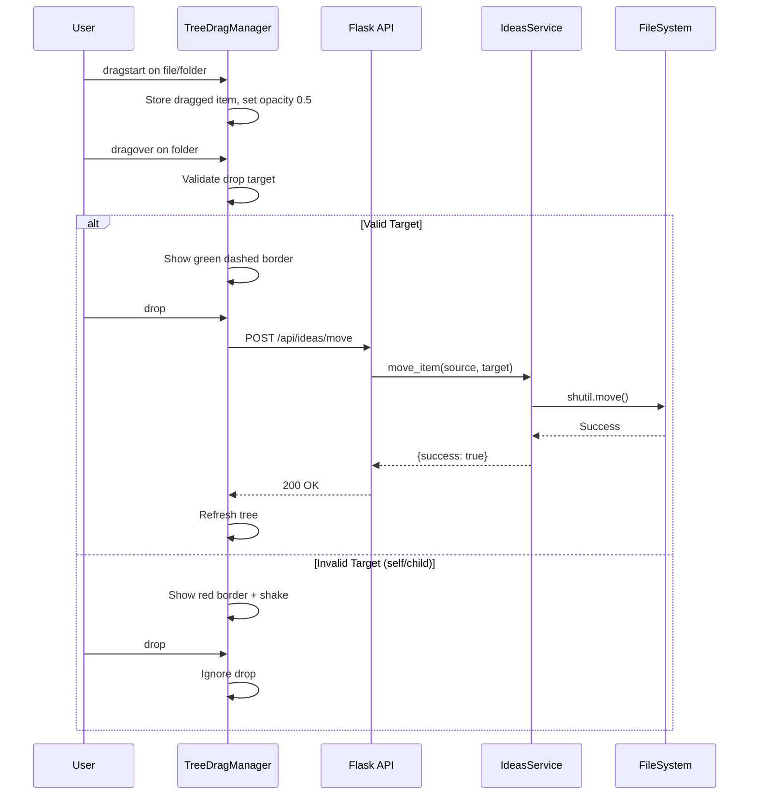

### Folder View Panel Flow

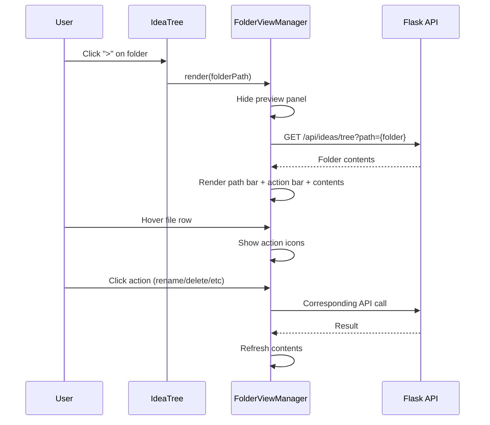

### Search Filter Logic

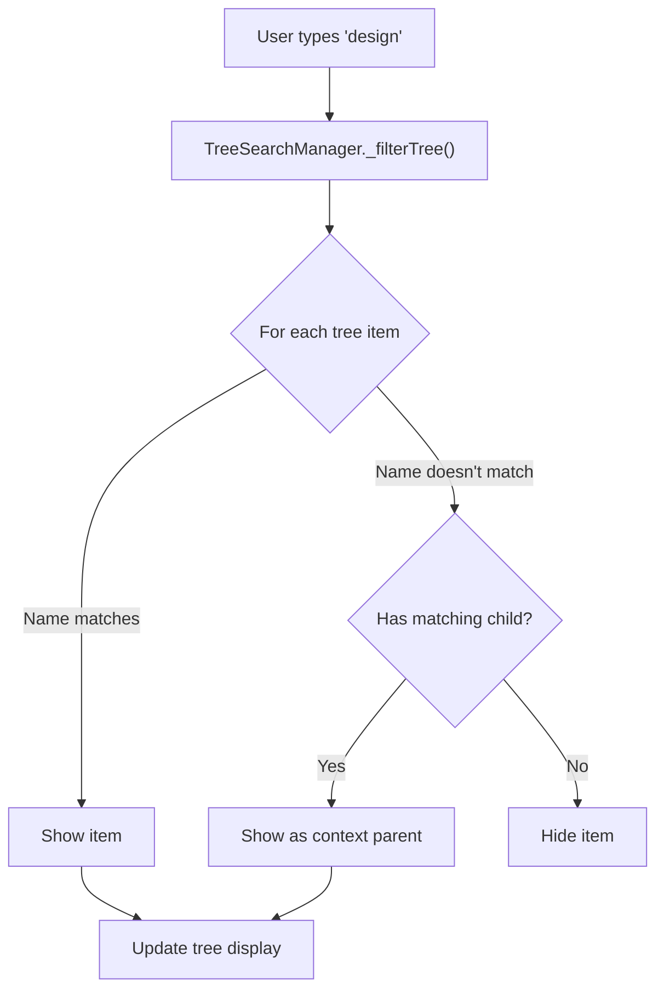

### Backend API Endpoints (CR-006)

| Endpoint | Method | Request Body | Response |
|----------|--------|--------------|----------|
| `/api/ideas/move` | POST | `{source_path, target_folder}` | `{success, new_path}` |
| `/api/ideas/duplicate` | POST | `{path}` | `{success, new_path}` |
| `/api/ideas/item` | DELETE | `?path=...` | `{success}` |
| `/api/ideas/download` | GET | `?path=...` | File download |

### IdeasService New Methods (CR-006)

```python
class IdeasService:
    def move_item(self, source_path: str, target_folder: str) -> dict:
        """Move file or folder to target folder.
        
        Args:
            source_path: Relative path from ideas root
            target_folder: Target folder relative path
            
        Returns:
            {success: bool, new_path: str, error?: str}
            
        Validation:
            - source must exist
            - target must be folder
            - target cannot be source or child of source
        """
        pass
    
    def duplicate_item(self, path: str) -> dict:
        """Duplicate file or folder with -copy suffix.
        
        Creates: filename-copy.ext or foldername-copy/
        If exists: filename-copy-2.ext, etc.
        """
        pass
    
    def delete_item(self, path: str) -> dict:
        """Delete file or folder.
        
        For folders: recursively deletes contents.
        Returns error if path doesn't exist.
        """
        pass
```

### Frontend Module: FolderViewManager

```javascript
/**
 * FolderViewManager - Detailed folder view panel
 * Location: src/x_ipe/static/js/features/folder-view.js
 */
class FolderViewManager {
    constructor(options) {
        this.container = options.container;
        this.onAction = options.onAction; // Callback for actions
        this.onNavigate = options.onNavigate; // Callback for navigation
        this.currentPath = null;
        this.expandedFolders = new Set();
    }
    
    /**
     * Render folder view for given path
     */
    async render(folderPath) {
        this.currentPath = folderPath;
        const contents = await this._loadContents(folderPath);
        
        this.container.innerHTML = `
            <div class="folder-view">
                <header class="panel-header">
                    ${this._renderPathBar(folderPath)}
                    ${this._renderActionBar()}
                </header>
                <div class="folder-view-content">
                    ${this._renderContents(contents)}
                </div>
            </div>
        `;
        
        this._bindEvents();
    }
    
    _renderPathBar(path) {
        const parts = path.split('/').filter(Boolean);
        const breadcrumbs = parts.map((part, i) => {
            const fullPath = parts.slice(0, i + 1).join('/');
            const isLast = i === parts.length - 1;
            return `<span class="breadcrumb-item ${isLast ? 'current' : ''}" 
                         data-path="${fullPath}">${part}</span>`;
        }).join('<span class="breadcrumb-sep">/</span>');
        
        return `<nav class="breadcrumb">
            <span class="breadcrumb-item" data-path="">Ideas</span>
            <span class="breadcrumb-sep">/</span>
            ${breadcrumbs}
        </nav>`;
    }
    
    _renderActionBar() {
        return `<div class="panel-actions">
            <button class="action-btn" data-action="add-file">
                <i class="bi bi-file-earmark-plus"></i> Add File
            </button>
            <button class="action-btn" data-action="add-folder">
                <i class="bi bi-folder-plus"></i> Add Folder
            </button>
            <button class="action-btn" data-action="rename">
                <i class="bi bi-pencil"></i> Rename
            </button>
            <button class="action-btn" data-action="delete">
                <i class="bi bi-trash"></i> Delete
            </button>
        </div>`;
    }
    
    _renderContents(items) {
        return `<div class="folder-list">
            ${items.map(item => this._renderItem(item)).join('')}
        </div>`;
    }
    
    _renderItem(item) {
        const isFolder = item.type === 'folder';
        const icon = isFolder ? 'bi-folder-fill' : this._getFileIcon(item.name);
        const actions = isFolder 
            ? ['rename', 'delete', 'duplicate']
            : ['rename', 'delete', 'duplicate', 'download'];
        
        return `<div class="folder-item" data-path="${item.path}" data-type="${item.type}">
            <div class="drag-handle"><i class="bi bi-grip-vertical"></i></div>
            <i class="item-icon ${icon}"></i>
            <span class="item-name">${item.name}</span>
            <span class="item-meta">${item.meta || ''}</span>
            <div class="item-actions">
                ${actions.map(a => `
                    <button class="item-action ${a === 'delete' ? 'delete' : ''}" 
                            data-action="${a}" title="${a}">
                        <i class="bi bi-${this._getActionIcon(a)}"></i>
                    </button>
                `).join('')}
            </div>
        </div>`;
    }
}
```

### Frontend Module: TreeDragManager

```javascript
/**
 * TreeDragManager - Drag-drop file/folder reorganization
 * Location: src/x_ipe/static/js/features/tree-drag.js
 */
class TreeDragManager {
    constructor(options) {
        this.treeContainer = options.treeContainer;
        this.onMove = options.onMove; // Callback for move operation
        this.draggedItem = null;
    }
    
    init() {
        this.treeContainer.querySelectorAll('[data-draggable="true"]').forEach(item => {
            item.addEventListener('dragstart', this._onDragStart.bind(this));
            item.addEventListener('dragend', this._onDragEnd.bind(this));
            item.addEventListener('dragover', this._onDragOver.bind(this));
            item.addEventListener('dragleave', this._onDragLeave.bind(this));
            item.addEventListener('drop', this._onDrop.bind(this));
        });
    }
    
    _onDragStart(e) {
        this.draggedItem = e.target.closest('[data-path]');
        this.draggedItem.classList.add('dragging');
        e.dataTransfer.effectAllowed = 'move';
    }
    
    _onDragOver(e) {
        e.preventDefault();
        const target = e.target.closest('[data-type="folder"]');
        if (!target || target === this.draggedItem) return;
        
        if (this._isValidDrop(target)) {
            target.classList.add('drag-over');
            target.classList.remove('drag-invalid');
        } else {
            target.classList.add('drag-invalid');
            target.classList.remove('drag-over');
        }
    }
    
    _onDrop(e) {
        e.preventDefault();
        const target = e.target.closest('[data-type="folder"]');
        if (!target || !this._isValidDrop(target)) {
            this._showInvalidFeedback(target);
            return;
        }
        
        const sourcePath = this.draggedItem.dataset.path;
        const targetPath = target.dataset.path;
        
        this.onMove(sourcePath, targetPath);
    }
    
    _isValidDrop(target) {
        if (!this.draggedItem) return false;
        const sourcePath = this.draggedItem.dataset.path;
        const targetPath = target.dataset.path;
        
        // Cannot drop into self
        if (sourcePath === targetPath) return false;
        
        // Cannot drop into child folder
        if (targetPath.startsWith(sourcePath + '/')) return false;
        
        return true;
    }
    
    _showInvalidFeedback(target) {
        if (!target) return;
        target.classList.add('drag-invalid');
        target.style.animation = 'shake 0.3s ease';
        setTimeout(() => {
            target.classList.remove('drag-invalid');
            target.style.animation = '';
        }, 300);
    }
}
```

### Frontend Module: TreeSearchManager

```javascript
/**
 * TreeSearchManager - Search/filter tree
 * Location: src/x_ipe/static/js/features/tree-search.js
 */
class TreeSearchManager {
    constructor(options) {
        this.treeContainer = options.treeContainer;
        this.searchInput = null;
    }
    
    init() {
        this._createSearchBar();
        this.searchInput.addEventListener('input', 
            this._debounce(this._filterTree.bind(this), 150));
    }
    
    _createSearchBar() {
        const header = this.treeContainer.closest('.workplace-sidebar-content')
            .querySelector('.workplace-sidebar-header');
        
        const searchHtml = `
            <div class="search-container">
                <div class="search-wrapper">
                    <i class="bi bi-search search-icon"></i>
                    <input type="text" class="search-input" 
                           placeholder="Filter files and folders...">
                </div>
            </div>
        `;
        header.insertAdjacentHTML('afterend', searchHtml);
        this.searchInput = header.nextElementSibling.querySelector('.search-input');
    }
    
    _filterTree() {
        const query = this.searchInput.value.toLowerCase().trim();
        const items = this.treeContainer.querySelectorAll('.tree-item');
        
        if (!query) {
            items.forEach(item => item.style.display = '');
            return;
        }
        
        const matchingPaths = new Set();
        
        // Find all matching items and their parent paths
        items.forEach(item => {
            const name = item.querySelector('.tree-label')?.textContent.toLowerCase();
            const path = item.dataset.path;
            
            if (name?.includes(query)) {
                matchingPaths.add(path);
                // Add all parent paths
                const parts = path.split('/');
                for (let i = 1; i < parts.length; i++) {
                    matchingPaths.add(parts.slice(0, i).join('/'));
                }
            }
        });
        
        // Show/hide based on matching paths
        items.forEach(item => {
            const path = item.dataset.path;
            item.style.display = matchingPaths.has(path) ? '' : 'none';
        });
    }
}
```

### CSS Updates (CR-006)

```css
/* Design system variables */
:root {
    --color-primary: #0f172a;
    --color-secondary: #475569;
    --color-accent: #10b981;
    --color-accent-light: #d1fae5;
    --color-border: #e2e8f0;
    --color-bg: #f8fafc;
    --color-error: #ef4444;
    --color-error-light: #fee2e2;
    --radius-md: 8px;
    --radius-lg: 12px;
    --shadow-sm: 0 1px 2px 0 rgb(0 0 0 / 0.05);
}

/* Drag-drop states */
.tree-item.dragging {
    opacity: 0.5;
}

.tree-item.drag-over {
    background: var(--color-accent-light);
    border: 2px dashed var(--color-accent);
    border-radius: var(--radius-md);
}

.tree-item.drag-invalid {
    background: var(--color-error-light);
    border: 2px solid var(--color-error);
    border-radius: var(--radius-md);
}

@keyframes shake {
    0%, 100% { transform: translateX(0); }
    20%, 60% { transform: translateX(-4px); }
    40%, 80% { transform: translateX(4px); }
}

/* Folder view button */
.tree-folder-view-btn {
    opacity: 0;
    transition: opacity 0.15s ease;
}

.tree-item:hover .tree-folder-view-btn {
    opacity: 1;
}

.tree-folder-view-btn:hover {
    background: var(--color-accent);
    color: white;
}

/* Folder view panel */
.folder-view {
    display: flex;
    flex-direction: column;
    height: 100%;
}

.panel-header {
    padding: 12px 20px;
    border-bottom: 1px solid var(--color-border);
    display: flex;
    align-items: center;
    gap: 12px;
}

.folder-item {
    display: flex;
    align-items: center;
    padding: 10px 12px;
    background: white;
    border: 1px solid var(--color-border);
    border-radius: var(--radius-md);
    margin-bottom: 2px;
}

.folder-item:hover .item-actions {
    opacity: 1;
}

.item-actions {
    opacity: 0;
    transition: opacity 0.15s ease;
}

/* Search bar */
.search-container {
    padding: 12px 16px;
    border-bottom: 1px solid var(--color-border);
}

.search-input {
    width: 100%;
    padding: 8px 12px 8px 36px;
    border: 1px solid var(--color-border);
    border-radius: var(--radius-md);
    font-size: 13px;
}

.search-input:focus {
    border-color: var(--color-accent);
    box-shadow: 0 0 0 3px rgb(16 185 129 / 0.15);
}
```

### Edge Cases (CR-006)

| Scenario | Expected Behavior |
|----------|-------------------|
| Drag folder into itself | Red border + shake, drop ignored |
| Drag folder into child | Red border + shake, drop ignored |
| Drag file onto file | Drop ignored (only folders accept) |
| Delete folder with contents | Confirmation shows content count |
| Duplicate name exists | Append -2, -3, etc. |
| Search with no matches | Show empty state message |
| Network error on move | Error toast, tree unchanged |

---

## Design Change Log

| Date | Phase | Change Summary |
|------|-------|----------------|
| 01-31-2026 | CR-006 | Major UX upgrade: Added FolderViewManager, TreeDragManager, TreeSearchManager as standalone modules (~800 lines total). New backend endpoints for move/duplicate/delete/download. UI refresh with new design system variables. |
| 01-23-2026 | CR-003 | Added Ideation Toolbox: IdeasService.get_toolbox() and save_toolbox() for config persistence, /api/ideas/toolbox endpoints, WorkplaceManager toolbox dropdown with sections and checkboxes, bidirectional state sync with .ideation-tools.json |
| 01-23-2026 | CR-002 | Added drag-drop upload to existing folders: IdeasService.upload() accepts target_folder, API extracts from form data, frontend handles dragover/drop on folder nodes with visual feedback |
| 01-22-2026 | CR-001 | Added Copilot button integration: terminal panel expand, Copilot mode detection, typing simulation, refine command automation |
| 01-22-2026 | Initial Design | Initial technical design for FEATURE-008: Workplace (Idea Management). Two-column layout with IdeasService backend, auto-save editor, drag-drop upload, and inline folder rename. |
| 01-23-2026 | Refactoring | Updated file paths: `src/services.py` split into `src/services/` package. IdeasService now in `src/services/ideas_service.py`, FileNode in `src/services/file_service.py`. Imports via `from src.services import X` still work due to `__init__.py` re-exports. |

---

## CR-003: Ideation Toolbox Configuration

### Overview

Add "Ideation Toolbox" button beside "Create Idea" that opens a dropdown panel with 3 sections containing tool checkboxes. State persists to `.ideation-tools.json` in the ideas folder root.

### Workflow Diagram

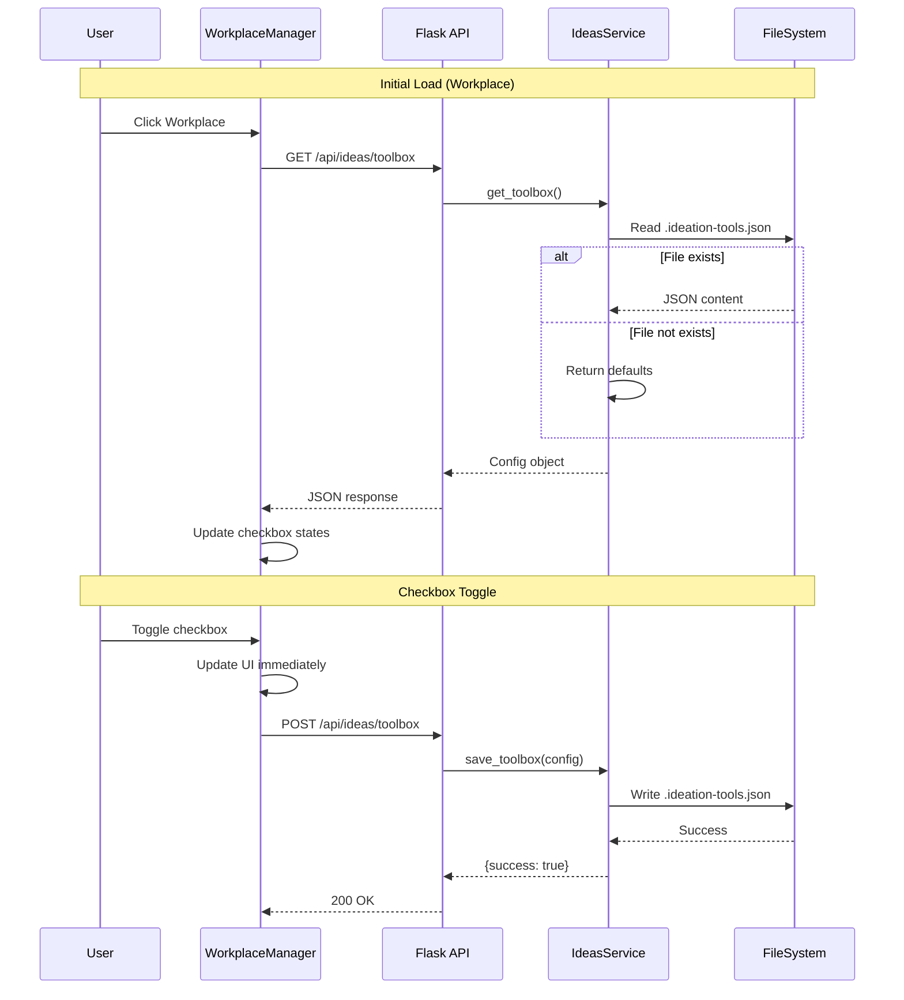

### JSON File Schema

**File:** `x-ipe-docs/ideas/.ideation-tools.json`

```json
{
    "version": "1.0",
    "ideation": {
        "antv-infographic": false,
        "mermaid": true
    },
    "mockup": {
        "frontend-design": true
    },
    "sharing": {}
}
```

### Backend: IdeasService Methods

```python
# Add to src/services/ideas_service.py

TOOLBOX_FILE = '.ideation-tools.json'
DEFAULT_TOOLBOX = {
    "version": "1.0",
    "ideation": {
        "antv-infographic": False,
        "mermaid": True
    },
    "mockup": {
        "frontend-design": True
    },
    "sharing": {}
}

def get_toolbox(self) -> dict:
    """
    Read toolbox configuration from JSON file.
    Returns defaults if file doesn't exist.
    """
    toolbox_path = self.ideas_root / TOOLBOX_FILE
    if toolbox_path.exists():
        try:
            with open(toolbox_path, 'r') as f:
                return json.load(f)
        except (json.JSONDecodeError, IOError):
            return DEFAULT_TOOLBOX.copy()
    return DEFAULT_TOOLBOX.copy()

def save_toolbox(self, config: dict) -> dict:
    """
    Save toolbox configuration to JSON file.
    Creates file if not exists.
    """
    toolbox_path = self.ideas_root / TOOLBOX_FILE
    try:
        # Ensure ideas directory exists
        self.ideas_root.mkdir(parents=True, exist_ok=True)
        with open(toolbox_path, 'w') as f:
            json.dump(config, f, indent=2)
        return {'success': True}
    except IOError as e:
        return {'success': False, 'error': str(e)}
```

### Backend: API Endpoints

```python
# Add to src/app.py

@app.route('/api/ideas/toolbox', methods=['GET'])
def get_ideas_toolbox():
    """Get ideation toolbox configuration"""
    ideas_service = IdeasService(get_project_root())
    config = ideas_service.get_toolbox()
    return jsonify(config)

@app.route('/api/ideas/toolbox', methods=['POST'])
def save_ideas_toolbox():
    """Save ideation toolbox configuration"""
    ideas_service = IdeasService(get_project_root())
    config = request.json
    result = ideas_service.save_toolbox(config)
    return jsonify(result)
```

### Frontend: Button and Dropdown HTML

```html
<!-- Add to workplace controls (index.html) next to Create Idea button -->
<div class="btn-group">
    <button id="create-idea-btn" class="btn btn-sm btn-outline-primary">
        <i class="bi bi-plus-lg"></i> Create Idea
    </button>
    <div class="dropdown">
        <button id="toolbox-btn" class="btn btn-sm btn-outline-secondary dropdown-toggle" 
                type="button" data-bs-toggle="dropdown" aria-expanded="false">
            <i class="bi bi-tools"></i> Ideation Toolbox
        </button>
        <div class="dropdown-menu toolbox-menu p-3" style="min-width: 250px;">
            <!-- Section 1: Ideation -->
            <h6 class="dropdown-header">
                <i class="bi bi-lightbulb"></i> Ideation
            </h6>
            <div class="form-check">
                <input class="form-check-input toolbox-checkbox" type="checkbox" 
                       id="tool-antv-infographic" data-section="ideation" data-tool="antv-infographic">
                <label class="form-check-label" for="tool-antv-infographic">
                    AntV Infographic
                </label>
            </div>
            <div class="form-check">
                <input class="form-check-input toolbox-checkbox" type="checkbox" 
                       id="tool-mermaid" data-section="ideation" data-tool="mermaid" checked>
                <label class="form-check-label" for="tool-mermaid">
                    Mermaid Diagrams
                </label>
            </div>
            
            <div class="dropdown-divider"></div>
            
            <!-- Section 2: Mockup -->
            <h6 class="dropdown-header">
                <i class="bi bi-brush"></i> Mockup
            </h6>
            <div class="form-check">
                <input class="form-check-input toolbox-checkbox" type="checkbox" 
                       id="tool-frontend-design" data-section="mockup" data-tool="frontend-design" checked>
                <label class="form-check-label" for="tool-frontend-design">
                    Frontend Design
                </label>
            </div>
            
            <div class="dropdown-divider"></div>
            
            <!-- Section 3: Sharing -->
            <h6 class="dropdown-header">
                <i class="bi bi-share"></i> Sharing
            </h6>
            <p class="text-muted small mb-0 px-2">Coming soon...</p>
        </div>
    </div>
</div>
```

### Frontend: JavaScript Handler

```javascript
// Add to WorkplaceManager class in app.js

_initToolbox() {
    // Load initial state
    this._loadToolboxState();
    
    // Bind checkbox change handlers
    document.querySelectorAll('.toolbox-checkbox').forEach(checkbox => {
        checkbox.addEventListener('change', () => this._onToolboxChange());
    });
}

async _loadToolboxState() {
    try {
        const response = await fetch('/api/ideas/toolbox');
        const config = await response.json();
        this.toolboxConfig = config;
        
        // Update checkboxes to match config
        for (const [section, tools] of Object.entries(config)) {
            if (typeof tools === 'object' && section !== 'version') {
                for (const [tool, enabled] of Object.entries(tools)) {
                    const checkbox = document.querySelector(
                        `.toolbox-checkbox[data-section="${section}"][data-tool="${tool}"]`
                    );
                    if (checkbox) {
                        checkbox.checked = enabled;
                    }
                }
            }
        }
    } catch (error) {
        console.error('Failed to load toolbox config:', error);
    }
}

async _onToolboxChange() {
    // Build config from current checkbox states
    const config = {
        version: '1.0',
        ideation: {},
        mockup: {},
        sharing: {}
    };
    
    document.querySelectorAll('.toolbox-checkbox').forEach(checkbox => {
        const section = checkbox.dataset.section;
        const tool = checkbox.dataset.tool;
        config[section][tool] = checkbox.checked;
    });
    
    // Save to backend
    await this._saveToolboxState(config);
}

async _saveToolboxState(config) {
    try {
        const response = await fetch('/api/ideas/toolbox', {
            method: 'POST',
            headers: { 'Content-Type': 'application/json' },
            body: JSON.stringify(config)
        });
        const result = await response.json();
        if (!result.success) {
            console.error('Failed to save toolbox config:', result.error);
        }
    } catch (error) {
        console.error('Failed to save toolbox config:', error);
    }
}
```

### Edge Cases

| Scenario | Behavior |
|----------|----------|
| `.ideation-tools.json` doesn't exist | Return/use defaults (mermaid: true, frontend-design: true) |
| Invalid JSON in file | Return defaults |
| Missing section in JSON | Preserve existing, fill missing with defaults |
| Checkbox toggled rapidly | Each change triggers save (debounce optional) |
| Network error on save | Log error, UI remains updated |
| ideas folder doesn't exist | Create folder when saving config |

---

## CR-004: Sidebar Submenu, Rename to Ideation, Copilot Hover Menu

> Added: 01-28-2026

### Overview

This change request restructures the navigation to use a submenu pattern:
1. Workplace becomes a parent menu item (no action on click)
2. Ideation appears as first nested child (existing Workplace functionality)
3. UIUX Feedbacks appears as second nested child (new placeholder - FEATURE-022)
4. Copilot button changes from direct click to hover menu with "Refine idea" as primary action

### Components Modified

| File | Component | Changes |
|------|-----------|---------|
| `src/x_ipe/templates/base.html` | Sidebar HTML | Add submenu structure with nested items |
| `src/x_ipe/static/js/features/sidebar.js` | `SidebarNav` | Add submenu rendering and behavior handling |
| `src/x_ipe/static/css/sidebar.css` | Submenu styles | Add CSS for nested items indentation |
| `src/x_ipe/static/js/features/content-renderer.js` | `ContentRenderer` | Add Copilot hover menu initialization |
| `src/x_ipe/templates/workplace.html` | Page template | Rename title/header to "Ideation" |
| `src/x_ipe/app.py` | Route `/uiux-feedbacks` | Add new route for UIUX Feedbacks page (FEATURE-022) |
| `src/x_ipe/templates/uiux-feedbacks.html` | New template | Simple WIP placeholder page |

### Implementation Details

#### Sidebar Submenu Structure (HTML)

```html
<!-- base.html sidebar -->
<nav class="sidebar-nav">
    <!-- Workplace Parent - No action on click -->
    <div class="sidebar-item sidebar-parent" data-no-action="true">
        <i class="bi bi-briefcase"></i>
        <span>Workplace</span>
        <i class="bi bi-chevron-down submenu-indicator"></i>
    </div>
    
    <!-- Submenu Items - Always visible, indented -->
    <div class="sidebar-submenu">
        <a href="{{ url_for('workplace') }}" class="sidebar-item sidebar-child">
            <i class="bi bi-lightbulb"></i>
            <span>Ideation</span>
        </a>
        <a href="{{ url_for('uiux_feedbacks') }}" class="sidebar-item sidebar-child">
            <i class="bi bi-chat-square-text"></i>
            <span>UIUX Feedbacks</span>
        </a>
    </div>
    
    <!-- Existing sidebar items continue below -->
    <a href="{{ url_for('planning') }}" class="sidebar-item">
        <i class="bi bi-kanban"></i>
        <span>Planning</span>
    </a>
    <!-- ... -->
</nav>
```

#### Sidebar CSS (sidebar.css)

```css
/* CR-004: Submenu Styles */
.sidebar-parent {
    cursor: default; /* No pointer - not clickable */
}

.sidebar-parent[data-no-action="true"]:hover {
    background-color: transparent; /* No hover effect */
}

.sidebar-submenu {
    display: flex;
    flex-direction: column;
}

.sidebar-child {
    padding-left: 2.5rem; /* Indent nested items */
    font-size: 0.9em;
}

.sidebar-child:hover {
    background-color: var(--sidebar-hover-bg, #f5f5f5);
}

.submenu-indicator {
    margin-left: auto;
    font-size: 0.75em;
    opacity: 0.6;
}
```

#### Sidebar JavaScript (sidebar.js)

```javascript
/**
 * CR-004: Setup submenu parent item behavior
 */
_setupSubmenuBehavior() {
    const parentItems = document.querySelectorAll('.sidebar-parent[data-no-action="true"]');
    
    parentItems.forEach(item => {
        // Prevent default click action
        item.addEventListener('click', (e) => {
            e.preventDefault();
            e.stopPropagation();
            // Parent item does nothing - children are always visible
        });
    });
}

/**
 * CR-004: Highlight active submenu item based on current URL
 */
_highlightActiveSubmenuItem() {
    const currentPath = window.location.pathname;
    const submenuItems = document.querySelectorAll('.sidebar-child');
    
    submenuItems.forEach(item => {
        const href = item.getAttribute('href');
        if (currentPath === href || currentPath.startsWith(href)) {
            item.classList.add('active');
            // Also mark parent as active-parent
            const parent = item.closest('.sidebar-submenu').previousElementSibling;
            if (parent && parent.classList.contains('sidebar-parent')) {
                parent.classList.add('active-parent');
            }
        }
    });
}
```

#### Copilot Hover Menu (content-renderer.js)

```javascript
/**
 * CR-004: Initialize Copilot button hover menu
 */
_initCopilotHoverMenu() {
    const copilotBtn = document.getElementById('copilot-btn');
    if (!copilotBtn) return;
    
    // Remove direct click handler
    copilotBtn.removeAttribute('onclick');
    
    // Create dropdown menu
    const menuHTML = `
        <div class="copilot-hover-menu" id="copilot-menu">
            <div class="copilot-menu-item" data-action="refine">
                <i class="bi bi-stars"></i> Refine idea
            </div>
            <div class="copilot-menu-item" data-action="option2">
                <i class="bi bi-chat-dots"></i> Chat with Copilot
            </div>
            <div class="copilot-menu-item" data-action="option3">
                <i class="bi bi-code-slash"></i> Generate code
            </div>
            <div class="copilot-menu-item" data-action="option4">
                <i class="bi bi-question-circle"></i> Ask a question
            </div>
        </div>
    `;
    
    // Insert menu after button
    copilotBtn.insertAdjacentHTML('afterend', menuHTML);
    
    // Setup hover behavior
    const menu = document.getElementById('copilot-menu');
    
    copilotBtn.addEventListener('mouseenter', () => {
        menu.classList.add('visible');
    });
    
    copilotBtn.parentElement.addEventListener('mouseleave', () => {
        menu.classList.remove('visible');
    });
    
    // Setup menu item click handlers
    menu.querySelectorAll('.copilot-menu-item').forEach(item => {
        item.addEventListener('click', (e) => {
            const action = e.currentTarget.dataset.action;
            this._handleCopilotMenuAction(action);
            menu.classList.remove('visible');
        });
    });
}

/**
 * CR-004: Handle Copilot menu action selection
 */
_handleCopilotMenuAction(action) {
    switch (action) {
        case 'refine':
            // Trigger original Copilot button behavior (FR-7)
            this._handleCopilotClick();
            break;
        case 'option2':
            // Chat with Copilot - expand terminal and send 'copilot' command only
            this._expandTerminalWithCopilot();
            break;
        case 'option3':
            // Generate code - placeholder for future
            console.log('Generate code - coming soon');
            break;
        case 'option4':
            // Ask a question - placeholder for future
            console.log('Ask a question - coming soon');
            break;
    }
}
```

#### Copilot Hover Menu CSS

```css
/* CR-004: Copilot Hover Menu */
.copilot-hover-menu {
    position: absolute;
    top: 100%;
    right: 0;
    min-width: 180px;
    background: white;
    border: 1px solid #ddd;
    border-radius: 6px;
    box-shadow: 0 4px 12px rgba(0, 0, 0, 0.15);
    z-index: 1000;
    opacity: 0;
    visibility: hidden;
    transform: translateY(-10px);
    transition: opacity 0.15s, transform 0.15s, visibility 0.15s;
}

.copilot-hover-menu.visible {
    opacity: 1;
    visibility: visible;
    transform: translateY(0);
}

.copilot-menu-item {
    padding: 10px 14px;
    cursor: pointer;
    display: flex;
    align-items: center;
    gap: 8px;
    color: #333;
}

.copilot-menu-item:first-child {
    border-radius: 6px 6px 0 0;
    font-weight: 600;
    background-color: #f0f9ff;
    color: #0ea5e9;
}

.copilot-menu-item:last-child {
    border-radius: 0 0 6px 6px;
}

.copilot-menu-item:hover {
    background-color: #f5f5f5;
}

.copilot-menu-item:first-child:hover {
    background-color: #e0f2fe;
}
```

#### UIUX Feedbacks Route (app.py)

```python
@app.route('/uiux-feedbacks')
def uiux_feedbacks():
    """FEATURE-022: UIUX Feedbacks placeholder page (CR-004)"""
    return render_template('uiux-feedbacks.html')
```

#### UIUX Feedbacks Template (uiux-feedbacks.html)

```html


UIUX Feedbacks - X-IPE


<div class="container-fluid h-100 d-flex align-items-center justify-content-center">
    <div class="text-center">
        <i class="bi bi-chat-square-text display-1 text-secondary mb-4"></i>
        <h2 class="text-muted">Work in Progress</h2>
        <p class="text-secondary">UIUX Feedback collection feature coming soon.</p>
    </div>
</div>

```

#### Rename Workplace to Ideation

**Files to update:**
1. `workplace.html` - Update page title and header
2. Sidebar labels - Change "Workplace" child to "Ideation"
3. Route name can remain `/workplace` for backward compatibility (URL stays same)

```html
<!-- workplace.html -->
Ideation - X-IPE


<div class="container-fluid h-100">
    <div class="row h-100">
        <div class="col-md-3 border-end p-3">
            <h5 class="mb-3">
                <i class="bi bi-lightbulb me-2"></i>Ideation
            </h5>
            <!-- ... rest of sidebar content ... -->
        </div>
        <!-- ... -->
    </div>
</div>

```

### Workflow Diagram

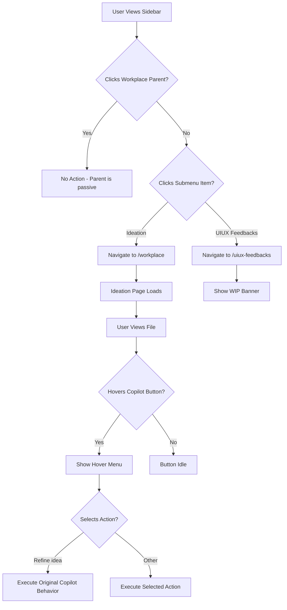

### Edge Cases

| Scenario | Behavior |
|----------|----------|
| Click on Workplace parent | Nothing happens (event prevented) |
| Keyboard navigation on parent | Skip to first child item |
| Active page in submenu | Both child and parent get active styling |
| Copilot menu open, click outside | Menu closes |
| Copilot menu open, hover out | Menu closes after small delay |
| No file selected, hover Copilot | Menu shows but "Refine idea" is disabled |
| Mobile touch on parent | Same as click - no action |
| Mobile touch on Copilot | Menu toggles visibility |

### Verification Checklist

| Check | Description |
|-------|-------------|
| ✅ | Workplace parent click does nothing |
| ✅ | Ideation and UIUX Feedbacks visible as nested items |
| ✅ | Submenu items properly indented |
| ✅ | Clicking Ideation navigates to /workplace |
| ✅ | Clicking UIUX Feedbacks navigates to /uiux-feedbacks |
| ✅ | UIUX Feedbacks shows WIP banner |
| ✅ | Copilot button not directly clickable |
| ✅ | Hover shows dropdown menu |
| ✅ | "Refine idea" is first option with highlight |
| ✅ | "Refine idea" triggers original behavior |
| ✅ | All existing Workplace/Ideation functions work |

---

## Design Change Log

| Date | Phase | Change Summary |
|------|-------|----------------|
| 01-28-2026 | Technical Design | CR-004: Added sidebar submenu with passive parent, Copilot hover menu with 4 options, UIUX Feedbacks route, page rename to Ideation |
| 01-23-2026 | Technical Design | CR-003: Added Ideation Toolbox configuration with stages, API endpoints, and checkbox UI |
| 01-23-2026 | Technical Design | CR-002: Added drag-drop upload to existing folders with folder highlighting |
| 01-22-2026 | Technical Design | CR-001: Added Copilot button with terminal integration and typing simulation |
| 01-22-2026 | Initial Design | Initial technical design for Workplace/Idea Management feature |
