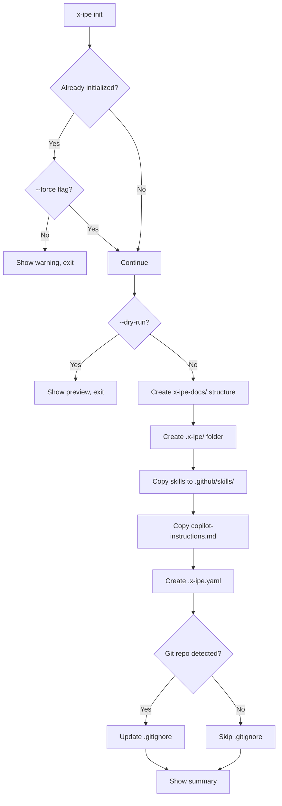
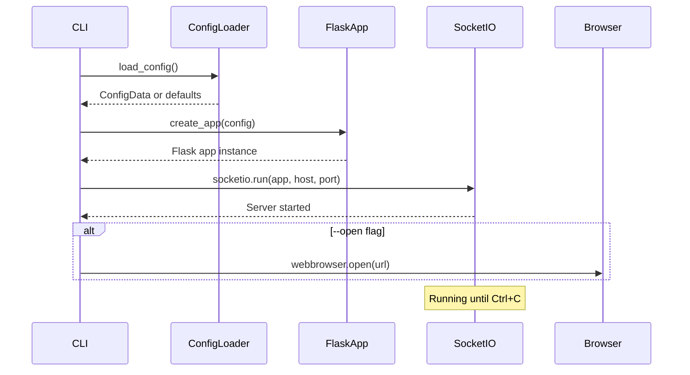
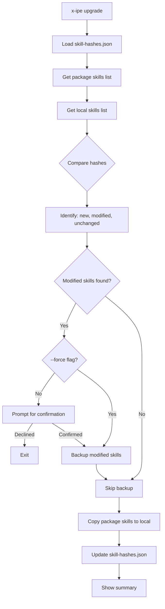

# Technical Design: X-IPE CLI Tool

> Feature ID: FEATURE-018 | Version: v1.0 | Last Updated: 01-25-2026

---

## Part 1: Agent-Facing Summary

> **Purpose:** Quick reference for AI agents navigating large projects.
> **📌 AI Coders:** Focus on this section for implementation context.

### Key Components Implemented

| Component | Responsibility | Scope/Impact | Tags |
|-----------|----------------|--------------|------|
| `x_ipe/cli.py` | CLI entry point and command routing | All CLI commands | #cli #click #entry-point |
| `x_ipe/commands/init.py` | Project initialization handler | Creates x-ipe-docs/, .x-ipe/, .github/ | #init #scaffolding |
| `x_ipe/commands/serve.py` | Web server launcher | Starts Flask app | #serve #server #flask |
| `x_ipe/commands/upgrade.py` | Skills sync handler | Updates local skills from package | #upgrade #skills |
| `x_ipe/commands/status.py` | Project status checker | Shows initialization state | #status #diagnostics |
| `x_ipe/commands/info.py` | Detailed diagnostics | Shows paths, versions, config | #info #diagnostics |
| `x_ipe/core/config.py` | Config file handling | Reads/writes .x-ipe.yaml | #config #yaml |
| `x_ipe/core/scaffold.py` | File/folder scaffolding | Creates project structure | #scaffold #init |
| `x_ipe/core/skills.py` | Skills management | Package/local skill discovery | #skills #discovery |
| `x_ipe/core/hashing.py` | File hash utilities | Detects modified skills | #hash #upgrade |

### Scope & Boundaries

**In Scope:**
- PyPI package structure with `pyproject.toml`
- CLI commands: init, serve, upgrade, status, info
- Package data access for skills, templates, static files
- Config file parsing (.x-ipe.yaml)
- Git-aware .gitignore updates

**Out of Scope:**
- Web UI changes (existing Flask app reused)
- Skill content changes (bundled as-is)
- Plugin/extension system
- Remote project support

### Dependencies

| Dependency | Source | Design Link | Usage Description |
|------------|--------|-------------|-------------------|
| Flask app | Existing | [app.py](../../../src/app.py) | Reused for `x-ipe serve` command |
| Services | Existing | [services/](../../../src/services/) | Reused for server functionality |
| Skills | Existing | [.github/skills/](../../../.github/skills/) | Bundled as package data |

### Major Flow

1. **Install:** `pip install x-ipe` → Package installed with CLI entry point
2. **Init:** `x-ipe init` → Scaffold creates x-ipe-docs/, .x-ipe/, .github/skills/
3. **Serve:** `x-ipe serve` → Config loaded → Flask app created → Server starts
4. **Upgrade:** `x-ipe upgrade` → Hash comparison → Backup modified → Copy new skills

### Usage Example

```bash
# Install X-IPE
pip install x-ipe

# Initialize project
cd /path/to/my-project
x-ipe init
# Output: Created x-ipe-docs/, .x-ipe/, .github/skills/, .x-ipe.yaml

# Start server
x-ipe serve --port 8080 --open
# Output: Server running at http://127.0.0.1:8080

# Check status
x-ipe status
# Output: Project initialized, 45 skills (42 package, 3 local overrides)

# Upgrade skills
x-ipe upgrade
# Output: 2 skills updated, 1 backed up to .x-ipe/backups/
```

---

## Part 2: Implementation Guide

> **Purpose:** Human-readable details for developers.
> **📌 Emphasis on visual diagrams for comprehension.

### Package Structure

```
x-ipe/                          # Repository root
├── pyproject.toml              # Package config (PEP 621)
├── README.md                   # PyPI description
├── LICENSE                     # MIT
├── CHANGELOG.md                # Version history
└── src/
    └── x_ipe/                  # Main package
        ├── __init__.py         # Version: __version__ = "1.0.0"
        ├── __main__.py         # python -m x_ipe support
        ├── cli.py              # Click CLI definition
        │
        ├── commands/           # CLI command handlers
        │   ├── __init__.py
        │   ├── init.py         # x-ipe init
        │   ├── serve.py        # x-ipe serve
        │   ├── upgrade.py      # x-ipe upgrade
        │   ├── status.py       # x-ipe status
        │   └── info.py         # x-ipe info
        │
        ├── core/               # Core utilities
        │   ├── __init__.py
        │   ├── config.py       # .x-ipe.yaml handling
        │   ├── scaffold.py     # File/folder creation
        │   ├── skills.py       # Skill discovery/management
        │   ├── hashing.py      # File hash utilities
        │   └── paths.py        # Path resolution
        │
        ├── app.py              # Flask app (moved from src/)
        ├── config.py           # Flask config (moved from src/)
        ├── services/           # Services (moved from src/)
        │
        ├── templates/          # Jinja2 templates (package data)
        ├── static/             # CSS, JS, images (package data)
        │
        ├── skills/             # Bundled skills (package data)
        │   ├── task-type-bug-fix/
        │   ├── task-type-code-implementation/
        │   └── ...
        │
        └── scaffolds/          # Init templates (package data)
            ├── x-ipe-docs/           # x-ipe-docs/ folder template
            ├── github/         # .github/ folder template
            └── config/         # .x-ipe.yaml template
```

### Workflow Diagrams

#### Init Command Flow



#### Serve Command Flow



#### Upgrade Command Flow



### Data Models

#### Config File Schema (.x-ipe.yaml)

```yaml
# .x-ipe.yaml - X-IPE project configuration
version: 1

paths:
  # All paths relative to config file location
  project_root: "."           # The project being managed
  docs: "docs"                # Documentation folder
  skills: ".github/skills"    # Skills folder
  runtime: ".x-ipe"           # Runtime data folder

server:
  host: "127.0.0.1"
  port: 5000
  debug: false

# Future: additional config options
```

#### Skill Hashes File (.x-ipe/skill-hashes.json)

```json
{
  "version": "1.0.0",
  "generated_at": "2026-01-25T05:20:00Z",
  "skills": {
    "task-type-bug-fix": {
      "hash": "sha256:abc123...",
      "source": "package",
      "files": ["SKILL.md", "references/examples.md"]
    },
    "task-type-code-implementation": {
      "hash": "sha256:def456...",
      "source": "local",
      "modified": true
    }
  }
}
```

### CLI Command Specifications

#### Main CLI (cli.py)

```python
import click
from x_ipe import __version__
from x_ipe.commands import init, serve, upgrade, status, info

@click.group()
@click.version_option(version=__version__, prog_name="x-ipe")
def main():
    """X-IPE: Intelligent Project Environment
    
    A tool for managing project documentation, ideas, requirements,
    and AI-assisted development workflows.
    """
    pass

main.add_command(init.init_cmd, name="init")
main.add_command(serve.serve_cmd, name="serve")
main.add_command(upgrade.upgrade_cmd, name="upgrade")
main.add_command(status.status_cmd, name="status")
main.add_command(info.info_cmd, name="info")

if __name__ == "__main__":
    main()
```

#### Init Command (commands/init.py)

```python
@click.command("init")
@click.option("--force", is_flag=True, help="Overwrite existing files")
@click.option("--dry-run", is_flag=True, help="Preview changes without writing")
@click.pass_context
def init_cmd(ctx, force: bool, dry_run: bool):
    """Initialize X-IPE in the current directory.
    
    Creates:
      - x-ipe-docs/ folder with ideas, planning, requirements, themes
      - .x-ipe/ folder for runtime data
      - .github/skills/ with skills from package
      - .x-ipe.yaml configuration file
      - Updates .gitignore (if git repo detected)
    """
```

#### Serve Command (commands/serve.py)

```python
@click.command("serve")
@click.option("--port", "-p", default=5000, help="Port to run server on")
@click.option("--host", "-h", default="127.0.0.1", help="Host to bind to")
@click.option("--open", "open_browser", is_flag=True, help="Open browser automatically")
@click.option("--debug", is_flag=True, help="Enable debug mode with hot reload")
@click.pass_context
def serve_cmd(ctx, port: int, host: str, open_browser: bool, debug: bool):
    """Start the X-IPE web server.
    
    Runs the X-IPE web interface for managing ideas, requirements,
    and project documentation.
    """
```

#### Upgrade Command (commands/upgrade.py)

```python
@click.command("upgrade")
@click.option("--force", is_flag=True, help="Overwrite modified skills without prompt")
@click.option("--dry-run", is_flag=True, help="Preview changes without writing")
@click.pass_context
def upgrade_cmd(ctx, force: bool, dry_run: bool):
    """Update skills from the installed X-IPE package.
    
    Syncs skills from the package to your local .github/skills/ folder.
    Modified local skills are backed up before overwriting.
    """
```

#### Status Command (commands/status.py)

```python
@click.command("status")
@click.pass_context
def status_cmd(ctx):
    """Show X-IPE project status.
    
    Displays:
      - Initialization state
      - Skills count (package vs local)
      - Config file status
      - Server status
    """
```

#### Info Command (commands/info.py)

```python
@click.command("info")
@click.option("--json", "as_json", is_flag=True, help="Output as JSON")
@click.pass_context
def info_cmd(ctx, as_json: bool):
    """Show detailed X-IPE diagnostics.
    
    Displays version info, paths, config, and environment details.
    """
```

### Core Modules

#### Config Loader (core/config.py)

```python
from dataclasses import dataclass
from pathlib import Path
from typing import Optional
import yaml

CONFIG_FILE = ".x-ipe.yaml"

@dataclass
class XIPEConfig:
    """Resolved X-IPE configuration."""
    config_path: Optional[Path]
    project_root: Path
    docs_path: Path
    skills_path: Path
    runtime_path: Path
    server_host: str
    server_port: int
    server_debug: bool
    
    @classmethod
    def load(cls, start_dir: Path = None) -> "XIPEConfig":
        """Load config from .x-ipe.yaml or use defaults."""
        ...
    
    @classmethod
    def defaults(cls, project_root: Path) -> "XIPEConfig":
        """Create config with sensible defaults."""
        ...
```

#### Scaffold Manager (core/scaffold.py)

```python
from pathlib import Path
from typing import List, Tuple
from importlib import resources

class ScaffoldManager:
    """Manages project structure creation."""
    
    def __init__(self, project_root: Path, dry_run: bool = False):
        self.project_root = project_root
        self.dry_run = dry_run
        self.created: List[Path] = []
        self.skipped: List[Path] = []
    
    def create_docs_structure(self) -> None:
        """Create x-ipe-docs/ folder with subfolders."""
        ...
    
    def create_runtime_folder(self) -> None:
        """Create .x-ipe/ folder."""
        ...
    
    def copy_skills(self, force: bool = False) -> None:
        """Copy skills from package to .github/skills/."""
        ...
    
    def copy_github_config(self) -> None:
        """Copy copilot-instructions.md to .github/."""
        ...
    
    def create_config_file(self) -> None:
        """Create .x-ipe.yaml with defaults."""
        ...
    
    def update_gitignore(self) -> None:
        """Add X-IPE patterns to .gitignore."""
        ...
    
    def get_summary(self) -> Tuple[List[Path], List[Path]]:
        """Return (created, skipped) paths."""
        return self.created, self.skipped
```

#### Skills Manager (core/skills.py)

```python
from pathlib import Path
from typing import Dict, List, Optional
from dataclasses import dataclass

@dataclass
class SkillInfo:
    """Information about a skill."""
    name: str
    path: Path
    source: str  # "package" or "local"
    hash: str
    modified: bool = False

class SkillsManager:
    """Manages skill discovery and synchronization."""
    
    def __init__(self, project_root: Path):
        self.project_root = project_root
        self.local_skills_path = project_root / ".github" / "skills"
        self.hash_file = project_root / ".x-ipe" / "skill-hashes.json"
    
    def get_package_skills(self) -> Dict[str, SkillInfo]:
        """Get skills bundled in the package."""
        ...
    
    def get_local_skills(self) -> Dict[str, SkillInfo]:
        """Get skills in local .github/skills/."""
        ...
    
    def get_merged_skills(self) -> Dict[str, SkillInfo]:
        """Get merged view: local overrides package."""
        ...
    
    def detect_modifications(self) -> List[SkillInfo]:
        """Find locally modified skills."""
        ...
    
    def sync_from_package(self, force: bool = False) -> Dict[str, str]:
        """Sync package skills to local, return actions taken."""
        ...
    
    def backup_skill(self, skill_name: str) -> Path:
        """Backup a skill, return backup path."""
        ...
```

### Implementation Steps

#### Phase 1: Package Restructure (2 hours)

1. Create `pyproject.toml` with package metadata
2. Reorganize source files into `src/x_ipe/` structure
3. Move existing code (app.py, services/, etc.)
4. Configure package data includes (skills, templates, static)
5. Test local installation with `pip install -e .`

#### Phase 2: CLI Foundation (1 hour)

1. Create `cli.py` with Click group
2. Implement `__main__.py` for `python -m x_ipe`
3. Add version option
4. Create command stubs (init, serve, upgrade, status, info)
5. Test CLI entry point works

#### Phase 3: Init Command (2 hours)

1. Implement `ScaffoldManager` class
2. Create scaffold templates in `scaffolds/`
3. Implement docs structure creation
4. Implement .x-ipe folder creation
5. Implement skills copy with `importlib.resources`
6. Implement .gitignore update
7. Add --force and --dry-run flags

#### Phase 4: Serve Command (1 hour)

1. Implement config loading
2. Adapt Flask app factory for CLI usage
3. Implement port/host options
4. Implement --open browser flag
5. Add graceful shutdown handling

#### Phase 5: Upgrade Command (2 hours)

1. Implement `SkillsManager` class
2. Implement hash calculation and storage
3. Implement modification detection
4. Implement backup functionality
5. Implement sync with confirmation prompt
6. Add --force and --dry-run flags

#### Phase 6: Status & Info Commands (1 hour)

1. Implement status checks (init state, skills, server)
2. Implement info gathering (version, paths, config)
3. Add --json output option for info
4. Add colored output formatting

#### Phase 7: Testing & Polish (2 hours)

1. Test on clean project (not X-IPE itself)
2. Test all commands with various flags
3. Test edge cases (no permissions, existing files)
4. Add helpful error messages
5. Update README for PyPI

### pyproject.toml Configuration

```toml
[build-system]
requires = ["hatchling"]
build-backend = "hatchling.build"

[project]
name = "x-ipe"
version = "1.0.0"
description = "Intelligent Project Environment - AI-assisted development workflow tool"
readme = "README.md"
license = "MIT"
requires-python = ">=3.10"
authors = [
    { name = "X-IPE Team" }
]
keywords = ["ai", "development", "workflow", "project-management", "copilot"]
classifiers = [
    "Development Status :: 4 - Beta",
    "Environment :: Console",
    "Framework :: Flask",
    "Intended Audience :: Developers",
    "License :: OSI Approved :: MIT License",
    "Programming Language :: Python :: 3",
    "Programming Language :: Python :: 3.10",
    "Programming Language :: Python :: 3.11",
    "Programming Language :: Python :: 3.12",
    "Topic :: Software Development",
]

dependencies = [
    "flask>=3.0.0",
    "flask-socketio>=5.3.0",
    "click>=8.1.0",
    "pyyaml>=6.0",
    "python-socketio>=5.10.0",
    "watchdog>=4.0.0",
]

[project.optional-dependencies]
dev = [
    "pytest>=7.0",
    "pytest-cov>=4.0",
]

[project.scripts]
x-ipe = "x_ipe.cli:main"

[project.urls]
Homepage = "https://github.com/x-ipe/x-ipe"
Documentation = "https://github.com/x-ipe/x-ipe#readme"
Repository = "https://github.com/x-ipe/x-ipe"

[tool.hatch.build.targets.wheel]
packages = ["src/x_ipe"]

[tool.hatch.build.targets.wheel.force-include]
".github/skills" = "x_ipe/skills"
```

### Edge Cases & Error Handling

| Scenario | Error Message | Recovery |
|----------|---------------|----------|
| No write permission | "Error: Cannot create files in {path}: Permission denied" | Suggest sudo or different directory |
| Port in use | "Error: Port {port} is already in use. Try: x-ipe serve --port {alt}" | Suggest alternative port |
| Invalid YAML | "Error: Cannot parse .x-ipe.yaml (line {n}): {error}" | Show problematic line |
| Missing Python 3.10 | "Error: X-IPE requires Python 3.10+. Current: {version}" | Exit with code 1 |
| Interrupted init | Partial state left | Next init continues from where stopped |
| Skill copy fails | "Warning: Could not copy skill {name}: {error}" | Continue with others, show summary |

---

## Design Change Log

| Date | Phase | Change Summary |
|------|-------|----------------|
| 01-25-2026 | Initial Design | Created technical design for X-IPE CLI Tool. Package restructure with src layout, Click-based CLI with 5 commands (init, serve, upgrade, status, info), core modules for config/scaffold/skills management. |

---
