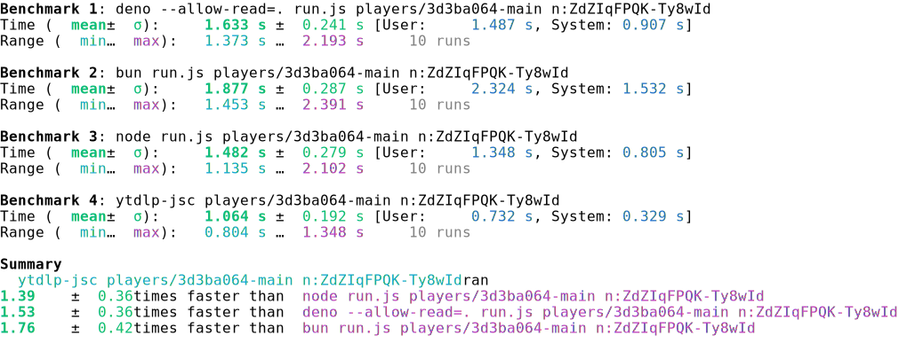

# ytdlp-jsc

YouTube player JavaScript challenge solver for yt-dlp n-parameter and signature decryption.

## Installation

```bash
pip install ytdlp-jsc

pip install ytdlp-jsc --target ~/.yt-dlp/plugins/
```

Build from source (requires Rust toolchain):

```bash
pip install maturin
maturin develop
```

## CLI Usage

```bash
# Single request
ytdlp-jsc <player_path> <type>:<challenge>

# Multiple requests
ytdlp-jsc <player_path> <type>:<challenge> [<type>:<challenge> ...]
```

Arguments:
- `player_path`: Path to player.js file
- `type`: Request type, either `n` or `sig`
- `challenge`: String to decrypt

Examples:

```bash
# Decrypt n parameter
ytdlp-jsc players/3d3ba064-phone n:ZdZIqFPQK-Ty8wId

# Multiple challenges
ytdlp-jsc players/3d3ba064-phone n:ZdZIqFPQK-Ty8wId sig:xxxx
```

## Python API

```python
from ytdlp_jsc import solve

with open("players/3d3ba064-phone", "r") as f:
    player = f.read()

result = solve(player=player, challenge_type="n", challenge="ZdZIqFPQK-Ty8wId")
print(result)
```

## bench

```bash
hyperfine --shell fish --style=full \
    "deno --allow-read=. run.js players/3d3ba064-main n:ZdZIqFPQK-Ty8wId" \
    "bun run.js players/3d3ba064-main n:ZdZIqFPQK-Ty8wId" \
    "node run.js players/3d3ba064-main n:ZdZIqFPQK-Ty8wId" \
    "ytdlp-jsc players/3d3ba064-main n:ZdZIqFPQK-Ty8wId"
```
<div style="display: flex;">
  
</div>


## License

MIT